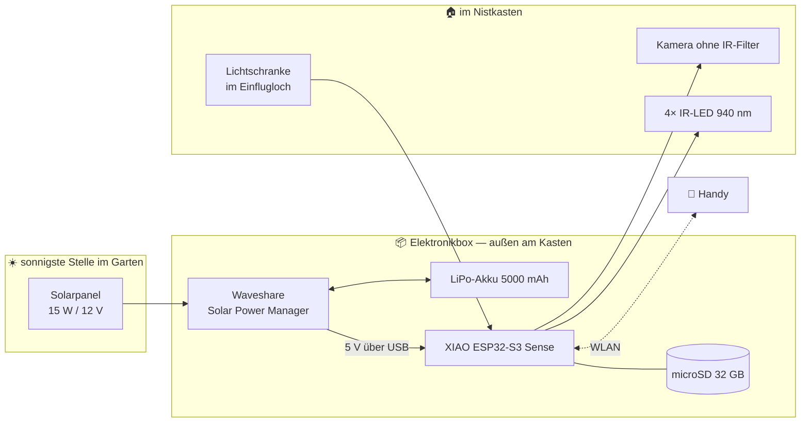

# 🐦 BirdyCam — die Kamera im Nistkasten

Eine **solarbetriebene Kamera im Vogel-Nistkasten** mit Nachtsicht, Ton, Livestream und
einer eigenen Website. Für ungefähr **200 €**, ohne Vorkenntnisse, ohne Computer im Haus.

> ⚠️ **Zeitplan vorab:** Gebaut wird **September bis Februar**, zugeschaut wird ab März.
> Ein belegter Nistkasten darf nicht geöffnet werden (§ 44 BNatSchG). Das ist keine
> Formalie, sondern bestimmt den ganzen Projektplan —
> [warum](docs/01-ueberblick.md#18-rechtliches-und-tierschutz).

---

## Was das Ding kann

| | |
|---|---|
| 👀 **Live zusehen** | Handy ins WLAN, Adresse aufrufen, fertig |
| 🌙 **Auch nachts** | unsichtbares Infrarotlicht, das die Vögel nicht stört |
| 🎬 **Clips automatisch** | mit 2–3 Sekunden **Vorlauf**, damit der Anflug drauf ist |
| 🔊 **Mit Ton** | Mikrofon ist schon auf der Platine. Bettelnde Junge sind laut |
| 🔢 **Vögel zählen** | eine Lichtschranke im Einflugloch — echte Zahlen, keine Schätzung |
| 📊 **Statistik** | Besuche pro Stunde, Aufenthaltsdauer, Verlauf über 30 Tage |
| ☀️ **Monatelang allein** | Solarpanel und Akku, kein Kabel zum Haus |

**Das Gehirn ist ein XIAO ESP32-S3 Sense** — ein Bastelcomputer in Briefmarkengröße, der
alles selbst macht: filmen, hören, rechnen, funken, Website ausliefern. Kein Server, keine
Cloud, kein Abo, keine App.

---

## Der Aufbau in einem Bild


Neun Verbindungen, alle gesteckt oder geschraubt. **Gelötet wird nichts.**

---

## Die Anleitung, in Leseordnung

| Kapitel | Inhalt |
|---|---|
| **[1. Überblick](docs/01-ueberblick.md)** | Was es kann, was nicht, und ob die Sonne reicht |
| **[2. Stückliste](docs/02-stueckliste.md)** | Welche Teile, und warum genau die |
| **[3. Schaltplan](docs/03-schaltplan.md)** ⭐ | **Wo welches Kabel hinkommt — mit Bildern, für Anfänger** |
| **[4. Bauplan](docs/04-bauplan.md)** | Einbau in den Nistkasten, Maße, Panelmontage |
| **[5. Software](docs/05-software.md)** | Arduino einrichten, 7 Lernprogramme, fertige Firmware |
| **[6. Website & Daten](docs/06-website-und-daten.md)** | Dashboard, Statistik, Tagesarchiv |
| **[7. Wartung & Fehlersuche](docs/07-wartung-und-fehlersuche.md)** | Jahresrhythmus, Fehlertabellen, Notfallkarte |
| **[8. Bestellliste](docs/08-bestellliste.md)** 🛒 | Nach Shop sortiert, zum Abhaken |

**Wenn du sofort loslegen willst:** [8. Bestellliste](docs/08-bestellliste.md) → bestellen →
[5. Software](docs/05-software.md) Schritt 0.

---

## So funktioniert es



### Zwei Betriebsarten, die sich abwechseln

```
   Niemand schaut zu          Jemand ruft die Website auf
   ─────────────────────      ───────────────────────────
   ⏺ AUFNAHMEBEREIT           📹 LIVESTREAM
   Kamera → Vorlaufpuffer     Kamera → ins WLAN
   Bewegung → Clip auf SD     Aufnahme pausiert
   Lichtschranke zählt        Lichtschranke zählt weiter
   Mikrofon → Tonspur         Mikrofon → Ton ins WLAN
```

Ein Bild geht entweder ins WLAN **oder** auf die Speicherkarte — beides zusammen ist mehr,
als die Karte schreiben kann. Die Umschaltung passiert automatisch.

---

## Die Lichtschranke ist der beste Teil

Ein Infrarot-Strahl quer durch das Einflugloch. Fliegt ein Vogel durch, bricht er ihn.

1. **Exaktes Zählen.** Kein Sonnenfleck, kein wackelnder Ast löst aus. Die Besuchszahlen auf
   der Website sind echte Messwerte, keine Schätzungen.
2. **Ein- und Ausflug unterscheidbar** — und damit die Aufenthaltsdauer im Kasten.

Kostet 3 € und braucht fast keinen Strom.
[Wie sie funktioniert](docs/03-schaltplan.md#37-die-lichtschranke-im-einflugloch)

---

## Ehrlich gesagt: das Video ruckelt

Der ESP32 kann Video nicht komprimieren wie eine Handykamera. Er macht sehr schnell
Einzelfotos und hängt sie aneinander. Ergebnis:

| | |
|---|---|
| Auflösung | 1600 × 1200 (1,92 Megapixel) — praktisch so viel Detail wie Full HD |
| Bilder pro Sekunde | **8 bis 12** (Fernsehen hat 25) |
| Jedes Einzelbild | gestochen scharf |
| Clip abspielen | **nicht** im Browser — herunterladen und mit [VLC](https://www.videolan.org/) öffnen |

**Das Ruckeln ist der Preis, das Bild selbst ist gut.** Eine Zeile in `config.h` macht
daraus 800 × 600 mit ~15 Bildern/s, falls dir Flüssigkeit wichtiger ist.
[Mehr dazu](docs/01-ueberblick.md#14-das-video--ehrlich-gesagt)

---

## Der Code

| Ordner | Inhalt |
|---|---|
| [`software/firmware/birdycam/`](software/firmware/birdycam/) | Die fertige Firmware, 12 Module |
| [`software/firmware/steps/`](software/firmware/steps/) | 7 Lernprogramme zum Einzeltesten |

**Anfassen musst du nur eine Datei:**
[`config.h`](software/firmware/birdycam/config.h). Alles darin ist auf Deutsch kommentiert
und erklärt.

---

## Aufwand

| Phase | Zeit |
|---|---|
| Teile bestellen | 30 min |
| Arduino IDE einrichten | 30 min |
| Lernprogramme 1–4 (Board, Karte, **erstes Livebild**, IR-Licht) | 2 h |
| Lernprogramme 5–7 (Akku kalibrieren, Mikrofon, Lichtschranke) | 1,5 h |
| Fertige Firmware, Feineinstellung | 1 h |
| Einbau in den Kasten, Panel montieren | 2–3 h |
| Feinjustierung, Empfindlichkeit, Deko | über Wochen |

**Das erste Livebild kommt in Schritt 3 — nicht am Ende.** Das ist Absicht.

---

## Wenn du nur fünf Minuten hast

1. Der Kasten bekommt eine **Kamera ohne Infrarot-Filter**, vier unsichtbare IR-LEDs und
   eine **Lichtschranke im Einflugloch**, die Vögel exakt zählt.
2. Ein **XIAO ESP32-S3 Sense** macht alles: Stream, Aufnahme, Ton, Statistik, Website.
   Kein Rechner im Haus nötig.
3. **Stream und Aufnahme wechseln sich ab.** Schaut jemand zu → Livestream. Schaut niemand
   zu → Clips auf die Karte, mit Vorlauf. **Ton läuft immer mit.**
4. **Zwei Netzwerk-Betriebsarten:** am **Router** (sparsam, vom Sofa erreichbar) **oder**
   ein **eigenes WLAN** (autark, überall im Garten). Ab Werk probiert sie erst den Router
   und schaltet sonst selbst um.
5. **Solar + LiPo-Akku.** Der ESP32 braucht nur 0,7 Watt. Für Regenwochen gibt es eine
   USB-Notlade-Buchse am Laderegler — Powerbank anstecken, fertig.
6. **Der Verlauf bleibt erhalten:** Jede Stunde schreibt die Kamera eine Zeile in
   `tage.csv` — Besuche, erster und letzter Anflug, Aufenthaltsdauer, Akku-Minimum.
   Die Website zeigt daraus die **letzten 30 Tage**, und die Datei öffnet sich in Excel.
7. Gebaut wird im **Winter**, geschaut wird im **Frühling**. Ab März bleibt der Kasten zu.

→ Los geht's mit **[1. Überblick](docs/01-ueberblick.md)**
oder direkt mit der **[8. Bestellliste](docs/08-bestellliste.md)**
