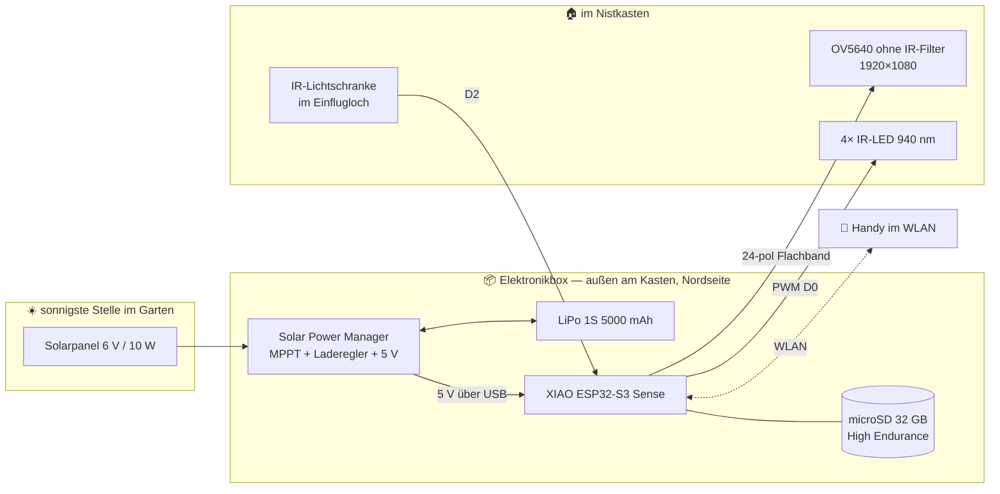

# 🐦 BirdyCam — Nistkasten-Kamera für Vater & Kind

Ein Bauprojekt für eine
solarbetriebene Kamera im Nistkasten mit Nachtsicht, Full-HD-Aufnahmen, Livestream und
einer eigenen Website.

> **Zeitplan-Hinweis vorab:** Gebaut wird **September–Februar**, zugeschaut wird ab März.
> Ein belegter Nistkasten darf nicht geöffnet werden (§ 44 BNatSchG). Das ist keine
> Formalie, sondern bestimmt den ganzen Projektplan. Details in
> [Machbarkeit 1.8](docs/01-machbarkeit.md#18-rechtliches-und-tierschutz).

---

## Es gibt zwei Varianten — gebaut wird **Variante B**

> ✅ **Entscheidung: Variante B (ESP32-S3), ≈ 149 €.** Begründung: Als kleines Projekt
> reichen Livestream, Clips, Statistik und Dashboard. Alles, was darüber hinausgeht
> (Gesangsbestimmung, Artenerkennung), würde ohnehin eine Basisstation im Haus brauchen —
> und damit ein anderes Projekt sein.
>
> **Variante A bleibt als Alternative dokumentiert**, falls das Projekt später wächst:
> [1. Machbarkeit](docs/01-machbarkeit.md) bis [7. Wartung](docs/07-wartung-und-fehlersuche.md)
> beschreiben sie vollständig, der Code liegt in [`software/pi/`](software/pi/).
>
> 👉 **Der Weg für Variante B: [8. Variante ESP32](docs/08-variante-esp32.md)**

Beide sind vollständig ausgeplant. Sie unterscheiden sich in Preis und Videoqualität.

| | **Variante A — Raspberry Pi Zero 2 W** | **Variante B — ESP32-S3** ⭐ gewählt |
|---|---|---|
| **Preis** | **≈ 269 €** | **≈ 155 €** |
| Video | **H.264, 1080p, 15–30 fps** | MJPEG, 1080p bei ~6 fps |
| Clips im Browser abspielbar | ✅ **MP4, direkt klickbar** | ❌ Download + VLC Player |
| 10-Sekunden-Clip | ~5 MB **bei 15 fps** | ~7 MB **bei nur 6 fps** |
| Speicher | **USB-SSD, SD-Karte wird entfernt** | High-Endurance-SD-Karte |
| Verbrauch | 42 Wh/Tag | 15 Wh/Tag |
| Solarpanel | 30 W | 10 W |
| Akku | LiFePO4 12 V / 12 Ah | LiPo 1S 5000 mAh |
| Sprache | Python (gut lesbar) | C++ (näher an der Hardware) |


### Was Variante B beim Video kostet — offen gesagt

Der Pi hat einen Hardware-H.264-Encoder, der ESP32 kann nur Einzelbilder (MJPEG). Bei Full
HD heißt das konkret:

| | Pi (A) | ESP32 (B) |
|---|---|---|
| 1080p-Bildrate | 15–30 | **~6** |
| 10-Sekunden-Clip | ~5 MB | ~7 MB |
| Clip abspielen | Klick im Browser | Download + [VLC](https://www.videolan.org/) |

Der Unterschied steckt **nicht in der Dateigröße, sondern in der Bildrate**: Beide landen
bei ~0,5–0,7 MB/s, nur liefert H.264 dafür 15–30 Bilder/s statt 6. Für dieselbe Flüssigkeit
bräuchte MJPEG etwa das Dreifache an Platz — und das kann die SD-Karte nicht schreiben.

**Full HD funktioniert bei Variante B — es ruckelt aber.** Zwei Gegenmaßnahmen stecken im
Plan:

1. **Stream ODER Aufnahme, nie beides.** Ein Bild geht entweder ins WLAN oder auf die
   SD-Karte. Genau die Trennung, die für dieses Projekt gewünscht war — und sie ist bei
   Full HD technisch notwendig, weil die SD-Karte am ESP32 nur ~1,2 MB/s schreibt.
2. **JPEG-Qualität 18 statt 12.** Bringt die SD-Auslastung von über 100 % auf 67 %.
   Sichtbar kaum ein Unterschied.

**Und ein Fund, der die Sache entspannt:** Das gut lieferbare OV2640-Nachtsichtmodul kann
1600×1200 = **1,92 Megapixel** — gegen 2,07 bei Full HD. Das sind **7 % Unterschied**, dafür
die doppelte Bildrate (8–12 statt 6). Die Firmware ist deshalb auf `FRAMESIZE_UXGA`
voreingestellt. Details in [9.0](docs/09-bestellliste.md#90-️-die-eine-entscheidung-die-du-vorher-treffen-musst).

Wer echtes 16:9 will, nimmt ein OV5640-Modul und stellt `FRAMESIZE_FHD` ein — beides ist
vorbereitet.

📄 **Der Weg für Variante B: [8. Variante ESP32](docs/08-variante-esp32.md).** Die Kapitel
[3. Schaltplan](docs/03-schaltplan.md) und [4. Bauplan](docs/04-bauplan.md) gelten für beide
Varianten.

---

## Was gebaut wird (Variante B — die gewählte)



**Zwei Betriebsarten, die sich abwechseln:**

```
   Niemand schaut zu          Jemand ruft die Website auf
   ─────────────────────      ───────────────────────────
   ⏺ AUFNAHMEBEREIT           📹 STREAM
   Kamera → Vorlaufpuffer     Kamera → WLAN, Full HD
   Auslöser → Clip auf SD     Aufnahme pausiert
   Lichtschranke zählt        Lichtschranke zählt weiter
```

*(Diagramm für Variante A steht in [1. Machbarkeit](docs/01-machbarkeit.md).)*

### Die IR-Lichtschranke ist der beste Teil

Ein Infrarot-Strahl quer durch das Einflugloch. Fliegt ein Vogel durch, bricht er ihn.
Zwei Vorteile gegenüber reiner Bilderkennung:

1. **Exaktes Zählen.** Kein Sonnenfleck, kein wackelnder Ast löst aus. Die Besuchszahlen
   auf der Website sind echte Zahlen, nicht Schätzungen.
2. **Ein-/Ausflug unterscheidbar** — und damit die Aufenthaltsdauer im Kasten.

Kostet 6 € und braucht Mikrowatt.

---

## Anforderungen: was erfüllt wird

| # | Anforderung | **Variante B (gewählt)** | Variante A |
|---|---|---|---|
| 1 | Tag- und Nachtsicht | ✅ | ✅ |
| 2 | Livestream beim Verbinden | ✅ 1600×1200 (1,92 MP) | ✅ |
| 3 | Clips bei Bewegung, Round-Robin | ✅ 1600×1200, ~2,4 s Vorlauf | ✅ |
| 4 | Clips nur, wenn nicht gestreamt wird | ✅ eingebaut | (nicht nötig) |
| 5 | Statistik + Dashboard | ✅ inkl. Akku & Systemzustand | ✅ |
| 6 | **Router *oder* eigenes WLAN** | ✅ beides, automatisch umschaltend | nur Router |
| 6 | Stabiler Speicher (kein SD-Tod) | ✅ High-Endurance-SD, kein OS auf der Karte | ✅ SSD, keine SD im Betrieb |
| — | Vogelgesang | ⬜ Code liegt bereit, abgeschaltet | ⬜ nicht vorgesehen |
| — | Artenerkennung | ⬜ gestrichen | ⬜ gestrichen |

Gesang und Artenerkennung sind **gestrichen** — beides würde ohnehin eine Basisstation im
Haus brauchen und ist damit ein eigenes Projekt. Die Begründung mit Zahlen steht in
[Machbarkeit 1.7](docs/01-machbarkeit.md#17-was-bewusst-fehlt-und-warum).

> **Zur Speicherfrage:** Die SD-Karte ist hier weniger kritisch als befürchtet, weil auf
> einem ESP32 **kein Betriebssystem** auf der Karte liegt — keine Logs, kein Swap, kein
> Journal. Sie sieht nur große, zusammenhängende Schreibvorgänge. Details und Rechnung in
> [8.8](docs/08-variante-esp32.md#88-speicher--warum-die-sd-karte-hier-hält).

---

## Die Dokumente, in Leseordnung

### Für Variante B — den gewählten Weg

| Dokument | Inhalt |
|---|---|
| [1. Machbarkeit](docs/01-machbarkeit.md) | Strom-, Speicher- und Ertragsrechnung | 
| [2. Stückliste](docs/02-stueckliste.md) → Abschnitt **Variante B** | Teile mit Kauflinks, ≈ 149 € |
| **[8. Variante ESP32](docs/08-variante-esp32.md)** ⭐ | **Schaltplan, Tutorial, Firmware — der Hauptweg** | gemeinsam |
| **[9. Bestellliste](docs/09-bestellliste.md)** 🛒 | **Nach Shop gruppiert, zum Abhaken** | 
| [3. Schaltplan](docs/03-schaltplan.md) | IR-LEDs, Lichtschranke, Kamera-Regeln (gilt für beide) |
| [4. Bauplan](docs/04-bauplan.md) | Einbau in Kasten, Panel-Montage, Maße (gilt für beide) | 

### Für Variante A — die dokumentierte Alternative

| Dokument | Inhalt |
|---|---|
| [5. Software-Tutorial](docs/05-software-tutorial.md) | 8 Schritte, Raspberry Pi |
| [6. Website & Daten](docs/06-website-und-daten.md) | Website, Ringspeicher, SQLite |
| [7. Wartung & Fehlersuche](docs/07-wartung-und-fehlersuche.md) | Jahresrhythmus, Fehlertabellen |

*Kapitel 7 lohnt sich auch für Variante B — der Jahresrhythmus und die Wartungsliste gelten
unabhängig von der Hardware.*

## Der Code

| Ordner | Für | Inhalt |
|---|---|---|
| [`software/firmware/birdycam/`](software/firmware/birdycam/) | **Variante B** ⭐ | Arduino-Firmware, 10 Module |
| [`software/firmware/steps/`](software/firmware/steps/) | **Variante B** ⭐ | 7 Lern-Sketches zum Einzeltesten |
| [`software/pi/`](software/pi/) | Variante A | Python-Programm, Website, systemd-Dienst, Installer |

---

## Aufwand

Für Variante B (ESP32):

| Phase | Zeit |
|---|---|
| Teile bestellen | 30 min |
| Arduino IDE einrichten | 30 min |
| Lern-Sketches 1–4 (Board, SD, **erstes Livebild**, IR-Licht) | 2 h |
| Lern-Sketches 5+7 (Akku kalibrieren, Lichtschranke) | 1 h |
| Fertige Firmware, Feineinstellung | 1 h | 
| Einbau in Kasten + Panel montieren | 2–3 h | 
| Feinjustierung, Empfindlichkeit, Deko | über Wochen | 

Das erste Livebild kommt in **Sketch 3** — nicht am Ende. Das ist absichtlich so gebaut.

---

## Wenn du nur fünf Minuten hast

1. Der Kasten bekommt eine **Kamera ohne Infrarot-Filter** (Full HD), vier unsichtbare
   IR-LEDs und eine **Lichtschranke im Einflugloch**, die Vögel exakt zählt.
2. Ein **XIAO ESP32-S3 Sense** macht alles: Stream, Aufnahme, Statistik, Website. Kein
   Rechner im Haus nötig.
3. **Stream und Aufnahme wechseln sich ab.** Schaut jemand zu → Full-HD-Stream. Schaut
   niemand zu → Clips auf die SD-Karte, mit 3 Sekunden Vorlauf.
4. **Zwei Netzwerk-Betriebsarten, beide eingebaut:** Sie hängt sich an deinen **Router**
   (sparsam, vom Sofa erreichbar) **oder** macht ihr **eigenes WLAN** auf (autark, überall
   im Garten, ohne Router). `NETZ_AUTO` probiert erst den Router und schaltet sonst selbst
   um. ⚡ Eigenes WLAN kostet ~40 % mehr Strom → dann **15-W-Panel statt 10 W**.
5. **Solar + LiPo 5000 mAh.** Der ESP32 braucht nur 0,7 W — deshalb reicht ein kleines
   Panel. Für Regenwochen gibt es eine USB-Notlade-Buchse.
5. **Full HD ruckelt** (~6 Bilder/s). Eine Zeile in `config.h` macht daraus SVGA mit
   ~15 Bildern/s — falls Flüssigkeit doch wichtiger ist.
6. Gebaut wird im **Winter**, geschaut wird im **Frühling**. Ab März bleibt der Kasten zu.

→ Los geht's mit **[8. Variante ESP32](docs/08-variante-esp32.md)**
(Hintergrund und Rechnungen: [1. Machbarkeit](docs/01-machbarkeit.md))
