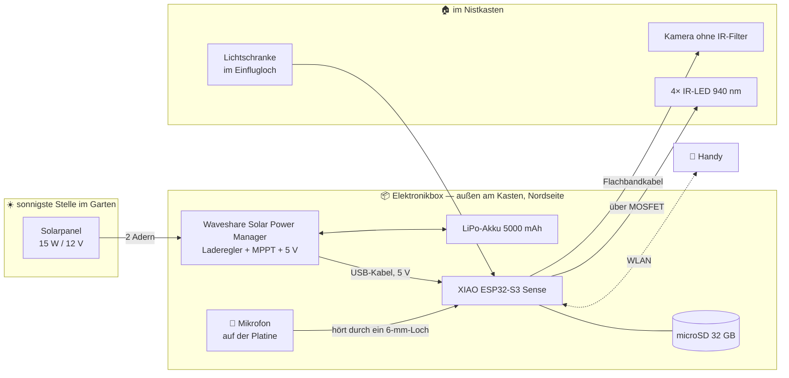

# 1. Überblick — was gebaut wird und warum es funktioniert

Dieses Kapitel beantwortet die Fragen, die man **vor** dem Bestellen hat: Was kann das Ding
am Ende? Was kann es nicht? Reicht die Sonne wirklich? Und darf man das überhaupt?

Wenn du direkt loslegen willst, ist das auch in Ordnung — dann geh gleich zur
[2. Stückliste](02-stueckliste.md) und zur [8. Bestellliste](08-bestellliste.md).

---

## 1.1 Was BirdyCam ist

Eine **Kamera im Nistkasten**, die mit Sonne läuft und eine eigene Website hat.

| Sie kann… | Wie |
|---|---|
| 👀 **live zusehen** | Handy ins WLAN, Adresse aufrufen, fertig |
| 🌙 **auch nachts sehen** | unsichtbares Infrarotlicht, das die Vögel nicht stört |
| 🎬 **automatisch Clips aufnehmen** | mit 2–3 Sekunden Vorlauf, damit der Anflug drauf ist |
| 🔊 **Ton aufnehmen** | Mikrofon sitzt schon auf der Platine. Bettelnde Junge sind laut |
| 🔢 **Vögel zählen** | eine Lichtschranke im Einflugloch — echte Zahlen, keine Schätzung |
| 📊 **Statistik führen** | Besuche pro Stunde, Aufenthaltsdauer, Verlauf über 30 Tage |
| ☀️ **monatelang allein laufen** | Solarpanel und Akku, kein Kabel zum Haus |

**Kosten:** ungefähr 200 € an der Kasse, inklusive Versand über mehrere Shops.
**Bauzeit:** ein Wochenende für die Elektronik, ein zweites für den Einbau.
**Vorkenntnisse:** keine. Das ist der Anspruch dieser Anleitung.

### Es braucht keinen Computer im Haus

Das ist der Punkt, der viele überrascht: Der ganze Aufbau steckt in einem Bauteil von der
Größe einer Briefmarke — dem **XIAO ESP32-S3 Sense**. Der macht alles selbst: filmen,
hören, rechnen, funken, Website ausliefern. Es läuft kein Server, es gibt keine Cloud, kein
Abo und keine App.

---

## 1.2 Wie das Ganze funktioniert



### Zwei Betriebsarten, die sich abwechseln

```
   Niemand schaut zu               Jemand ruft die Website auf
   ─────────────────────────       ────────────────────────────
   ⏺ AUFNAHMEBEREIT                📹 LIVESTREAM
   Kamera → Vorlaufpuffer          Kamera → ins WLAN
   Bewegung → Clip auf SD-Karte    Aufnahme pausiert
   Lichtschranke zählt             Lichtschranke zählt weiter
   Mikrofon → Tonspur im Clip      Mikrofon → Ton ins WLAN
```

**Warum nicht beides gleichzeitig?** Weil ein Bild entweder ins WLAN geht **oder** auf die
Speicherkarte. Beides zusammen ist mehr, als die Karte schreiben kann — dann fehlen Bilder
im Clip. Die Umschaltung passiert automatisch, du merkst davon nichts.

**Zwei Kleinigkeiten, die bewusst so sind:**

1. **Gezählt wird auch beim Zuschauen.** Die Statistik soll keine Löcher haben, nur weil
   gerade jemand zuguckt.
2. **Der erste Clip nach dem Zuschauen hat keinen Vorlauf.** Während des Streams wird der
   Vorlaufspeicher nicht gefüllt; er braucht danach ein paar Sekunden.

### Router oder eigenes WLAN — beides geht

```
   ROUTER-BETRIEB                       EIGENES WLAN
   ─────────────────────────            ──────────────────────────
   📱 ──── 🏠 Router ──── 📷            📱 ──────────────── 📷
      Handy   Heimnetz   Kamera            Handy      Kamera macht
                                                      ein eigenes WLAN auf
   ✅ sparsamer                         ✅ funktioniert überall
   ✅ Uhrzeit kommt aus dem Internet    ✅ kein Router nötig
   ✅ vom Sofa aus erreichbar           ⚠️ etwa 40 % mehr Stromverbrauch
   ⚠️ braucht WLAN-Empfang am Kasten    ⚠️ nur in Funkreichweite im Garten
```

Ab Werk steht die Kamera auf **`NETZ_AUTO`**: Sie probiert zuerst deinen Router, und wenn
der nicht da ist, macht sie ihr eigenes WLAN auf. So kommst du immer dran.

**Die Uhrzeit im eigenen WLAN:** Da gibt es kein Internet und damit keinen Zeitserver.
Deshalb schenkt der **erste Besucher der Website** der Kamera die Uhrzeit seines Handys —
das passiert automatisch beim Öffnen der Seite. Praktische Folge: Nach einem Neustart im
eigenen WLAN einmal die Website aufrufen, dann stimmen die Zeitstempel wieder.

---

## 1.3 Die Lichtschranke — die beste Idee im ganzen Plan

Statt Bewegung nur im Bild zu suchen, geht ein Infrarot-Strahl quer durch das Einflugloch.
Fliegt ein Vogel durch, bricht er ihn.

| | Nur Bilderkennung | Mit Lichtschranke |
|---|---|---|
| Sonnenfleck wandert durch den Kasten | ❌ Fehlalarm | ✅ wird ignoriert |
| Blattschatten flackert | ❌ Fehlalarm | ✅ wird ignoriert |
| Vogel fliegt ein | ✅ erkannt | ✅ erkannt, **exakt** |
| Ein- oder Ausflug? | ❌ nicht unterscheidbar | ✅ zählbar |
| Aufenthaltsdauer | ❌ Schätzung | ✅ echte Messung |
| Stromverbrauch | 0,4 W | fast nichts |
| Preis | 0 € | 3 € |

**Benutzt werden beide**, weil sie Verschiedenes sehen: Die Lichtschranke merkt das Kommen
und Gehen, die Bilderkennung merkt Bewegung *innerhalb* des Kastens — Küken füttern, Nest
umbauen. Gezählt wird aber nur die Lichtschranke. Deshalb sind die Zahlen auf der Website
belastbar.

Einbau: [Bauplan 4.4](04-bauplan.md#44-die-lichtschranke-einbauen) ·
Anschluss: [Schaltplan 3.7](03-schaltplan.md#37-die-lichtschranke-im-einflugloch)

---

## 1.4 Das Video — ehrlich gesagt

Hier ist der einzige Punkt, an dem dieser Aufbau spürbar Kompromisse macht. Das gehört
gesagt, bevor du bestellst.

**Der ESP32 kann Video nicht komprimieren wie eine Handykamera.** Er kann nur sehr schnell
Einzelfotos machen und die aneinanderhängen. Das heißt **MJPEG**. Ergebnis:

| | Was du bekommst |
|---|---|
| Auflösung | 1600 × 1200 (1,92 Megapixel) — praktisch so viel Detail wie Full HD |
| Bilder pro Sekunde | **8 bis 12** — Fernsehen hat 25. Es ruckelt also sichtbar |
| Jedes Einzelbild | gestochen scharf |
| Clip abspielen | **nicht** direkt im Browser. Herunterladen und mit [VLC](https://www.videolan.org/) öffnen |
| Ton im Clip | ✅ ja, als zweite Spur in derselben Datei |

**Das Ruckeln ist der Preis, das Bild selbst ist gut.** Du siehst alles, was passiert — es
sieht nur aus wie ein Daumenkino statt wie ein Film.

**Willst du es flüssiger?** Eine einzige Zeile in
[`config.h`](../software/firmware/birdycam/config.h) ändern:

```cpp
#define BILD_GROESSE    FRAMESIZE_SVGA    // 800x600, dafür ~15 Bilder/s
```

Kleineres Bild, dafür flüssiger. Du kannst das jederzeit hin- und herstellen, auch später
noch — es ist eine Softwareeinstellung, keine Hardwarefrage.

> **Warum die Clips nicht im Browser laufen:** Browser können MJPEG-Dateien nicht abspielen.
> Das ist keine Einstellung, die man ändern könnte, sondern eine Eigenschaft des Formats.
> VLC ist kostenlos und spielt sie auf jedem Gerät.

---

## 1.5 Nachtsicht — wie man im Dunkeln sieht

Zwei Dinge sind nötig, und beide stecken im Plan:

1. **Eine Kamera ohne Infrarot-Filter.** Jede normale Kamera hat ein winziges Filterglas
   über dem Sensor, das Infrarot wegfiltert — genau das macht sie nachts blind. Unser Modul
   hat dieses Glas nicht („no IR filter“, „night vision“, „NoIR“).
2. **Eigenes Infrarotlicht.** Das hier ist **keine Wärmebildkamera**. Ohne die IR-LEDs sieht
   sie in völliger Dunkelheit exakt gar nichts.

### 940 nm oder 850 nm?

Beides sind Wellenlängen von Infrarotlicht. Vögel sehen bis etwa 700 nm — **beide Varianten
sind für den Vogel unsichtbar**. Es ist also keine Tierschutzfrage, sondern eine technische:

| | **940 nm** (unsere Wahl) | 850 nm |
|---|---|---|
| Für **Menschen** sichtbar? | nein | schwaches rotes Glimmen, wenn man direkt hineinschaut |
| Für **Vögel** sichtbar? | nein | nein |
| Wie gut die Kamera es sieht | etwa halb so gut | **voll** |
| Nachtbild bei gleicher LED-Stärke | dunkler | **heller** |

**Der Plan nimmt 940 nm**, weil genug Reserve da ist: Die LEDs laufen ab Werk auf nur ~30 %
(`IR_HELLIGKEIT 75` von 255). Ist das Nachtbild zu dunkel, drehst du einfach hoch — bis zur
dreifachen Helligkeit ist Luft.

Reicht das nicht, in dieser Reihenfolge probieren: `IR_HELLIGKEIT` hoch → mehr LEDs (6 statt
4) → auf 850 nm wechseln.

### Was man nachts realistisch sieht

Graustufen, etwas körnig, Vögel und Bewegung klar erkennbar. **Farben gibt es nachts nicht**
— im Infrarotbereich existiert keine Farbe. Das ist Physik, keine Einstellungssache.

---

## 1.6 Rechnet die Stromversorgung?

Kurz: **Ja, für die Brutsaison von März bis Juli.** Das ist genau die sonnige Hälfte des
Jahres — der Grund, warum Solar hier überhaupt aufgeht.

### Was verbraucht wird

| Betriebsart | Verbrauch am Gerät |
|---|---|
| Router-Betrieb, mit Ton | **≈ 16 Wh am Tag** |
| Eigenes WLAN, mit Ton | **≈ 22 Wh am Tag** |

Zum Vergleich: Eine LED-Lampe mit 6 Watt verbraucht das in unter drei Stunden. Der ganze
Nistkasten braucht also ungefähr so viel Strom wie eine Schreibtischlampe, die eine
Viertelstunde am Tag brennt.

### Was das Panel liefert

Als Faustregel liefert ein unverschattetes Modul in Mitteleuropa pro Tag zwischen dem
**0,5-fachen** (Dauerregen) und dem **4,5-fachen** (klarer Maitag) seiner Nennleistung in
Wattstunden.

Und dazwischen geht etwas verloren: Der Laderegler lädt mit etwa 78 % Wirkungsgrad in den
Akku und gibt mit etwa 86 % wieder heraus. Unterm Strich kommen rund **zwei Drittel** der
Panelernte beim XIAO an.

| Tag im Frühling | Panel liefert | davon kommt an | reicht für 16 Wh? |
|---|---|---|---|
| Dauerregen, sehr trüb | 7 Wh | 5 Wh | ❌ Akku muss ran |
| bedeckt | 22 Wh | 15 Wh | 🟡 gerade so |
| durchwachsen | 38 Wh | 25 Wh | ✅ Überschuss |
| sonniger Maitag | 68 Wh | 45 Wh | ✅ deutlich mehr als genug |

**Das 15-W-Panel ist bewusst großzügig gewählt.** An Sonnentagen ist es überdimensioniert —
genau das ist der Punkt: An **trüben** Tagen zählt jedes Watt, und im März sind die meisten
Tage trüb.

### Der Akku überbrückt die Nacht und die Regentage

Der LiPo-Akku mit 5000 mAh speichert 18,5 Wh, davon nutzbar etwa 14 Wh. Das reicht bei
völliger Dunkelheit für **knapp einen Tag**. Weil aber selbst ein Regentag noch etwas
liefert, kommt man real auf **ungefähr eineinhalb bis zwei trübe Tage**.

**Drei Wege, wenn eine Regenwoche kommt** — in dieser Reihenfolge:

| Maßnahme | Bringt | Kostet |
|---|---|---|
| `NETZ_MODUS NETZ_ROUTER` statt `NETZ_AUTO` | 22 → 16 Wh/Tag | 0 € |
| `AP_NACHTS_AUS true` (falls doch eigenes WLAN) | −2,5 Wh/Tag | 0 € |
| **Powerbank an die USB-Buchse des Ladereglers** | füllt den Akku komplett | 0 €, falls im Haus |
| Akku mit 10 000 mAh statt 5 000 | doppelte Reserve | +12 € |

> ⭐ **Der praktischste Punkt ist die Powerbank.** Der Laderegler hat neben dem Solareingang
> eine ganz normale Micro-USB-Buchse. Powerbank anstecken, Akku füllt sich. Wenn du beim
> Bauen ein kurzes USB-Kabel nach außen legst, musst du dafür nicht einmal die Box öffnen.

### Drei Dinge, die die Stromversorgung kaputt machen können

1. **Panel im Schatten.** Nistkästen hängen gern halbschattig unter Bäumen — genau falsch
   für Solar. Das Panel gehört deshalb **nicht an den Kasten**, sondern per Kabel an die
   sonnigste erreichbare Stelle: Schuppendach, Zaunpfosten, Garagenwand.
   Siehe [Bauplan 4.6](04-bauplan.md#46-solarpanel-montieren).
2. **Hitze.** Ein Akku über 45 °C altert schnell. Die Elektronikbox sitzt deshalb auf der
   **Nordseite** im Schatten.
3. **Frost.** Lithium-Akkus mögen es nicht, unter 0 °C geladen zu werden. Im März gibt es
   Nachtfrost. Praktisch ist das selten ein Problem, weil bei Frost nachts sowieso nicht
   geladen wird und es tagsüber in der Sonne wärmer ist.

---

## 1.7 Was bewusst fehlt — und warum

### Vogelgesang mit Artnamen

**Nicht vorgesehen.** *Ton aufnehmen* kann die Kamera sehr wohl — Clips und Livestream haben
Bild und Ton. Was fehlt, ist die **Bestimmung**: Welcher Vogel singt da gerade?

Der Grund ist Rechenleistung. Das dafür übliche Programm heißt BirdNET, kennt über 6000
Arten und braucht mindestens einen Raspberry Pi 4 — ein Gerät, das dauerhaft am Stromkabel
hängt. In einen batteriebetriebenen Bastelcomputer passt das nicht.

> **Und es müsste auch gar nicht am Kasten hängen.** Ein Mikrofon hört ohnehin den ganzen
> Garten und nicht nur den Nistkasten. Wer Gesangsbestimmung will, stellt sich später
> [BirdNET-Go](https://github.com/tphakala/birdnet-go) auf einen Pi am Hausfenster. Das ist
> ein eigenes, gutes zweites Projekt — und der Nistkasten bleibt dabei unverändert.

### Artenerkennung im Bild

**Auch nicht vorgesehen** — und sie wäre im Nistkasten wenig wert:

1. **In einem Nistkasten brütet genau ein Paar.** Sechs Wochen lang dieselbe Blaumeise. Die
   Statistik „welche Arten besuchen den Kasten“ hätte einen einzigen Eintrag.
2. **Nachts ist alles grau.** Erkennungsmodelle sind auf Farbfotos trainiert.
3. **Der Vogel ist zu nah und halb verdeckt.** Man sieht einen Rücken, einen Flügel, aus
   20 cm Entfernung.

**Was du stattdessen bekommst:** Anflüge pro Stunde, Aufenthaltsdauer, erster und letzter
Anflug, Verlauf über die ganze Brutzeit. Die Fütterfrequenz steigt dramatisch, sobald die
Küken schlüpfen — **das ist die Kurve, an der man den Schlupftag sieht.** Kein Artenmodell
liefert etwas Vergleichbares.

Wer echte Artenerkennung will, braucht eine zweite Kamera **am Futterhaus**: Farbe,
Tageslicht, Seitenansicht, 20 und mehr Arten. Auch das ein schöner Ausbau — siehe
[7.6](07-wartung-und-fehlersuche.md#76-wenn-das-projekt-größer-werden-soll).

---

## 1.8 Rechtliches und Tierschutz

Nistkästen mit Kamera sind in Deutschland erlaubt. Aber **§ 44 BNatSchG** schützt heimische
Vogelarten vor *erheblicher Störung* während der Brut- und Aufzuchtzeit, und Brutstätten
dürfen nicht beschädigt werden.

Daraus folgen drei ganz praktische Regeln:

### 1. Gebaut wird September bis Februar. Punkt.

Die meisten heimischen Singvögel fangen im **März** an. Ist der Kasten belegt, wird er
**nicht** geöffnet — auch nicht „kurz zum Kabel nachziehen“.

> ⚠️ **Wer im April merkt, dass die Kamera schief hängt, muss bis zum Herbst warten.**
> Das ist keine Formalie, sondern der Grund, warum diese Anleitung so viel Wert auf
> **Testen vor dem Einbau** legt. Zwei Wochen Probebetrieb auf dem Tisch sind Pflicht,
> nicht Kür.

### 2. Kein sichtbares Licht im Kasten

Nur 940-nm-Infrarot und der IR-Strahl der Lichtschranke. Beides sieht der Vogel nicht. Der
XIAO hat zwar eine kleine Betriebs-LED, die sitzt aber in der Box **außerhalb** des Kastens.

### 3. Keine Wärme, kein Lärm, kein Geruch im Kasten

Im Nistraum liegen nur Kamera, vier IR-LEDs, die Lichtschranke und Kabel. Bastelcomputer,
Akku und Laderegler sitzen in der Box **außen an der Wand**.

---

## 1.9 Speicher — warum die SD-Karte hier hält

Eine berechtigte Sorge: SD-Karten in Dauerbetrieb sterben gern. **Hier ist das Problem
deutlich kleiner, als man denkt** — und zwar aus einem Grund, den man kennen sollte.

**Warum SD-Karten in Raspberry-Pi-Projekten kaputtgehen:** nicht wegen der Videos, sondern
wegen des **Betriebssystems**. Systemprotokolle im Sekundentakt, Auslagerungsdatei,
Dateisystem-Journal, unsauberes Ausschalten mitten im Schreiben.

**Ein ESP32 hat kein Betriebssystem auf der Karte.** Keine Protokolle, keine Auslagerung,
kein Journal. Die Karte sieht ausschließlich große, zusammenhängende Schreibvorgänge: ein
Clip, ein Bild. Genau das, wofür Speicherkarten gebaut sind.

| Was am Tag geschrieben wird | Menge |
|---|---|
| Bewegungsclips (etwa 60 Stück) | ~384 MB |
| Tonspur in den Clips | ~16 MB |
| Vogelfotos (etwa 200) | ~16 MB |
| Statistik und Tagesarchiv | < 1 MB |
| **Summe** | **≈ 0,4 GB am Tag** |

Über eine Brutsaison von fünf Monaten sind das rund **60 GB**. Eine
**High-Endurance-Karte** (Dashcam-Klasse) verträgt mehrere Terabyte — also viele Jahre.

Dazu kommen drei Maßnahmen in der Software:

1. **Ringspeicher mit festen Dateinamen.** Ist der Ring voll, wird die älteste Datei
   überschrieben. Der Ordner wächst nie, und es werden nie Dateien angelegt und gelöscht.
2. **Jede Datei wird sofort geschlossen.** Ein Stromausfall kostet dann höchstens den einen
   gerade laufenden Clip — nie die ganze Karte.
3. **Die Karte meldet ihre Geschwindigkeit** auf der Website, damit man merkt, wenn sie
   schwächelt.

> **Und wenn sie doch stirbt?** Karte tauschen, 12 €. Die Firmware legt Ordner und Ring
> automatisch neu an. Was wichtig war, hast du längst heruntergeladen — die Karte ist
> Puffer, kein Archiv.

---

## 1.10 Wo es realistisch klemmen wird

Ehrliche Liste. Für jeden Punkt gibt es eine Gegenmaßnahme im Plan.

| Risiko | Wie wahrscheinlich | Was dagegen im Plan steht |
|---|---|---|
| **WLAN reicht nicht bis zum Kasten** | **hoch** | Vor dem Bau mit dem Handy am Kastenplatz nachsehen. Sonst: eigenes WLAN oder ein Repeater |
| **Kameramodul kommt mit IR-Filter** | mittel | Zwei Module bestellen und **vor** dem Einbau testen ([8.9](08-bestellliste.md#89-wareneingangs-prüfung)) |
| **Software läuft beim ersten Mal nicht durch** | **hoch** | Deshalb sieben einzeln testbare Lern-Sketches statt einem großen Programm |
| Flachbandkabel der Kamera bricht | mittel | Zugentlastung, nicht knicken, Ersatzmodul auf Lager |
| Akku leer nach einer Regenwoche | mittel | Powerbank an die USB-Buchse des Ladereglers |
| Lichtschranke löst nicht aus oder immer | mittel | Justierbar, [Sketch 7](05-software.md#52-die-sieben-lern-sketches) zeigt es live an |
| Beschlagene Linse | mittel | Silikagel in der Box, Acrylscheibe, Kamera nicht an der Außenwand |
| **Spinnennetz vor der Linse** 🕷️ | **hoch** | Klassiker. Im September putzen (Wartungsplan) |
| Zu viele Fehlalarme durch Sonnenflecken | mittel | Empfindlichkeit einstellbar — und die **Zählung** kommt von der Lichtschranke, bleibt also sauber |

---

## 1.11 Fazit

**Machbar, für rund 200 €, ohne Vorkenntnisse und ohne Computer im Haus.**

Das Video ruckelt — das ist der ehrliche Preis dieser Bauweise. Alles andere ist da:
Nachtsicht, Ton, Livestream, Clips mit Vorlauf, eine echte Besuchsstatistik und eine
Website, die man vom Sofa aus aufruft.

Und was der Nistkasten wirklich erzählen kann — wann geflogen wird, wie oft, wie lange, und
wann die Küken geschlüpft sind — liefert dieser Aufbau vollständig. Die Lichtschranke macht
diese Zahlen sogar belastbarer, als es reine Bilderkennung könnte.

---

### Quellen

- [XIAO ESP32S3 Sense — Spezifikation (Seeed Wiki)](https://wiki.seeedstudio.com/xiao_esp32s3_getting_started/)
- [Waveshare Solar Power Manager — Wiki](https://www.waveshare.com/wiki/Solar_Power_Manager)
- [Waveshare Solar Power Manager — Handbuch (PDF)](https://files.waveshare.com/upload/6/6c/Solar_Power_Manager_user_manual_en.pdf)
- [Tagesertrag von Solarmodulen, Faustregel (Öko-Energie)](https://www.oeko-energie.de/shop1/de/Solarstrom/Solarmodule/Solarmodul-Wissen/Leistung--bzw--Ertrag-eines-Solarmodules/)
- [BirdNET-Go — Hardware-Empfehlungen](https://github.com/tphakala/birdnet-go/wiki/hardware)

→ Weiter mit [2. Stückliste](02-stueckliste.md)
