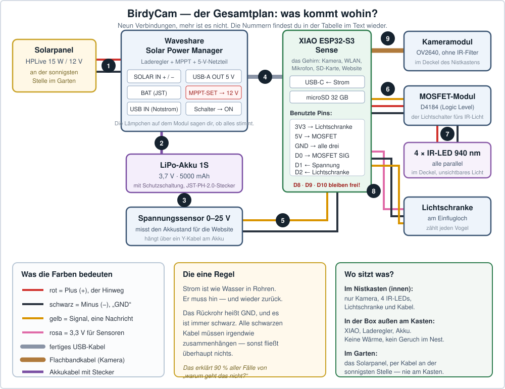
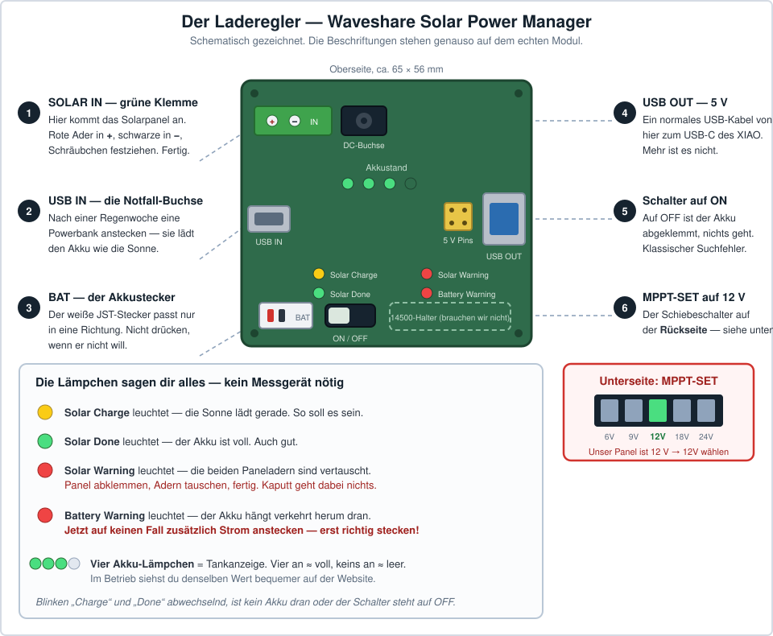
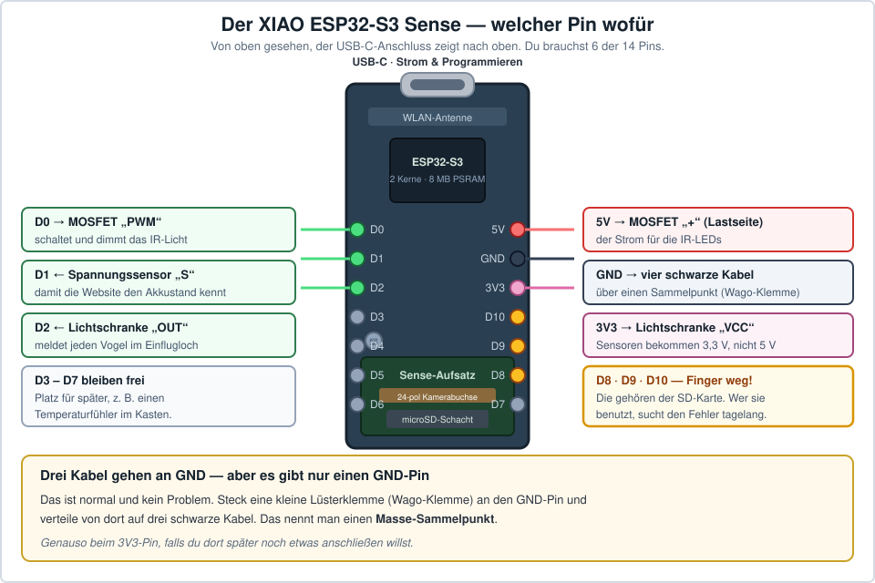
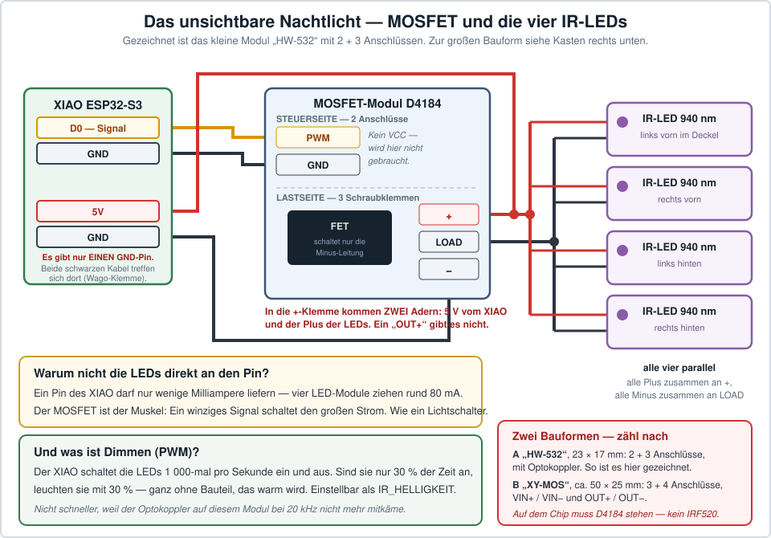

# 3. Schaltplan — wo welches Kabel hinkommt

Dieses Kapitel ist für Menschen geschrieben, die **noch nie etwas verkabelt haben**. Es
erklärt jeden Schritt einzeln, und es gibt zu allem ein Bild.

**Die gute Nachricht zuerst: Es wird nichts gelötet.** Alles wird gesteckt oder mit einem
kleinen Schraubendreher festgeschraubt. Wenn du einen Stecker in eine Buchse schieben und
eine Schraube drehen kannst, kannst du das hier auch.

---

## 3.1 Drei Wörter, und du verstehst jeden Schaltplan

Mehr braucht es wirklich nicht.

### Strom ist wie Wasser in Rohren

Er muss **hin** und wieder **zurück**. Das Hinrohr heißt **Plus (+)** und ist meistens
**rot**. Das Rückrohr heißt **Minus (−)** oder **GND** („Ground“, Masse) und ist meistens
**schwarz**.

> ⭐ **Die wichtigste Regel im ganzen Kapitel:** Alle schwarzen Kabel müssen irgendwie
> zusammenhängen. Sonst fließt gar nichts. Das erklärt neun von zehn Fällen von
> „warum geht das nicht?“.

### Signal ist keine Kraft, sondern eine Nachricht

Ein drittes Kabel überträgt oft weder Plus noch Minus, sondern eine **Information** —
zum Beispiel „jetzt war ein Vogel im Loch“. So ein Kabel heißt **Signal** und wird in
diesem Plan **gelb** gezeichnet. Es heißt auf den Modulen `S`, `SIG`, `OUT`, `PWM` oder
`TRIG` — gemeint ist immer dasselbe.

### Ein Pin ist ein kleiner Metallstift

Auf dem Bastelcomputer stehen 14 solche Stifte. Auf jeden davon passt ein Steckkabel
(„Dupont-Kabel“). Jeder Pin hat einen Namen wie `D0` oder `GND`, und dieser Name steht
auf der Platine — meist ganz klein daneben.

### Und ein Wort noch: Volt

Volt ist der **Druck** im Rohr. Unsere Bauteile arbeiten mit **3,3 Volt** oder **5 Volt**.
Zum Vergleich: Eine Steckdose hat 230 Volt. Alles, was du hier anfasst, ist ungefährlich —
nur der Akku braucht ein bisschen Respekt ([3.11](#311-sicherheit--die-fünf-dinge-die-man-nicht-tut)).

---

## 3.2 Der Gesamtplan — einmal alles auf einem Bild



Neun Verbindungen, das ist alles. Hier stehen sie noch einmal als Liste zum Abhaken:

| # | Von | Nach | Kabel | Schwierigkeit |
|---|---|---|---|---|
| **1** | Solarpanel, rote Ader | Laderegler `SOLAR IN` **+** | die 2 Adern des Panelkabels | schrauben |
| | Solarpanel, schwarze Ader | Laderegler `SOLAR IN` **−** | | |
| **2** | Akku | Laderegler `BAT` | der weiße Stecker am Akku | einstecken |
| **3** | Akku | Spannungssensor | Y-Kabel (siehe [3.8](#38-der-spannungssensor--damit-du-den-akkustand-siehst)) | einstecken |
| **4** | Laderegler `USB-A OUT` | XIAO `USB-C` | ein normales USB-Kabel | einstecken |
| **5** | Spannungssensor `S` | XIAO `D1` | gelbes Steckkabel | stecken |
| | Spannungssensor `−` | XIAO `GND` | schwarzes Steckkabel | |
| **6** | XIAO `D0` | MOSFET `SIG` | gelbes Steckkabel | stecken |
| | XIAO `5V` | MOSFET `VIN+` | rotes Kabel | schrauben |
| | XIAO `GND` | MOSFET `VIN−` | schwarzes Kabel | schrauben |
| **7** | MOSFET `OUT+` / `OUT−` | 4 IR-LEDs, alle parallel | rot / schwarz | schrauben |
| **8** | Lichtschranke `VCC` | XIAO `3V3` | rosa/rotes Steckkabel | stecken |
| | Lichtschranke `GND` | XIAO `GND` | schwarzes Steckkabel | |
| | Lichtschranke `OUT` | XIAO `D2` | gelbes Steckkabel | |
| **9** | Kameramodul | XIAO, Flachbandbuchse | das Flachbandkabel | vorsichtig! |

> 💡 **Nimm dir das Bild als Ausdruck mit an den Tisch** und hake jede Nummer ab, sobald
> sie steckt. Genau so ist es gemeint.

### Und noch ein Blick von oben: Wer macht eigentlich was?

| Bauteil | Aufgabe in einem Satz |
|---|---|
| **Solarpanel** | fängt Sonne ein |
| **Laderegler** | füllt damit den Akku und macht daraus stabile 5 Volt |
| **Akku** | überbrückt Nacht und Regentage |
| **XIAO ESP32-S3** | das Gehirn: filmt, hört, rechnet, funkt, betreibt die Website |
| **Kameramodul** | das Auge — ohne Infrarot-Filter, damit es nachts sieht |
| **IR-LEDs + MOSFET** | unsichtbares Nachtlicht |
| **Lichtschranke** | zählt Vögel im Einflugloch |
| **Spannungssensor** | sagt dem XIAO, wie voll der Akku ist |
| **microSD-Karte** | speichert Clips und Fotos |

---

## 3.3 Der Laderegler — das Herz der Stromversorgung

Das ist das Bauteil, an dem am meisten dranhängt. Und es ist zum Glück auch das mit den
freundlichsten Beschriftungen.



### Was das Ding überhaupt macht

Ein Solarpanel liefert je nach Wetter mal viel, mal wenig, mal gar nichts. Ein Akku will
aber **ganz genau** geladen werden, sonst nimmt er Schaden. Und der XIAO will **immer
exakt 5 Volt**, egal was gerade draußen los ist.

Der Laderegler ist der Übersetzer dazwischen. Er macht drei Dinge gleichzeitig:

1. **Er lädt den Akku**, so schnell die Sonne es hergibt — und hört rechtzeitig auf.
2. **Er holt aus dem Panel das Beste heraus.** Das nennt man MPPT. Grob gesagt: Er probiert
   dauernd aus, bei welcher Spannung das Panel gerade die meiste Leistung abgibt.
3. **Er macht saubere 5 Volt** für den XIAO — auch nachts, wenn nur der Akku da ist.

### Die vier Handgriffe, in dieser Reihenfolge

**① Den kleinen Schalter auf der Rückseite auf `12V` stellen.**
Er heißt **MPPT-SET** und hat fünf Stellungen: 6V, 9V, 12V, 18V, 24V. Unser Panel ist ein
12-Volt-Panel, also `12V`. Steht er falsch, geht trotzdem alles — es lädt nur langsamer.

**② Den Akku einstecken.**
Der Akku hat einen kleinen weißen Stecker (JST-PH 2.0). Er passt **nur in einer Richtung**
in die Buchse `BAT`. Wenn er nicht will, drehe ihn um — aber drücke nie mit Gewalt.

**③ Den Schalter neben der Akkubuchse auf `ON` schieben.**
Das ist der Hauptschalter für den Akku. Steht er auf `OFF`, passiert gar nichts, und man
sucht sehr lange nach dem Fehler.

**④ Das Solarpanel anschrauben** — siehe [3.4](#34-das-solarpanel-anschließen).

### Wie du siehst, dass es funktioniert — ganz ohne Messgerät

Auf dem Modul sitzen kleine Lämpchen. Die sagen dir alles:

| Lämpchen | Bedeutung | Was tun |
|---|---|---|
| 🟡 **Solar Charge** | Die Sonne lädt gerade | nichts, so soll es sein |
| 🟢 **Solar Done** | Der Akku ist voll | nichts, auch gut |
| 🔴 **Solar Warning** | Die zwei Paneladern sind **vertauscht** | Panel abklemmen, Adern tauschen. Kaputt geht dabei nichts |
| 🔴 **Battery Warning** | Der **Akku** hängt verkehrt herum dran | Sofort abziehen. ⚠️ Jetzt auf keinen Fall zusätzlich Strom anstecken |
| 🟢🟢🟢🟢 | Tankanzeige: vier an ≈ voll, keins an ≈ leer | — |

> ⚠️ **Der einzige Fehler, der wirklich etwas kaputt macht:** Wenn *Battery Warning*
> leuchtet und du zusätzlich das Panel oder ein USB-Netzteil ansteckst. Das steht so auch
> im Handbuch von Waveshare. Also: Leuchtet ein rotes Lämpchen — erst nachsehen, dann
> weitermachen.

**Blinken *Charge* und *Done* abwechselnd?** Dann ist gar kein Akku dran, oder der Schalter
steht auf `OFF`.

### Die Notfall-Buchse

Neben dem Solareingang sitzt eine **Micro-USB-Buchse**. Dort kannst du eine ganz normale
Powerbank oder ein Handy-Netzteil anstecken — und der Laderegler lädt den Akku damit
genauso, wie er es mit der Sonne täte.

Das ist die Rettung für Regenwochen im März. Leg beim Bauen ein kurzes USB-Kabel von dieser
Buchse nach außen ([Bauplan 4.5](04-bauplan.md#45-die-elektronikbox)), dann musst du die
Box dafür nicht einmal öffnen.

---

## 3.4 Das Solarpanel anschließen

Aus dem Panel kommt ein Kabel mit **zwei Adern**: eine für Plus, eine für Minus.

```
   ☀️ Panel  ──────── Kabel ────────  Laderegler
                                       SOLAR IN
   rote Ader   ────────────────────►      +
   schwarze    ────────────────────►      −
```

**So geht es:**

1. Die zwei Adern am Ende **abisolieren** (etwa 6 mm Kunststoff abziehen, mit einer
   Abisolierzange oder vorsichtig mit dem Seitenschneider).
2. Die kleinen Schrauben in der **grünen Klemme** mit einem Schlitzschraubendreher lösen.
3. Rote Ader ins Loch mit dem **+**, schwarze ins Loch mit dem **−**.
4. Schrauben festziehen. Danach kurz an den Adern ziehen — sie müssen halten.

**Welche Ader ist Plus?** Meistens die rote, oder die mit einem aufgedruckten Streifen.
Wenn du unsicher bist, ist das kein Drama: Steck es an, halte das Panel in die Sonne und
schau auf die Lämpchen. Leuchtet **Solar Warning** rot, sind die Adern vertauscht — dann
tauschen. Das Modul verträgt das.

> ⚠️ **Ein Punkt, den du wirklich prüfen solltest:** Auf dem Panel klebt ein Aufkleber mit
> technischen Daten. Dort steht eine Zeile `Voc` oder „Leerlaufspannung“. Dieser Wert muss
> **unter 24 Volt** liegen. Bei einem 12-Volt-Panel stehen dort typisch 18 bis 22 Volt —
> das passt. Steht dort mehr, gehört ein anderes Panel her.

**Warum ein 12-Volt-Panel und kein kleines 5-Volt-Panel?** Weil dieser Laderegler
6 bis 24 Volt annimmt und daraus selbst herunterrechnet, was er braucht. Damit hast du bei
der Panelauswahl freie Hand und musst nicht auf Zehntelvolt achten. Details in
[Überblick 1.6](01-ueberblick.md#16-rechnet-die-stromversorgung).

**Wo das Panel hinkommt** (nicht an den Nistkasten!) steht im
[Bauplan 4.6](04-bauplan.md#46-solarpanel-montieren).

---

## 3.5 Der XIAO ESP32-S3 — welcher Pin wofür



Das Board hat 14 Pins. Du benutzt **sechs** davon:

| Pin | Richtung | Geht an | Farbe im Plan |
|---|---|---|---|
| **3V3** | liefert Strom | Lichtschranke `VCC` | rosa |
| **5V** | liefert Strom | MOSFET `VIN+` | rot |
| **GND** | Rückweg | alle drei Module | schwarz |
| **D0** | sendet | MOSFET `SIG` (IR-Licht an/aus/dimmen) | gelb |
| **D1** | empfängt | Spannungssensor `S` (Akkustand) | gelb |
| **D2** | empfängt | Lichtschranke `OUT` (Vogel!) | gelb |

Frei bleiben **D3 bis D7** — Platz für Erweiterungen, zum Beispiel einen Temperaturfühler.

> ⚠️ **Der häufigste Anfängerfehler in diesem Projekt: D8, D9 oder D10 benutzen.**
> Die gehören der Speicherkarte. Steckt dort etwas anderes, funktioniert plötzlich die
> SD-Karte nicht mehr — und man sucht den Fehler tagelang in der Software.
> **Merksatz: D8, D9, D10 gehören der Speicherkarte.**

### Drei Kabel wollen an GND — es gibt aber nur einen GND-Pin

Das ist normal und kein Problem. Zwei Lösungen:

- **Elegant:** Eine kleine Klemme (Wago-Klemme oder Lüsterklemme) an ein Kabel, das im
  GND-Pin steckt. Von dort gehen drei schwarze Kabel weiter. Das nennt man einen
  **Masse-Sammelpunkt**.
- **Schnell:** Die schwarzen Kabelenden zusammendrehen und gemeinsam in eine Buchsenleiste
  stecken.

Beides funktioniert. Hauptsache, alle schwarzen Kabel hängen am Ende zusammen.

### Wie kommt der Strom ins Board?

Über das **USB-C-Kabel vom Laderegler** — Verbindung ④. Mehr ist es nicht.

Zum **Programmieren** ziehst du dieses Kabel ab und steckst stattdessen das USB-C-Kabel vom
Computer an. Beides gleichzeitig ist nicht nötig und auch nicht schlimm.

---

## 3.6 Das unsichtbare Nachtlicht — MOSFET und IR-LEDs



### Warum ein Extra-Bauteil dazwischen muss

Ein Pin des XIAO darf nur eine winzige Menge Strom liefern — deutlich weniger, als vier
LED-Module brauchen (zusammen ungefähr 80 mA). Würde man die LEDs direkt anstecken, wäre
der Pin überlastet.

Der **MOSFET** löst das. Er ist ein **elektronischer Lichtschalter**: Der XIAO sagt ihm nur
„an“ oder „aus“, und der MOSFET schaltet dann den großen Strom für die LEDs. Genau wie ein
Lichtschalter an der Wand: Dein Finger muss die Kraft für die Deckenlampe nicht selbst
aufbringen.

### Der Anschluss

Das MOSFET-Modul hat **zwei Seiten**:

**Steuerseite** (kleine Steckstifte — hier redet der XIAO mit dem Modul):

| MOSFET | XIAO | Farbe |
|---|---|---|
| `SIG` (auch `PWM` oder `TRIG` genannt) | `D0` | gelb |
| `GND` | `GND` | schwarz |
| `VCC` — **nur falls vorhanden** | `3V3` | rosa |

**Lastseite** (Schraubklemmen — hier fließt der Strom für die LEDs):

| MOSFET | Wohin | Farbe |
|---|---|---|
| `VIN+` | XIAO `5V` | rot |
| `VIN−` | XIAO `GND` | schwarz |
| `OUT+` | Plus aller vier LEDs | rot |
| `OUT−` | Minus aller vier LEDs | schwarz |

**„Alle vier parallel“ heißt:** Alle Plus-Anschlüsse der LEDs zusammen an `OUT+`, alle
Minus-Anschlüsse zusammen an `OUT−`. Nicht hintereinander, sondern nebeneinander — wie vier
Lampen an einer Steckdosenleiste.

### Dimmen ohne Dimmer — das ist ein netter Trick

Der XIAO schaltet die LEDs **20 000 Mal pro Sekunde** ein und aus. Sind sie dabei nur 30 %
der Zeit an, leuchten sie mit 30 % Helligkeit. Das heißt **PWM**, kostet kein einziges
Bauteil, und nichts wird dabei warm.

Eingestellt wird das mit `IR_HELLIGKEIT` in
[`config.h`](../software/firmware/birdycam/config.h) — Standard ist 75 von 255, also
ungefähr 30 %. Ist das Nachtbild zu dunkel, drehst du hoch.

*(Warum 20 000 Mal und nicht 1 000? Weil 1 000 Mal pro Sekunde ein hörbares Pfeifen wäre —
und das Mikrofon hätte es jede Nacht mit aufgenommen.)*

> 🔦 **Netter Test, wenn alles steckt:** Halte die **Frontkamera deines Handys** auf die
> IR-LEDs. Viele Handykameras sehen Infrarot als schwaches violett-weißes Leuchten — deine
> Augen nicht. Ein sehr überzeugender Moment.

> ⚠️ **Beim Kauf:** Auf dem Chip des MOSFET-Moduls muss **D4184** oder **AOD4184** stehen.
> Ein `IRF520`-Modul sieht genauso aus, schaltet aber bei 3,3 Volt nicht richtig durch —
> die LEDs bleiben dann dunkel oder glimmen nur.

---

## 3.7 Die Lichtschranke im Einflugloch


Das ist das schönste Bauteil im ganzen Projekt: ein unsichtbarer Infrarot-Strahl quer durch
das Einflugloch. Fliegt ein Vogel durch, bricht er ihn — und wird gezählt.

### Der Anschluss: drei Kabel

| Lichtschranke | XIAO | Farbe |
|---|---|---|
| `VCC` | **`3V3`** — nicht 5V! | rosa |
| `GND` | `GND` | schwarz |
| `OUT` (manchmal `DO` oder `S`) | `D2` | gelb |

> **Warum 3V3 und nicht 5V?** Weil das Modul sein Signal mit derselben Spannung
> zurückschickt, die es bekommt. Bekommt es 3,3 Volt, schickt es 3,3 Volt zurück — und
> genau das erwartet der Eingang des XIAO. Der ESP32 verzeiht auch 5 Volt meistens, aber
> warum sollte man es darauf ankommen lassen?

### Was das Programm daraus macht

| Ereignis | Wird gewertet als |
|---|---|
| einmal unterbrochen | ein Durchflug |
| zweimal, mit Pause dazwischen | Einflug + Ausflug — die Pause ist die **Aufenthaltsdauer** |
| kürzer als 30 ms | Insekt oder Zittern → ignoriert |
| länger als 2 Sekunden | Blatt oder Schmutz im Loch → ignoriert |

Deshalb sind die Besuchszahlen auf der Website **echte Messwerte** und keine Schätzungen.
Eine reine Bilderkennung würde auch auf wandernde Sonnenflecken anspringen.

**Wo genau sie eingebaut wird** (seitlich neben dem Loch, 5 mm unter der Lochmitte, nie im
Flugweg) steht im [Bauplan 4.4](04-bauplan.md#44-die-lichtschranke-einbauen). **Justiert**
wird sie mit [Sketch 7](05-software.md#schritt-7--die-lichtschranke-justieren).

> 💡 **Die Lichtschranke ist optional.** Ohne sie läuft alles weiter — dann löst nur die
> Bilderkennung aus, und die Besuchszahlen fehlen. In `config.h`:
> `LICHTSCHRANKE_AN false`.

---

## 3.8 Der Spannungssensor — damit du den Akkustand siehst

Der XIAO kann Spannung messen, aber nur bis 3,3 Volt. Der Akku hat bis zu 4,2 Volt — zu
viel. Der Spannungssensor ist deshalb nichts weiter als ein **Teiler**: Er gibt genau ein
Fünftel der Spannung weiter. Aus 4,0 Volt werden 0,8 Volt, und die kann der XIAO messen.
Die Software rechnet dann wieder mal fünf.

```
   🔋 Akku 4,0 V ──► Spannungssensor ──► 0,8 V ──► XIAO D1
                        teilt durch 5
```

### Der Anschluss

Das Modul hat eine **Schraubklemme** (dort kommt die zu messende Spannung rein) und drei
**Steckstifte** (dort geht das Ergebnis raus):

| Am Modul | Wohin |
|---|---|
| Schraubklemme `+` | Akku **Plus** |
| Schraubklemme `−` | Akku **Minus** |
| Stift `S` | XIAO `D1` |
| Stift `−` | XIAO `GND` |
| Stift `+` | bleibt frei |

### Und wie kommt man an den Akku dran, wenn der doch im Laderegler steckt?

Mit einem **JST-PH-2.0-Y-Kabel** (kostet 2–3 €, gibt es im 5er-Pack). Das ist ein Kabel mit
einer Buchse und zwei Steckern:

```
   🔋 Akku ──► [ Y-Kabel ] ──┬──► Laderegler BAT
                             └──► Spannungssensor (Schraubklemme)
```

So bekommen beide dieselbe Spannung, und du musst nichts anlöten oder aufschneiden.

> **Kein Y-Kabel da?** Dann lass den Sensor einfach weg und setze in `config.h`
> `AKKU_MESSEN false`. Alles läuft weiter — auf der Website fehlt dann nur die
> Akkuanzeige. Die vier Lämpchen am Laderegler zeigen den Akkustand trotzdem, nur eben
> erst, wenn man die Box öffnet.

**Vor dem Einbau muss der Sensor einmal kalibriert werden** — das dauert fünf Minuten und
steht in [Sketch 5](05-software.md#52-die-sieben-lern-sketches).

---

## 3.9 Die Kamera — das einzige empfindliche Kabel

Die Kamera hängt an einem **Flachbandkabel**: dünn, biegsam, hellbraun, mit vielen feinen
Leiterbahnen darin. Es ist das einzige Teil in diesem Projekt, das man beim Basteln
wirklich kaputt machen kann.

```
   XIAO Sense                Verlängerung             Kameramodul
   ┌────────────┐            (max. 15 cm)             ┌──────────┐
   │  ▭▭▭▭▭▭▭▭  │══════════════════════════════════════│ ▭▭▭▭▭▭▭  │
   │ 24 Kontakte│                                      │  OV2640  │
   └────────────┘                                      └──────────┘
```

### So öffnest du die Buchse richtig

An der Buchse sitzt ein winziger **schwarzer oder brauner Bügel**. Der muss auf, bevor das
Kabel hineingeht:

1. Bügel mit dem **Fingernagel** vorsichtig nach oben klappen. Er geht leicht, mit ganz
   wenig Kraft.
2. Das Flachbandkabel **gerade** einschieben, bis es nicht weiter geht. Die **blanken
   Kontakte zeigen dabei zur Platine hin**.
3. Bügel wieder nach unten drücken.
4. Vorsichtig am Kabel ziehen. Es muss halten.

### Die drei Regeln

- **Nie knicken.** Sanfte Bögen sind völlig in Ordnung. Eine scharfe Falte trennt die
  Leiterbahnen im Inneren — man sieht es von außen nicht, und die Kamera geht nie wieder.
- **Nie ein- oder ausstecken, solange Strom drauf ist.** Erst USB abziehen.
- **Nicht länger als 15 cm.** Eine längere Verlängerung fängt sich Störungen ein, und das
  Bild rauscht.

> ⚠️ **Bestell ein zweites Kameramodul mit.** Hier geht am ehesten etwas kaputt, und aus
> Asien wartet man sonst mitten im Bau zwei bis vier Wochen. Zehn Euro Versicherung.

**Bild rauscht oder hat Streifen?** In `config.h` `XCLK_MHZ` von 20 auf 10 stellen. Das ist
der Takt, mit dem die Kamera ausgelesen wird — langsamer ist störungsfester.

---

## 3.10 Die Reihenfolge: nicht alles auf einmal

Der wichtigste Rat des ganzen Kapitels: **Steck nicht alles zusammen und schalte dann ein.**
Wenn dann etwas nicht geht, weißt du nicht, woran es liegt.

Stattdessen Stück für Stück, und nach jedem Schritt ein kleines Testprogramm laufen lassen.
Genau dafür gibt es die sieben Lern-Sketches in [Kapitel 5](05-software.md).

| Schritt | Was du ansteckst | Was du testest | Sketch |
|---|---|---|---|
| 1 | nur den XIAO ans USB-Kabel vom Computer | Board meldet sich, LED blinkt | 1 |
| 2 | SD-Karte einschieben | Karte wird erkannt, Schreibtest | 2 |
| 3 | Kameramodul ans Flachband | 🎉 **erstes Livebild im Browser** | 3 |
| 4 | MOSFET + 4 IR-LEDs (Verbindung ⑥ ⑦) | Handykamera sieht die LEDs leuchten | 4 |
| 5 | Spannungssensor (Verbindung ③ ⑤) | Akkuspannung wird angezeigt, kalibrieren | 5 |
| 6 | — (Mikrofon ist schon auf dem Board) | Lautstärkebalken bewegt sich | 6 |
| 7 | Lichtschranke (Verbindung ⑧) | Zähler springt, wenn der Finger durchgeht | 7 |
| 8 | Laderegler, Akku, Panel (Verbindung ① ② ④) | läuft ohne Computer, Akku steigt bei Sonne | fertige Firmware |

> **Warum die Stromversorgung zuletzt kommt:** Solange der Computer per USB versorgt, kannst
> du alles bequem am Schreibtisch testen. Akku und Panel sind der letzte Schritt, nicht der
> erste.

---

## 3.11 Sicherheit — die fünf Dinge, die man nicht tut

Die 3,3- und 5-Volt-Seite ist völlig harmlos: Du kannst alles anfassen, es passiert nichts.
Die Vorsicht gilt dem **Akku**. Ein LiPo-Akku kann kurzzeitig sehr viel Strom liefern.

1. **Den Akku nie kurzschließen.** Also nie die beiden Kontakte mit Metall verbinden, nie
   Werkzeug auf dem Akku ablegen.
2. **Nie mit Gewalt stecken.** Alle Stecker in diesem Projekt passen nur in eine Richtung.
   Wenn es nicht geht, ist es falsch herum.
3. **Bei einem roten Warnlämpchen am Laderegler nichts zusätzlich anstecken** — erst den
   Fehler beheben ([3.3](#33-der-laderegler--das-herz-der-stromversorgung)).
4. **Den Akku nicht quetschen.** Mit Klettband befestigen, nicht mit Kabelbindern
   zusammenschnüren, nicht festkleben. Er soll tauschbar bleiben.
5. **Bläht sich der Akku auf oder wird er heiß:** abziehen, nach draußen auf einen nicht
   brennbaren Untergrund legen, zum Wertstoffhof bringen. Nicht in den Hausmüll.

Und eine Regel, die nichts mit Gefahr zu tun hat, aber viel Ärger spart:
**Vor dem Umstecken immer den Strom abziehen.** Also das USB-Kabel raus, bevor du ein Kabel
umsteckst.

---

## 3.12 Es geht nicht — die häufigsten Verkabelungsfehler

Bevor du in der Software suchst, arbeite diese Liste ab. Fast immer steckt es hier.

| Was du siehst | Was fast immer die Ursache ist |
|---|---|
| **Gar nichts leuchtet, nichts läuft** | Schalter am Laderegler steht auf `OFF`. Oder Akku nicht eingesteckt |
| **Der XIAO startet immer wieder neu** | Schlechtes USB-Kabel. Viele billige Kabel sind reine Ladekabel mit dünnen Adern — ein anderes probieren |
| **Die SD-Karte wird nicht gefunden** | An `D8`, `D9` oder `D10` hängt etwas. Die gehören der Karte |
| **Kein Bild, Kamera meldet Fehler** | Flachbandkabel sitzt nicht richtig, oder der Bügel ist nicht zu. Neu einlegen |
| **Bild ist da, aber verrauscht/gestreift** | Flachband zu lang, oder `XCLK_MHZ` auf 10 stellen |
| **IR-LEDs bleiben dunkel** | MOSFET ist ein `IRF520` statt `D4184`. Oder `SIG` steckt nicht auf `D0`. Oder die LEDs sind verpolt |
| **Akkuanzeige zeigt 0,00 V** | Spannungssensor nicht angeschlossen, oder `S` steckt nicht auf `D1`, oder das schwarze Kabel zu `GND` fehlt |
| **Akkuanzeige zeigt Unsinn** | Sensor ist nicht kalibriert → [Sketch 5](05-software.md#52-die-sieben-lern-sketches) |
| **Vogelzähler läuft ohne Vögel hoch** | Lichtschranke schaut nicht genau geradeaus, oder Sonne blendet den Empfänger. Sonst `LICHTSCHRANKE_INVERTIERT` umstellen |
| **Ein Modul reagiert überhaupt nicht** | Das schwarze GND-Kabel fehlt. **Immer zuerst prüfen.** |
| **Akku wird nie voll** | `MPPT-SET` steht falsch, Panel im Schatten, oder Panel verschmutzt |
| 🔴 **Solar Warning leuchtet** | Die zwei Paneladern sind vertauscht — einfach tauschen |

> **Wenn gar nichts hilft:** Zieh alles ab und baue nur den Schritt wieder auf, der zuletzt
> funktioniert hat ([3.10](#310-die-reihenfolge-nicht-alles-auf-einmal)). Dann einen Schritt
> weiter. Der Fehler steckt fast immer in genau dem Teil, den du zuletzt dazugesteckt hast.

---

→ Weiter mit [4. Bauplan](04-bauplan.md)
