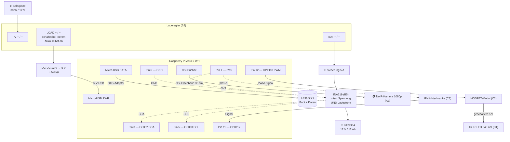

# 3. Schaltplan (Variante A — Raspberry Pi)

Alles wird **gesteckt oder geschraubt**. Der Pi Zero 2 **WH** hat die Stiftleiste schon
angelötet — es gibt in diesem Projekt keine einzige Lötstelle.

> 🧒 **Für den Baumeister:** Strom ist wie Wasser in Rohren. Er muss *hin* und wieder
> *zurück*. Das Zurück-Rohr heißt **GND** (Masse) — schwarz. Alle schwarzen Kabel müssen
> irgendwie zusammenhängen, sonst fließt nichts. Das ist die Regel, die 90 % aller
> „warum geht das nicht?" erklärt.

*(Schaltplan für Variante B steht in [8. Variante ESP32](08-variante-esp32.md#schaltplan).)*

---

## 3.1 Der Gesamtplan



---

## 3.2 Pinbelegung am Raspberry Pi

Der Pi hat 40 Pins. Wir benutzen sieben davon.

```
        Pi Zero 2 WH, von oben, USB-Buchsen unten

          3V3  ( 1) ( 2)  5V
   SDA GPIO2   ( 3) ( 4)  5V
   SCL GPIO3   ( 5) ( 6)  GND
       GPIO4   ( 7) ( 8)  GPIO14
          GND  ( 9) (10)  GPIO15
      GPIO17   (11) (12)  GPIO18   <- PWM für IR-LEDs
      GPIO27   (13) (14)  GND
         ...            ...
```

| Pin | Name | Belegung | Richtung |
|---|---|---|---|
| **1** | 3V3 | → INA219 `VCC`, Lichtschranke `VCC` | Versorgung |
| **3** | GPIO2 / SDA | ↔ INA219 `SDA` | I2C-Daten |
| **5** | GPIO3 / SCL | ↔ INA219 `SCL` | I2C-Takt |
| **6** | GND | → gemeinsame Masse (mehrfach nötig) | Masse |
| **11** | GPIO17 | ← Lichtschranke `OUT` | Eingang |
| **12** | GPIO18 | → MOSFET-Modul `SIG` | Ausgang (PWM) |
| 7 | GPIO4 | frei — z. B. DS18B20 Temperaturfühler | — |
| 9, 14, 20… | GND | weitere Masse-Pins | Masse |

> **GPIO18 ist kein Zufall.** Der Pi hat nur an GPIO12, 13, 18 und 19 einen echten
> **Hardware**-PWM. An allen anderen Pins müsste die Software das Ein-/Ausschalten selbst
> machen — das flackert und kostet Rechenzeit. GPIO18 ist der klassische PWM-Pin.

Masse brauchen wir dreimal (INA219, Lichtschranke, MOSFET). Lösung: ein
**F-F-Dupontkabel** in Pin 6 und mit einer kleinen Schraubklemme auf drei Kabel verteilen —
der „Masse-Sammelpunkt". Oder einfach Pin 6, 9 und 14 einzeln benutzen.

---

## 3.3 ⚠️ Die wichtigste Warnung: 3,3 V, nicht 5 V

**Der Raspberry Pi verträgt an seinen GPIO-Pins maximal 3,3 V. 5 V zerstören ihn** — sofort
und endgültig. Das ist ein Unterschied zu vielen Arduino-Boards, die 5 V aushalten.

Konkret betrifft das die **Lichtschranke**:

```
   RICHTIG:                        FALSCH — tötet den Pi:

   Pi Pin 1 (3V3) ──> VCC          Pi Pin 2 (5V) ──> VCC
   Pi Pin 6 (GND) ──> GND          Pi Pin 6 (GND)──> GND
   OUT ──> Pi Pin 11               OUT (jetzt 5 V!) ──> Pi Pin 11
        (max. 3,3 V) ✅                              ☠️
```

**Regel: Jedes Modul, dessen Ausgang an einen GPIO-Pin geht, wird aus Pin 1 (3V3)
versorgt — nie aus Pin 2 oder 4 (5 V).**

Die IR-LEDs dürfen 5 V bekommen, weil zwischen ihnen und dem Pi das MOSFET-Modul sitzt: Der
Pi steuert nur die kleine Signalseite, die 5 V berühren ihn nie.

---

## 3.4 Die Stromversorgung im Detail

```
   ☀️  Solarpanel 30 W / 12 V
       │  rot (+) / schwarz (−)
       ▼
 ┌────────────────────────────────────────────────────┐
 │  Laderegler (B2)                                   │
 │                                                    │
 │  [PV + / −]     ← Solarpanel                       │
 │  [BAT + / −]    ← Akku (über Sicherung + INA219)   │
 │  [LOAD + / −]   → Verbraucher                      │
 │                                                    │
 │  Vier Aufgaben:                                    │
 │   1. Akku laden, ohne ihn zu überladen             │
 │   2. LiFePO4-Ladeprofil einhalten (3,65 V/Zelle)   │
 │   3. Last abschalten, wenn der Akku leer wird      │
 │   4. Last wieder einschalten, wenn Sonne kommt ⭐   │
 └────────────────────────────────────────────────────┘
       │ LOAD                          ▲ BAT
       ▼                               │
 ┌──────────────┐              ┌───────┴────────┐
 │ DC-DC 12→5 V │              │ Sicherung 5 A  │
 │    3 A       │              └───────┬────────┘
 └──────┬───────┘                      │
        │ USB 5 V              ┌───────┴────────┐
        ▼                      │ INA219  VIN+   │
   Pi Micro-USB PWR            │         VIN−   │
                               └───────┬────────┘
                                       │
                                 🔋 LiFePO4 12 V
```

### Punkt 4 ist der wichtige

Ein Pi, der sich selbst herunterfährt, **startet nicht von allein wieder**. Der Ablauf, der
das löst:

| Akkuspannung | Was passiert |
|---|---|
| fällt auf **11,0 V** | Die Software fährt den Pi **sauber** herunter — Dateisystem bleibt intakt |
| fällt auf **~10,5 V** | Der Laderegler trennt den LOAD-Ausgang (Tiefentladeschutz) |
| steigt auf **~12,5 V** | Laderegler schaltet LOAD wieder ein → **der Pi bootet von selbst** |

Deshalb steht in der Stückliste ausdrücklich „Laderegler **mit Last-Ausgang und
Tiefentladeschutz**". Ein Regler ohne diese Funktion macht das Gerät nach dem ersten
Regenwochenende dauerhaft tot, bis jemand hingeht.

### Warum der INA219 in der Akkuleitung sitzt

Nicht in der Lastleitung — dort würde er nur den Verbrauch messen. In der **Akkuleitung**
misst er den **Nettostrom**:

- **positiv** = der Akku wird geladen → „die Sonne bringt gerade 0,8 A"
- **negativ** = der Akku wird entladen → „wir verbrauchen 0,2 A"

Das ist die Zahl, an der man sofort sieht, ob die Anlage aufgeht. Auf der Website wird sie
angezeigt.

> 🧒 **Experiment:** Hand über das Panel halten und auf die Website schauen. Der Ladestrom
> bricht sofort ein. Dann eine Wolke abwarten und wieder schauen. So versteht man in fünf
> Minuten, warum das Panel nicht in den Schatten gehört.

---

## 3.5 Die IR-Beleuchtung

```
                      ┌─── MOSFET-Modul D4184 (C2) ───┐
  Pin 12 (GPIO18) ───→│ SIG                            │
  Pin 1  (3V3) ──────→│ VCC          (Steuerseite)     │
  Pin 6  (GND) ──────→│ GND                            │
                      │                                │
  Pin 2  (5V) ───────→│ VIN+   ┌──────┐  OUT+ ├────────┼──→ ┐
  Pin 9  (GND) ──────→│ VIN−   │ FET  │  OUT− ├────────┼──→ │
                      └────────┴──────┴────────────────┘    │
                        ┌───────────────────────────────────┘
                        ▼      alle 4 LEDs parallel
        ┌────────┐  ┌────────┐  ┌────────┐  ┌────────┐
        │ IR-LED │  │ IR-LED │  │ IR-LED │  │ IR-LED │
        │ 940 nm │  │ 940 nm │  │ 940 nm │  │ 940 nm │
        └────────┘  └────────┘  └────────┘  └────────┘
         im Deckel, ca. 15 cm über dem Nestboden
```

**Warum ein MOSFET und nicht direkt der Pin?** Ein GPIO-Pin des Pi darf ~16 mA liefern.
Vier LED-Module ziehen zusammen ~80 mA. Der Pin würde überlastet. Der MOSFET ist ein
elektronischer Schalter: Ein winziger Steuerstrom vom Pin schaltet den großen Strom für die
LEDs — wie ein Lichtschalter, der die Kraft nicht selbst aufbringen muss.

**PWM = Dimmen.** Der Pi schaltet die LEDs ~1000-mal pro Sekunde ein und aus. Bei 30 %
Einschaltdauer sind sie auf 30 % Helligkeit. Kein Bauteil wird warm, es gibt keinen
Dimmwiderstand. Einstellbar in `config.yaml` als `ir_helligkeit`.

> 🧒 **Experiment für später:** Handy-**Frontkamera** auf die LEDs halten. Viele
> Handysensoren *sehen* 940 nm als schwaches violett-weißes Leuchten — unsere Augen nicht.
> Ein sehr überzeugender „unsichtbares Licht gibt es wirklich"-Moment.

---

## 3.6 Die Lichtschranke im Einflugloch

Das Bauteil, das die Statistik ehrlich macht.

```
      Einflugloch von oben, im Schnitt durch die Vorderwand:

         außen                          innen
                ┌───────────────────┐
         ┌──────┤                   ├──────┐
         │ IR-  │   ●───────────●   │  IR- │
         │Sender│    IR-Strahl      │Empf. │
         └──────┤                   ├──────┘
                └───────────────────┘
                    Ø 28–32 mm

      Beide Bauteile sitzen in kleinen Bohrungen SEITLICH
      neben dem Einflugloch — nicht im Loch selbst,
      damit der Vogel sie nicht berührt.
```

Anschluss (⚠️ **3,3 V**, siehe [3.3](#33-️-die-wichtigste-warnung-33-v-nicht-5-v)):

| Modul | → Pi |
|---|---|
| `VCC` | Pin 1 (**3V3**, nicht 5 V!) |
| `GND` | Pin 6 |
| `OUT` | Pin 11 (GPIO17) |

**Wie die Software daraus Zahlen macht:** Der Strahl ist normalerweise geschlossen. Ein
Vogel unterbricht ihn für ~100–300 ms. Die Software zählt:

- **eine Unterbrechung** = ein Durchflug
- **zwei Unterbrechungen** mit Pause dazwischen = Einflug + Ausflug → die Pause ist die
  **Aufenthaltsdauer**
- Unterbrechungen unter 30 ms werden ignoriert (Insekten, Zittern)

Justage steht in [Tutorial Schritt 7](05-software-tutorial.md#schritt-7--die-lichtschranke-justieren).

---

## 3.7 Kamera und SSD

### Kamera

```
   Pi Zero: CSI-Buchse       CSI-Kabel 30 cm            Kameramodul
   ┌──────────┐              22-pol 0,5 mm ↔           ┌─────────┐
   │  ▭▭▭▭▭▭  │══════════════ 15-pol 1 mm ═════════════│ ▭▭▭▭▭▭  │
   │  schmal! │                                        │  NoIR   │
   └──────────┘                                        └─────────┘
```

⚠️ **Das Kabel aus der Kamerapackung passt nicht an den Zero.** Der Zero hat eine schmalere
Buchse (22-polig, 0,5 mm Raster) als alle anderen Pi-Modelle. Man braucht das Zero-Kabel
(A3).

**Die drei Regeln:**

- **Nie knicken.** Sanfte Bögen sind in Ordnung, scharfe Falten trennen die Leiterbahnen.
- **Nie im laufenden Betrieb ein-/ausstecken.** Vorher den Pi herunterfahren und
  Strom trennen.
- **Bügel richtig bedienen:** kleinen schwarzen Bügel mit dem Fingernagel nach oben
  klappen, Kabel gerade einschieben bis Anschlag, Bügel nach unten drücken. Es braucht
  **keine** Kraft. Danach vorsichtig ziehen — es muss halten.

### SSD

```
   Pi Zero hat zwei Micro-USB-Buchsen. Sie zu verwechseln
   ist der häufigste Anfängerfehler:

   ┌─────────────────────────────────┐
   │  [PWR]   [DATA/OTG]   [HDMI]    │
   │    ↑          ↑                 │
   │  5 V vom     SSD über           │
   │  DC-DC       OTG-Adapter        │
   └─────────────────────────────────┘

   PWR  = die Buchse AM RAND (nur Strom)
   DATA = die INNERE Buchse (Daten + Strom)
```

Die SSD gehört an **DATA/OTG** (die innere). Kommt sie an PWR, passiert einfach nichts.

---

## 3.8 Zusammenbau-Reihenfolge

Nicht alles auf einmal. Nach jedem Schritt kurz testen — dann weiß man immer, welche
Änderung den Fehler gebracht hat.

| Schritt | Was | Test |
|---|---|---|
| 1 | Pi mit SD-Karte am Handy-Netzteil | Tutorial 1: bootet, WLAN da |
| 2 | SSD an OTG, USB-Boot einrichten | Tutorial 2: bootet ohne SD-Karte |
| 3 | Software installieren | Tutorial 3–4: Website erreichbar |
| 4 | Kamera an CSI | Tutorial 5: Livebild |
| 5 | MOSFET + IR-LEDs | Tutorial 6: Handykamera sieht LEDs |
| 6 | Lichtschranke | Tutorial 7: Zähler springt |
| 7 | INA219 + Akku + Laderegler + Panel | Tutorial 8: Ladestrom auf der Website |
| 8 | Alles ins Gehäuse, in den Kasten | [Bauplan](04-bauplan.md) |

---

## 3.9 Sicherheitsregeln

Kurz, aber bitte einhalten. Der 12-V/12-Ah-Akku ist die einzige echte Gefahrenquelle — er
kann kurzzeitig sehr viel Strom liefern.

1. **Sicherung nicht weglassen.** Sie sitzt direkt am Akku-Plus. Ein Kurzschluss ohne
   Sicherung bringt Kabel zum Glühen.
2. **Akku nie kurzschließen.** Beim Verkabeln immer erst die Masse, dann Plus. Werkzeug
   nicht auf den Akku legen.
3. **Polarität doppelt prüfen**, bevor Strom draufkommt. Rot = Plus, schwarz = Minus.
   Verpolung tötet Laderegler und DC-DC-Wandler sofort.
4. **Reihenfolge beim Anschließen am Laderegler:** erst **Akku**, dann **Panel**, dann
   **Last**. Die meisten Regler erkennen die Systemspannung am Akku — ohne Akku zuerst
   stellen sie sich falsch ein.
5. **Akku auf Klettband, nicht mit Kabelbindern quetschen.**
6. **Nicht unter 0 °C laden** (siehe [1.8](01-machbarkeit.md#drei-dinge-die-das-kaputt-machen-können)).
7. **Bläht sich der Akku oder wird heiß:** abklemmen, nach draußen auf nicht brennbaren
   Untergrund, Wertstoffhof.

> Die 5-V-Seite (Pi, LEDs, Sensoren) ist völlig ungefährlich — anfassen kann man alles.
> Die Vorsicht gilt dem Akku und der 12-V-Seite.

→ Weiter mit [4. Bauplan](04-bauplan.md)
