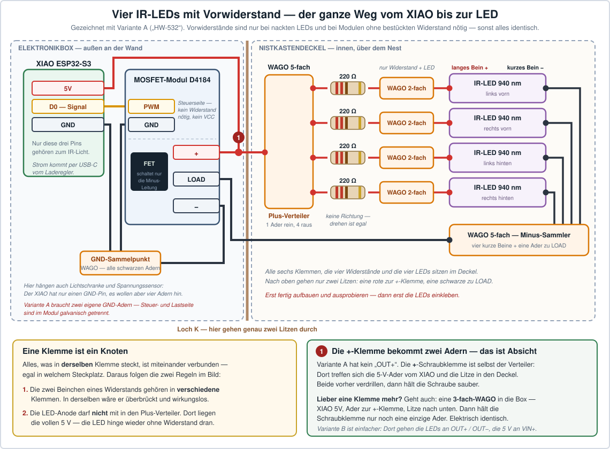

# 3. Schaltplan — wo welches Kabel hinkommt

Dieses Kapitel ist für Menschen geschrieben, die **noch nie etwas verkabelt haben**. Es
erklärt jeden Schritt einzeln, und es gibt zu allem ein Bild.

**Die gute Nachricht zuerst: Es wird nichts gelötet.** Alles wird gesteckt oder mit einem
kleinen Schraubendreher festgeschraubt. Wenn du einen Stecker in eine Buchse schieben und
eine Schraube drehen kannst, kannst du das hier auch.

---

## 3.1 Drei Wörter, und du verstehst jeden Schaltplan

Mehr braucht es wirklich nicht.

### Strom ist wie Wasser in Rohren

Er muss **hin** und wieder **zurück**. Das Hinrohr heißt **Plus (+)** und ist meistens
**rot**. Das Rückrohr heißt **Minus (−)** oder **GND** („Ground“, Masse) und ist meistens
**schwarz**.

> ⭐ **Die wichtigste Regel im ganzen Kapitel:** Alle schwarzen Kabel müssen irgendwie
> zusammenhängen. Sonst fließt gar nichts. Das erklärt neun von zehn Fällen von
> „warum geht das nicht?“.

### Signal ist keine Kraft, sondern eine Nachricht

Ein drittes Kabel überträgt oft weder Plus noch Minus, sondern eine **Information** —
zum Beispiel „jetzt war ein Vogel im Loch“. So ein Kabel heißt **Signal** und wird in
diesem Plan **gelb** gezeichnet. Es heißt auf den Modulen `S`, `SIG`, `OUT`, `PWM` oder
`TRIG` — gemeint ist immer dasselbe.

### Ein Pin ist ein kleiner Metallstift

Auf dem Bastelcomputer stehen 14 solche Stifte. Auf jeden davon passt ein Steckkabel
(„Dupont-Kabel“). Jeder Pin hat einen Namen wie `D0` oder `GND`, und dieser Name steht
auf der Platine — meist ganz klein daneben.

### Und ein Wort noch: Volt

Volt ist der **Druck** im Rohr. Unsere Bauteile arbeiten mit **3,3 Volt** oder **5 Volt**.
Zum Vergleich: Eine Steckdose hat 230 Volt. Alles, was du hier anfasst, ist ungefährlich —
nur der Akku braucht ein bisschen Respekt ([3.11](#311-sicherheit--die-fünf-dinge-die-man-nicht-tut)).

---

## 3.2 Der Gesamtplan — einmal alles auf einem Bild


Neun Verbindungen, das ist alles. Hier stehen sie noch einmal als Liste zum Abhaken:

| # | Von | Nach | Kabel | Schwierigkeit |
|---|---|---|---|---|
| **1** | Solarpanel, rote Ader | Laderegler `SOLAR IN` **+** | die 2 Adern des Panelkabels | schrauben |
| | Solarpanel, schwarze Ader | Laderegler `SOLAR IN` **−** | | |
| **2** | Akku | Spannungssensor, Schraubklemme | Buchsen-Pigtail JST-PH 2.0 — der Sensor ist der Verteiler ([3.8](#38-der-spannungssensor--damit-du-den-akkustand-siehst)) | stecken + schrauben |
| **3** | Spannungssensor, **dieselben** Klemmen | Laderegler `BAT` | Stecker-Pigtail JST-PH 2.0. ⚠️ Vorher Polarität durchmessen | schrauben + einstecken |
| **4** | Laderegler `USB-A OUT` | XIAO `USB-C` | ein normales USB-Kabel | einstecken |
| **5** | Spannungssensor `S` | XIAO `D1` | gelbes Steckkabel | stecken |
| | Spannungssensor `−` | XIAO `GND` | schwarzes Steckkabel | |
| **6** | XIAO `D0` | MOSFET `PWM` (heißt auf manchen Modulen `SIG`) | gelbes Steckkabel | stecken |
| | XIAO `GND` | MOSFET `GND` (Steuerseite) | schwarzes Steckkabel | stecken |
| | XIAO `5V` | MOSFET `+` | rotes Kabel | schrauben |
| | XIAO `GND` | MOSFET `−` | schwarzes Kabel | schrauben |
| **7** | MOSFET `+` / `LOAD` | 4 IR-LEDs, alle parallel | rot / schwarz | schrauben |
| **8** | Lichtschranke `VCC` | XIAO `3V3` | rosa/rotes Steckkabel | stecken |
| | Lichtschranke `GND` | XIAO `GND` | schwarzes Steckkabel | |
| | Lichtschranke `OUT` | XIAO `D2` | gelbes Steckkabel | |
| **9** | Kameramodul | XIAO, Flachbandbuchse | das Flachbandkabel | vorsichtig! |

> 💡 **Nimm dir das Bild als Ausdruck mit an den Tisch** und hake jede Nummer ab, sobald
> sie steckt. Genau so ist es gemeint.

### Und noch ein Blick von oben: Wer macht eigentlich was?

| Bauteil | Aufgabe in einem Satz |
|---|---|
| **Solarpanel** | fängt Sonne ein |
| **Laderegler** | füllt damit den Akku und macht daraus stabile 5 Volt |
| **Akku** | überbrückt Nacht und Regentage |
| **XIAO ESP32-S3** | das Gehirn: filmt, hört, rechnet, funkt, betreibt die Website |
| **Kameramodul** | das Auge — ohne Infrarot-Filter, damit es nachts sieht |
| **IR-LEDs + MOSFET** | unsichtbares Nachtlicht |
| **Lichtschranke** | zählt Vögel im Einflugloch |
| **Spannungssensor** | sagt dem XIAO, wie voll der Akku ist |
| **microSD-Karte** | speichert Clips und Fotos |

---

## 3.3 Der Laderegler — das Herz der Stromversorgung

Das ist das Bauteil, an dem am meisten dranhängt. Und es ist zum Glück auch das mit den
freundlichsten Beschriftungen.


### Was das Ding überhaupt macht

Ein Solarpanel liefert je nach Wetter mal viel, mal wenig, mal gar nichts. Ein Akku will
aber **ganz genau** geladen werden, sonst nimmt er Schaden. Und der XIAO will **immer
exakt 5 Volt**, egal was gerade draußen los ist.

Der Laderegler ist der Übersetzer dazwischen. Er macht drei Dinge gleichzeitig:

1. **Er lädt den Akku**, so schnell die Sonne es hergibt — und hört rechtzeitig auf.
2. **Er holt aus dem Panel das Beste heraus.** Das nennt man MPPT. Grob gesagt: Er probiert
   dauernd aus, bei welcher Spannung das Panel gerade die meiste Leistung abgibt.
3. **Er macht saubere 5 Volt** für den XIAO — auch nachts, wenn nur der Akku da ist.

### Die vier Handgriffe, in dieser Reihenfolge

**① Den kleinen Schalter auf der Rückseite auf `12V` stellen.**
Er heißt **MPPT-SET** und hat fünf Stellungen: 6V, 9V, 12V, 18V, 24V. Unser Panel ist ein
12-Volt-Panel, also `12V`. Steht er falsch, geht trotzdem alles — es lädt nur langsamer.

**② Den Akku einstecken.**
Der Akku hat einen kleinen weißen Stecker (JST-PH 2.0). Er passt **nur in einer Richtung**
in die Buchse `BAT`. Wenn er nicht will, drehe ihn um — aber drücke nie mit Gewalt.

> Zum Ausprobieren steckst du ihn hier direkt ein. Beim endgültigen Aufbau sitzt der
> **Spannungssensor dazwischen** — er ist gleichzeitig der Verteiler, damit er und der
> Laderegler beide am Akku hängen. Wie das geht, steht in
> [3.8](#38-der-spannungssensor--damit-du-den-akkustand-siehst).

**③ Den Schalter neben der Akkubuchse auf `ON` schieben.**
Das ist der Hauptschalter für den Akku. Steht er auf `OFF`, passiert gar nichts, und man
sucht sehr lange nach dem Fehler.

**④ Das Solarpanel anschrauben** — siehe [3.4](#34-das-solarpanel-anschließen).

### Wie du siehst, dass es funktioniert — ganz ohne Messgerät

Auf dem Modul sitzen kleine Lämpchen. Die sagen dir alles:

| Lämpchen | Bedeutung | Was tun |
|---|---|---|
| 🟡 **Solar Charge** | Die Sonne lädt gerade | nichts, so soll es sein |
| 🟢 **Solar Done** | Der Akku ist voll | nichts, auch gut |
| 🔴 **Solar Warning** | Die zwei Paneladern sind **vertauscht** | Panel abklemmen, Adern tauschen. Kaputt geht dabei nichts |
| 🔴 **Battery Warning** | Der **Akku** hängt verkehrt herum dran | Sofort abziehen. ⚠️ Jetzt auf keinen Fall zusätzlich Strom anstecken |
| 🟢🟢🟢🟢 | Tankanzeige: vier an ≈ voll, keins an ≈ leer | — |

> ⚠️ **Der einzige Fehler, der wirklich etwas kaputt macht:** Wenn *Battery Warning*
> leuchtet und du zusätzlich das Panel oder ein USB-Netzteil ansteckst. Das steht so auch
> im Handbuch von Waveshare. Also: Leuchtet ein rotes Lämpchen — erst nachsehen, dann
> weitermachen.

**Blinken *Charge* und *Done* abwechselnd?** Dann ist gar kein Akku dran, oder der Schalter
steht auf `OFF`.

### Die Notfall-Buchse

Neben dem Solareingang sitzt eine **Micro-USB-Buchse**. Dort kannst du eine ganz normale
Powerbank oder ein Handy-Netzteil anstecken — und der Laderegler lädt den Akku damit
genauso, wie er es mit der Sonne täte.

Das ist die Rettung für Regenwochen im März. Leg beim Bauen ein kurzes USB-Kabel von dieser
Buchse nach außen ([Bauplan 4.5](04-bauplan.md#45-die-elektronikbox)), dann musst du die
Box dafür nicht einmal öffnen.

---

## 3.4 Das Solarpanel anschließen

Aus dem Panel kommt ein Kabel mit **zwei Adern**: eine für Plus, eine für Minus.

```
   ☀️ Panel  ──────── Kabel ────────  Laderegler
                                       SOLAR IN
   rote Ader   ────────────────────►      +
   schwarze    ────────────────────►      −
```

**So geht es:**

1. Die zwei Adern am Ende **abisolieren** (etwa 6 mm Kunststoff abziehen, mit einer
   Abisolierzange oder vorsichtig mit dem Seitenschneider).
2. Die kleinen Schrauben in der **grünen Klemme** mit einem Schlitzschraubendreher lösen.
3. Rote Ader ins Loch mit dem **+**, schwarze ins Loch mit dem **−**.
4. Schrauben festziehen. Danach kurz an den Adern ziehen — sie müssen halten.

**Welche Ader ist Plus?** Meistens die rote, oder die mit einem aufgedruckten Streifen.
Wenn du unsicher bist, ist das kein Drama: Steck es an, halte das Panel in die Sonne und
schau auf die Lämpchen. Leuchtet **Solar Warning** rot, sind die Adern vertauscht — dann
tauschen. Das Modul verträgt das.

> ⚠️ **Ein Punkt, den du wirklich prüfen solltest:** Auf dem Panel klebt ein Aufkleber mit
> technischen Daten. Dort steht eine Zeile `Voc` oder „Leerlaufspannung“. Dieser Wert muss
> **unter 24 Volt** liegen. Bei einem 12-Volt-Panel stehen dort typisch 18 bis 22 Volt —
> das passt. Steht dort mehr, gehört ein anderes Panel her.

**Warum ein 12-Volt-Panel und kein kleines 5-Volt-Panel?** Weil dieser Laderegler
6 bis 24 Volt annimmt und daraus selbst herunterrechnet, was er braucht. Damit hast du bei
der Panelauswahl freie Hand und musst nicht auf Zehntelvolt achten. Details in
[Überblick 1.6](01-ueberblick.md#16-rechnet-die-stromversorgung).

**Wo das Panel hinkommt** (nicht an den Nistkasten!) steht im
[Bauplan 4.6](04-bauplan.md#46-solarpanel-montieren).

---

## 3.5 Der XIAO ESP32-S3 — welcher Pin wofür


Das Board hat 14 Pins. Du benutzt **sechs** davon:

| Pin | Richtung | Geht an | Farbe im Plan |
|---|---|---|---|
| **3V3** | liefert Strom | Lichtschranke `VCC` | rosa |
| **5V** | liefert Strom | MOSFET `+` (Lastseite) | rot |
| **GND** | Rückweg | **vier** schwarze Kabel — siehe unten | schwarz |
| **D0** | sendet | MOSFET `PWM` (IR-Licht an/aus/dimmen) | gelb |
| **D1** | empfängt | Spannungssensor `S` (Akkustand) | gelb |
| **D2** | empfängt | Lichtschranke `OUT` (Vogel!) | gelb |

Frei bleiben **D3 bis D7** — Platz für Erweiterungen, zum Beispiel einen Temperaturfühler.

> ⚠️ **Der häufigste Anfängerfehler in diesem Projekt: D8, D9 oder D10 benutzen.**
> Die gehören der Speicherkarte. Steckt dort etwas anderes, funktioniert plötzlich die
> SD-Karte nicht mehr — und man sucht den Fehler tagelang in der Software.
> **Merksatz: D8, D9, D10 gehören der Speicherkarte.**

### Vier Kabel wollen an GND — es gibt aber nur einen GND-Pin

Der XIAO hat genau **einen** GND-Pin in der Stiftleiste. Dorthin wollen:

| # | Von | Warum |
|---|---|---|
| 1 | MOSFET `GND` (**Steuerseite**) | Rückweg für das Signal von `D0` |
| 2 | MOSFET `−` (**Lastseite**) | Rückweg für den LED-Strom |
| 3 | Lichtschranke `GND` | Rückweg für Versorgung und Signal |
| 4 | Spannungssensor `−` | Rückweg für das Messsignal |

> 🔑 **Warum der MOSFET zwei GND-Kabel braucht und nicht eins.** Beim kleinen Modul
> „HW-532“ sind Steuerseite und Lastseite durch den Optokoppler **galvanisch getrennt** —
> das ist ja gerade sein Zweck. Innen gibt es keine Verbindung zwischen `GND` und `−`.
> Jede der beiden Seiten braucht darum ihren eigenen Rückweg. Lässt du einen weg, passiert
> je nachdem gar nichts oder die LEDs bleiben dunkel.
>
> Beim großen Modul „XY-MOS“ (Variante B) ist das anders: Dort sind `GND` und `VIN−` intern
> derselbe Anschluss, ein Kabel genügt. Dann sind es insgesamt drei statt vier.

**So löst man das** — beides funktioniert:

- **Elegant:** Eine kleine Klemme (Wago-Klemme oder Lüsterklemme) an ein Kabel, das im
  GND-Pin steckt. Von dort gehen die vier schwarzen Kabel weiter. Das nennt man einen
  **Masse-Sammelpunkt**.
- **Schnell:** Die schwarzen Kabelenden zusammendrehen und gemeinsam in eine Buchsenleiste
  stecken.

Hauptsache, alle schwarzen Kabel hängen am Ende zusammen. Elektrisch ist es völlig egal,
wo sie sich treffen — Hauptsache, sie treffen sich.

> ⚠️ **Der häufigste Fehler beim Sammelpunkt:** Ein Kabel rutscht heraus und man merkt es
> nicht, weil die anderen drei Module weiterlaufen. Wenn *ein* Modul nicht reagiert und
> alles andere geht — immer zuerst hier nachsehen.

### Wie kommt der Strom ins Board?

Über das **USB-C-Kabel vom Laderegler** — Verbindung ④. Mehr ist es nicht.

Zum **Programmieren** ziehst du dieses Kabel ab und steckst stattdessen das USB-C-Kabel vom
Computer an. Beides gleichzeitig ist nicht nötig und auch nicht schlimm.

---

## 3.6 Das unsichtbare Nachtlicht — MOSFET und IR-LEDs


### Warum ein Extra-Bauteil dazwischen muss

Ein Pin des XIAO darf nur eine winzige Menge Strom liefern — deutlich weniger, als vier
LED-Module brauchen (zusammen ungefähr 80 mA). Würde man die LEDs direkt anstecken, wäre
der Pin überlastet.

Der **MOSFET** löst das. Er ist ein **elektronischer Lichtschalter**: Der XIAO sagt ihm nur
„an“ oder „aus“, und der MOSFET schaltet dann den großen Strom für die LEDs. Genau wie ein
Lichtschalter an der Wand: Dein Finger muss die Kraft für die Deckenlampe nicht selbst
aufbringen.

### Zuerst: Welche Bauform hast du? Zähl die Anschlüsse

Es gibt zwei ganz verschiedene Platinen, die beide als „D4184-Modul“ verkauft werden. Sie
werden **unterschiedlich angeschlossen**. Zählen genügt:

| | **Variante A — „HW-532“** (die häufigste) | **Variante B — „XY-MOS“** |
|---|---|---|
| Größe | winzig, 23 × 17 mm | groß, ca. 50 × 25 mm |
| **Steuerseite** | **2** Anschlüsse: `PWM`, `GND` | **3** Stifte: `SIG`, `VCC`, `GND` |
| **Lastseite** | **3** Schraubklemmen: `+`, `LOAD`, `−` | **4** Schraubklemmen: `VIN+`, `VIN−`, `OUT+`, `OUT−` |
| Optokoppler | **ja** — kleiner schwarzer 4-Beiner `PC817` neben dem MOS-Chip | nein |
| Lastspannung laut Hersteller | 5–30 V | 5–36 V |
| An unseren 5 V | **Grenzfall** — siehe Kasten unten | unkritisch |

Auf dem Chip muss bei **beiden** `D4184` oder `AOD4184` stehen. Ein `IRF520` schaltet bei
3,3 V nicht durch.

### Variante A — das kleine Modul mit 2 + 3 Anschlüssen

**Steuerseite** (zwei Anschlüsse, Stiftleiste oder Schraubklemme — hier redet der XIAO mit
dem Modul):

| MOSFET | XIAO | Farbe |
|---|---|---|
| `PWM` | `D0` | gelb |
| `GND` | `GND` | schwarz |

Eine `VCC`-Leitung gibt es hier **nicht** und sie wird auch nicht gebraucht: Das Modul holt
sich alles, was es braucht, von der Lastseite.

**Lastseite** (drei Schraubklemmen `+` · `LOAD` · `−`):

| MOSFET | Wohin | Farbe |
|---|---|---|
| `+` | XIAO `5V` **und** Plus aller vier LEDs | rot (zwei Adern in einer Klemme) |
| `LOAD` | Minus aller vier LEDs | schwarz |
| `−` | XIAO `GND` | schwarz |

> 🔑 **Der Denkfehler, den hier jeder einmal macht:** Man sucht vergeblich nach einem
> `OUT+`. Es gibt keins. Dieses Modul schaltet nur die **Minus**-Leitung der LEDs (das
> heißt „Low-Side“). Der Plus der LEDs geht direkt mit an die `+`-Klemme, zusammen mit dem
> roten Kabel vom XIAO. **Zwei Adern in einer Schraubklemme** — das ist so gewollt. Beide
> Adern vorher verdrillen, dann hält es.
>
> **Magst du keine zwei Adern in einer Schraube?** Dann setz eine **3-fach-Klemme** in die
> Elektronikbox: XIAO `5V`, eine Ader zur `+`-Klemme, und die Litze in den Deckel. Die
> Schraubklemme hält dann nur noch eine einzige Ader. Elektrisch ist beides dasselbe — die
> `+`-Klemme *ist* der Verteilerpunkt, ob mit oder ohne Klemme davor.

### Variante B — das große Modul mit 3 + 4 Anschlüssen

**Steuerseite** (kleine Steckstifte):

| MOSFET | XIAO | Farbe |
|---|---|---|
| `SIG` (auch `PWM` oder `TRIG` genannt) | `D0` | gelb |
| `GND` | `GND` | schwarz |
| `VCC` — **nur falls vorhanden** | `3V3` | rosa |

**Lastseite** (Schraubklemmen):

| MOSFET | Wohin | Farbe |
|---|---|---|
| `VIN+` | XIAO `5V` | rot |
| `VIN−` | XIAO `GND` | schwarz |
| `OUT+` | Plus aller vier LEDs | rot |
| `OUT−` | Minus aller vier LEDs | schwarz |

**„Alle vier parallel“ heißt** (bei beiden Varianten): Alle Plus-Anschlüsse der LEDs
zusammen, alle Minus-Anschlüsse zusammen. Nicht hintereinander, sondern nebeneinander —
wie vier Lampen an einer Steckdosenleiste.

> 💡 **Zwischen XIAO und MOSFET kommt nichts weiter dazwischen.** Kein Vorwiderstand, kein
> Pull-up, nichts: `D0` → `PWM` bzw. `SIG`, `GND` → `GND`, fertig. Der Steuereingang des
> Moduls bringt seinen Widerstand schon auf der Platine mit und zieht nur ein bis drei
> Milliampere — das liefert ein Pin des XIAO mühelos. **Vorwiderstände braucht
> ausschließlich die LED-Seite.**
>
> Das Einzige, was auf der Steuerseite schiefgehen kann, ist eine vergessene Masse: Bei
> **Variante A** sind Steuer- und Lastseite galvanisch getrennt und brauchen **jede ihr
> eigenes** schwarzes Kabel zum XIAO ([3.5](#vier-kabel-wollen-an-gnd--es-gibt-aber-nur-einen-gnd-pin)).

> ⚠️ **Variante A und die 5 Volt — bitte einmal lesen, bevor du bestellst**
>
> Das kleine Modul stellt die Steuerspannung für den MOS-Chip aus der **Lastspannung** her,
> und zwar über einen Spannungsteiler hinter dem Optokoppler: Am Gate landet ungefähr die
> **Hälfte** der Lastspannung. Bei den 12 V, für die diese Module gedacht sind, sind das
> 6 V — reichlich. Bei unseren **5 V sind es nur noch etwa 2,5 V**, und genau dort liegt
> die Einschaltschwelle des AOD4184 (Datenblatt: 1,0–2,5 V).
>
> Im Klartext: Ob es geht, hängt am einzelnen Chip. Die meisten Exemplare schalten bei
> 2,5 V am Gate noch sauber durch, ein ungünstiges Exemplar bleibt dunkel oder glimmt nur.
> **Darum steht Schritt 4 vor dem Einbau** — [`step4_irlicht`](../software/firmware/steps/step4_irlicht/step4_irlicht.ino)
> sagt dir in zwei Minuten, was Sache ist.
>
> **Bleiben die LEDs dunkel oder glimmen sie nur:** nimm **Variante B**. Die treibt das
> Gate direkt aus dem 3,3-V-Signal und ist von der Lastspannung unabhängig. Die beiden
> Module kosten zusammen keine 10 €, und du hast ohnehin meist ein Mehrfachpack.

### Nackte LEDs statt Module? Dann brauchst du vier Vorwiderstände

Die Stückliste sieht **LED-Module** vor (`E9`) — kleine Platinen, auf denen der
Vorwiderstand schon sitzt. Wer stattdessen **nackte 5-mm-LEDs** nimmt, muss diesen
Widerstand selbst dazubauen. Sonst schmort es, und zwar wörtlich.

**Warum das so ist:** Eine LED sucht sich ihren Strom nicht selbst aus. Sie hat eine feste
**Flussspannung** — bei 940 nm rund 1,2 bis 1,5 V — und alles, was darüber hinaus anliegt,
muss irgendein anderes Bauteil im Kreis verbraten. Hängt sie ohne Widerstand an 5 V,
bleiben 3,7 V übrig, für die niemand zuständig ist. Dann fließt so viel Strom, wie Litzen,
Klemmen und MOSFET-Kanal gerade durchlassen: statt 20 mA schnell ein **Ampere**. Die LED
leuchtet dabei — hell sogar —, und der MOSFET wird heiß, weil er als einziges Bauteil mit
nennenswertem Widerstand die Leistung übernimmt.

> ⚠️ **Das PWM-Dimmen rettet hier nichts.** Es verkürzt nur die Einschaltzeit, der
> **Spitzenstrom** bleibt derselbe. Und [Sketch 4](../software/firmware/steps/step4_irlicht/step4_irlicht.ino)
> fährt in Test 1 absichtlich volle 255.

**Die Rechnung** ist eine Zeile — Ohmsches Gesetz, mehr steckt nicht dahinter:

```
R = (5 V − 1,3 V) ÷ 0,020 A ≈ 185 Ω
     │      │         └── der Strom, den du haben willst
     │      └── Flussspannung der LED
     └── deine Versorgung
```

| Widerstand | Strom je LED | Alle vier zusammen | Bauform |
|---|---|---|---|
| **180 Ω** ⭐ | ~20 mA | **82 mA** — genau der Wert, mit dem dieses Kapitel rechnet | ¼ W reicht (0,08 W) |
| 220 Ω | ~17 mA | 67 mA | ¼ W |
| 82 Ω — falls das Nachtbild zu dunkel bleibt | ~45 mA | 180 mA | ½ W nehmen (0,17 W) |

Unter etwa 68 Ω solltest du ohne Datenblatt deiner LEDs nicht gehen.

> 🔑 **Die Regel, an der alles hängt: ein eigener Widerstand pro LED.** Nicht einer für
> alle vier zusammen. Parallelgeschaltete LEDs teilen sich den Strom nämlich *nicht*
> gerecht: Die mit der niedrigsten Flussspannung zieht am meisten, wird dadurch wärmer —
> und weil die Flussspannung mit steigender Temperatur *sinkt*, zieht sie daraufhin noch
> mehr. Das schaukelt sich auf, bis eine LED stirbt. Vier Widerstände zwingen jeden Zweig
> auf seinen eigenen Strom.

**Und wie ohne Löten?** Genau wie der Rest des Projekts — mit Klemmen. Sechs Stück sind
es. Das Bild zeigt den ganzen Weg, vom Pin am XIAO bis zur letzten LED:



> 🔑 **Die eine Regel, aus der sich der ganze Aufbau ergibt: Eine Klemme ist ein Knoten.**
> Alles, was in **derselben** Klemme steckt, ist miteinander verbunden — egal in welchem
> Steckplatz. Daraus folgt beides, was im Bild auf den ersten Blick umständlich aussieht:
>
> 1. Die **zwei Beinchen eines Widerstands** gehören in **verschiedene** Klemmen. Stecken
>    beide in derselben, ist er überbrückt und wirkungslos — und der MOSFET wieder heiß.
> 2. Die **LED-Anode** darf **nicht** mit in den Plus-Verteiler. Dort liegen die vollen
>    5 V, die LED hinge also wieder ohne Widerstand daran.
>
> Deshalb bekommt jede LED ihre eigene kleine 2-fach-Klemme: Dort treffen sich genau zwei
> Dinge — ein Widerstandsbeinchen und ein langes LED-Bein. Sonst nichts.

**Was du dafür brauchst:**

| Anzahl | Klemme | Was hineinkommt |
|---|---|---|
| **1** | WAGO 221, **5-fach** | *Plus-Verteiler:* eine Ader von `MOSFET +`, dazu die vier Widerstandsbeinchen |
| **4** | WAGO 221, **2-fach** | je eine pro LED: das andere Widerstandsbeinchen + das **lange** LED-Bein |
| **1** | WAGO 221, **5-fach** | *Minus-Sammler:* die vier **kurzen** LED-Beine, dazu eine Ader zu `MOSFET LOAD` |
| *(1)* | WAGO 221, **3-fach** | *optional, oben in der Box:* XIAO `5V`, Ader zur `+`-Klemme, Litze in den Deckel — falls du keine zwei Adern in einer Schraubklemme magst |

Das sind die üblichen Größen aus jedem 221er-Set.

- **Langes Bein = Plus (Anode).** Das kurze Bein hat zusätzlich eine abgeflachte Stelle am
  Rand des Kunststoffkragens — das ist Minus. Bei Modulen steht es aufgedruckt, bei nackten
  LEDs musst du hinsehen. Verpolt leuchtet die LED einfach nicht; kaputt geht dabei nichts.
- **Der Widerstand selbst hat keine Richtung.** Beide Beinchen sind gleichwertig, du kannst
  ihn drehen, wie du willst. Die Farbringe haben zwar eine Leserichtung (der Goldring steht
  rechts), aber das ist nur zum **Ablesen** des Werts da, nicht zum Einbauen.
- ⚠️ Nimm **Hebelklemmen (WAGO 221)**. Ein Widerstandsbeinchen hat etwa 0,2 mm² — das hält
  dort sauber. In den steckbaren 773/2273, die für 0,5–2,5 mm² gedacht sind, rutscht es
  wieder heraus.
- **Kürz die Beinchen auf etwa 10 mm**, bevor du sie einklemmst. Lange, biegsame Drähtchen
  brechen mit der Zeit an der Klemme ab — und kompakt muss es im Deckel ohnehin werden.
- **Alles davon gehört mit in den Deckel**, direkt neben die LEDs — nicht nach oben in die
  Elektronikbox. Dann gehen weiterhin nur **zwei** Litzen durch Loch `K`, so wie es der
  [Bauplan 4.3](04-bauplan.md#die-ir-leds-setzen) vorsieht: eine vom Plus-Verteiler zu
  `MOSFET +`, eine vom Minus-Sammler zu `MOSFET LOAD`. Säßen die Widerstände oben, müsstest
  du vier Plus-Leitungen plus eine Masse durchs Loch fädeln.

Wird das Modul **trotz** Vorwiderständen warm, ist es nicht mehr die Last — dann geht es
weiter bei [7.3 „Das MOSFET-Modul wird heiß“](07-wartung-und-fehlersuche.md#das-mosfet-modul-wird-heiß).

### Dein LED-Modul hat drei Pins statt zwei

Viele fertige IR-LED-Module haben eine **dreipolige** Stiftleiste. Das sieht nach „mehr“
aus, ist aber kein Problem: **Einen der drei Pins lässt du einfach frei.** Man muss nur
wissen, welchen — und das findest du in zwei Minuten selbst heraus.

**Warum überhaupt drei?** Weil diese Platinen gar nicht als Lampe gedacht sind, sondern als
**Fernbedienungs-Sender**. Dort kommt das Signal direkt aus einem Controller-Pin, und die
Stiftleiste folgt dem üblichen Dreier-Raster der ganzen Modulfamilie (`VCC` · `GND` · `S`).
Bei den meisten Exemplaren ist einer der drei Pins gar nicht angeschlossen oder hat eine
Sonderaufgabe.

> 💡 **„38 kHz“ auf dem Etikett kannst du ignorieren.** Das ist keine Eigenschaft der
> Platine, sondern die Frequenz, mit der man so eine LED ansteuert, wenn man eine
> Fernbedienung nachbaut. Wir benutzen sie als Lampe. Die 1 000 Hz aus `IR_PWM_FREQUENZ`
> bleiben genau richtig.

> ⚠️ **Der wichtigste Satz dieses Abschnitts: „Modul“ heißt nicht automatisch
> „Vorwiderstand drauf“.** Beim weit verbreiteten **KY-005** ist je nach Revision einer
> bestückt — oder es sind nur zwei leere Lötpads da. Ohne Widerstand ist so ein Modul
> elektrisch **exakt eine nackte LED**, mit allem, was
> [einen Abschnitt weiter oben](#nackte-leds-statt-module-dann-brauchst-du-vier-vorwiderstände)
> dazu steht. Darum wird jetzt gemessen, bevor irgendetwas angeschlossen wird.

**Die Messung — ein Modul, ein Multimeter, zwei Minuten**

Nimm **ein** Modul in die Hand, nichts angeschlossen. Ich nenne die Pins hier `A`, `B`, `C`
(links, Mitte, rechts) — auf die Aufdrucke ist bei diesen Platinen kein Verlass.

**① Multimeter auf Diodentest** (Symbol `⏛` oder `▷|`). Tippe alle drei Paare durch, in
beide Richtungen. Genau **ein** Paar zeigt einen Wert von etwa **1,0 bis 1,3 V** — das ist
die LED.

| Prüfspitze | Der Pin darunter ist |
|---|---|
| **rot** | die **Anode** — Plus |
| **schwarz** | die **Kathode** — Minus |

**② Multimeter auf `Ω`**, zwischen dem **übrig gebliebenen** Pin und der Kathode aus ①:

| Anzeige | Was das bedeutet | Dein Minus-Anschluss ist |
|---|---|---|
| **100 – 1000 Ω** | Ein Vorwiderstand ist da, und er liegt im Pfad dieses Pins | der **dritte Pin** → Fall A |
| **0 Ω, piept** | Der Pin liegt auf derselben Masse, kein Widerstand dazwischen | die **Kathode** → Fall B |
| **∞ oder „OL“** | Der Pin ist gar nicht angeschlossen | die **Kathode** → Fall B |

> 🔑 **Warum diese zweite Messung nicht übersprungen werden darf:** Beim KY-005 sitzt der
> Platz für den Widerstand zwischen dem **mittleren** Pin und der Masse. Der äußere
> Minus-Pin geht direkt auf die Masse und **überbrückt ihn**. Klemmst du dort an, hast du
> den Vorwiderstand wegverdrahtet, ohne es zu merken — und bist genau bei dem Fehler aus
> dem Abschnitt davor.

**Fall A — Vorwiderstand vorhanden**

```
   XIAO 5V   ────  MOSFET +      ←── Anode aller vier Module
   XIAO GND  ────  MOSFET −
                   MOSFET LOAD   ←── dritter Pin aller vier Module

   Der direkte Kathoden-Pin bleibt frei — er würde den Widerstand überbrücken.
```

**Fall B — kein Vorwiderstand**

Das Modul ist elektrisch eine nackte LED, also wird es auch so verkabelt: **180 Ω in jeden
der vier Plus-Zweige**, genau nach dem Bild
[einen Abschnitt weiter oben](#nackte-leds-statt-module-dann-brauchst-du-vier-vorwiderstände).
Anode ans Widerstandsende, Kathode an `LOAD`, der dritte Pin bleibt frei.

**Fall C — kein Pin-Paar zeigt einen sauberen Diodenwert**

Dann sitzt ein **Transistor** auf der Platine, und `VCC` · `GND` · `IN` sind wörtlich
gemeint. So ein Modul hat den Schalter schon eingebaut und gehört deshalb **nicht** auf die
Lastseite des MOSFETs:

| Modul | XIAO |
|---|---|
| `VCC` | `5V` |
| `GND` | `GND` |
| `IN` — alle vier parallel | **`D0`** |

**Der MOSFET entfällt in diesem Fall komplett.** Ein Steuereingang zieht nur Mikroampere,
vier davon sind für einen ESP32-Pin (der bis 40 mA darf) kein Thema. Das Dimmen
funktioniert unverändert, denn das PWM-Signal kommt ja weiterhin aus `D0` — an der Software
ändert sich keine Zeile.

### Dimmen ohne Dimmer — das ist ein netter Trick

Der XIAO schaltet die LEDs **1 000 Mal pro Sekunde** ein und aus. Sind sie dabei nur 30 %
der Zeit an, leuchten sie mit 30 % Helligkeit. Das heißt **PWM**, kostet kein einziges
Bauteil, und nichts wird dabei warm.

Eingestellt wird die Helligkeit mit `IR_HELLIGKEIT` in
[`config.h`](../software/firmware/birdycam/config.h) — Standard ist 75 von 255, also
ungefähr 30 %. Ist das Nachtbild zu dunkel, drehst du hoch.

> **Warum ausgerechnet 1 000 Mal und nicht 20 000?** Wegen des Optokopplers auf
> **Variante A**. Ein PC817 braucht einige Dutzend Mikrosekunden zum Ein- und Ausschalten.
> Bei 20 kHz ist eine ganze Periode nur 50 µs lang — der Optokoppler käme gar nicht
> hinterher, und aus dem Dimmen würde ein unbrauchbarer Matsch. 1 kHz schafft er locker,
> und **Variante B** schafft es sowieso.
>
> Die Frequenz steht als `IR_PWM_FREQUENZ` in `config.h`. Hast du **Variante B** und hörst
> irgendwo ein leises Pfeifen, dreh sie auf `20000` hoch — dann liegt sie über dem, was
> Menschen und Mikrofon hören.

> 🔦 **Netter Test, wenn alles steckt:** Halte die **Frontkamera deines Handys** auf die
> IR-LEDs. Viele Handykameras sehen Infrarot als schwaches violett-weißes Leuchten — deine
> Augen nicht. Ein sehr überzeugender Moment.

### „Schafft das Modul überhaupt vier LEDs?“

Ja — mit sehr viel Luft nach oben. Man hört zu diesen Modulen oft „zwei LEDs, mehr nicht“;
das stimmt hier nicht, und es lohnt sich zu wissen, warum:

| | Wert |
|---|---|
| Vier IR-LED-Module zusammen | **rund 80 mA** |
| Davon bei `IR_HELLIGKEIT` 75/255 im Mittel | rund 25 mA |
| Was der AOD4184 laut Datenblatt kann | **40 V / 50 A** |
| Was die Platine realistisch kann | einige Ampere |

Der Schalter ist also um den **Faktor Hundert** überdimensioniert — daran scheitert nichts.
Die echte Grenze im Projekt ist der **5-V-Zweig**: Der USB-A-Ausgang des Ladereglers
liefert bis 5 V / 2,4 A, davon braucht der XIAO mit Kamera und WLAN in Spitzen schon
gut 400 mA. Für die LEDs bleibt reichlich übrig; selbst die sechs LEDs aus
[2.5](02-stueckliste.md#25-wenn-mehr-budget-da-ist) wären noch unkritisch.

Wo die Zahl „zwei“ herkommt: Wer **Variante A an 5 V** betreibt, hat am Gate nur die halbe
Spannung — der MOS-Chip ist dann nicht voll durchgeschaltet und wird zum Widerstand, statt
zum Schalter. Dann zählt plötzlich jedes Milliampere. Das ist aber kein Argument gegen vier
LEDs, sondern eins für den Test aus Schritt 4 (und notfalls für Variante B).

> ⚠️ **Beim Kauf:** Auf dem Chip des MOSFET-Moduls muss **D4184** oder **AOD4184** stehen.
> Ein `IRF520`-Modul sieht genauso aus, schaltet aber bei 3,3 V nicht richtig durch —
> die LEDs bleiben dann dunkel oder glimmen nur.

---

## 3.7 Die Lichtschranke im Einflugloch


Das ist das schönste Bauteil im ganzen Projekt: ein unsichtbarer Infrarot-Strahl quer durch
das Einflugloch. Fliegt ein Vogel durch, bricht er ihn — und wird gezählt.

### Der Anschluss: drei Kabel

| Lichtschranke | XIAO | Farbe |
|---|---|---|
| `VCC` | **`3V3`** — nicht 5V! | rosa |
| `GND` | `GND` | schwarz |
| `OUT` (manchmal `DO` oder `S`) | `D2` | gelb |

> **Warum 3V3 und nicht 5V?** Weil das Modul sein Signal mit derselben Spannung
> zurückschickt, die es bekommt. Bekommt es 3,3 Volt, schickt es 3,3 Volt zurück — und
> genau das erwartet der Eingang des XIAO. Der ESP32 verzeiht auch 5 Volt meistens, aber
> warum sollte man es darauf ankommen lassen?

### Was das Programm daraus macht

| Ereignis | Wird gewertet als |
|---|---|
| einmal unterbrochen | ein Durchflug |
| zweimal, mit Pause dazwischen | Einflug + Ausflug — die Pause ist die **Aufenthaltsdauer** |
| kürzer als 30 ms | Insekt oder Zittern → ignoriert |
| länger als 2 Sekunden | Blatt oder Schmutz im Loch → ignoriert |

Deshalb sind die Besuchszahlen auf der Website **echte Messwerte** und keine Schätzungen.
Eine reine Bilderkennung würde auch auf wandernde Sonnenflecken anspringen.

**Wo genau sie eingebaut wird** (seitlich neben dem Loch, 5 mm unter der Lochmitte, nie im
Flugweg) steht im [Bauplan 4.4](04-bauplan.md#44-die-lichtschranke-einbauen). **Justiert**
wird sie mit [Sketch 7](05-software.md#schritt-7--die-lichtschranke-justieren).

> 💡 **Die Lichtschranke ist optional — und ab Werk abgeschaltet.** In `config.h` steht
> `LICHTSCHRANKE_AN false`. Ohne sie läuft alles weiter: Ausgelöst wird dann allein über
> die Bilderkennung, und gezählt wird pro Clip statt pro Durchflug. Die Besuchszahlen
> sind damit Schätzungen statt Messwerte.
>
> Wenn du sie später einbaust: Modul anschließen, mit
> [Sketch 7](05-software.md#schritt-7--die-lichtschranke-justieren) justieren, dann
> `LICHTSCHRANKE_AN true` setzen. Vorher nicht — ein offener Eingang zählt sonst
> Phantom-Besuche.

---

## 3.8 Der Spannungssensor — damit du den Akkustand siehst

Der XIAO kann Spannung messen, aber nur bis 3,3 Volt. Der Akku hat bis zu 4,2 Volt — zu
viel. Der Spannungssensor ist deshalb nichts weiter als ein **Teiler**: Er gibt genau ein
Fünftel der Spannung weiter. Aus 4,0 Volt werden 0,8 Volt, und die kann der XIAO messen.
Die Software rechnet dann wieder mal fünf.

```
   🔋 Akku 4,0 V ──► Spannungssensor ──► 0,8 V ──► XIAO D1
                        teilt durch 5
```

### Braucht man ihn überhaupt? Der Laderegler kann doch schon alles

Für die **Sicherheit** des Akkus braucht man ihn nicht — der Laderegler schützt ihn von
sich aus und trennt bei 2,9 V. Was der Laderegler nicht kann: die Zahl herausgeben. Er
hat keinen Datenausgang, nur Lämpchen. Und der XIAO hängt an den geregelten **5 Volt**;
die bleiben 5 Volt, egal wie voll der Akku ist. Von dort ist der Ladezustand
prinzipiell nicht messbar. Deshalb die eigene Messleitung direkt an die Zelle.

Der Sensor bringt damit drei Dinge:

| | mit Sensor | ohne |
|---|---|---|
| Akkustand auf der Website | ✅ | ❌ |
| Lade-Trend („die Sonne lädt gerade“) | ✅ | ❌ |
| Abschaltung | **weich bei 3,40 V**, Statistik wird vorher gesichert | **hart bei 2,9 V** durch den Laderegler |

Die dritte Zeile ist der eigentliche Grund. Die Notbremse des Ladereglers kappt den Strom
irgendwann — womöglich mitten im Schreiben einer Videodatei. Das kostet im besten Fall
das laufende Video, im schlechteren das Dateisystem der Karte. Und 3,40 V ist für einen
LiPo deutlich schonender als 2,9 V.

### Der Anschluss — der Sensor ist selbst der Verteiler

Laderegler **und** Sensor wollen an denselben Akku. Naheliegend wäre ein Y-Kabel —
**such keins.** JST-**PH 2.0**-Splitter gibt es praktisch nicht zu kaufen. Was im
Modellbau als „JST-Y-Kabel“ verkauft wird, ist fast immer der dickere **JST-RCY/BEC** mit
2,5 mm Raster, und der passt nicht in die Akkubuchse des Ladereglers.

Man braucht auch keins. Das Sensormodul hat eine **Schraubklemme**, und in jede Klemme
passen **zwei Adern**. Damit wird der Sensor selbst zum Verteiler:

```
   🔋 Akku ──► [Buchsen-Pigtail] ──► Sensor-Schraubklemme ──► [Stecker-Pigtail] ──► Laderegler BAT
                                             │  + und −
                                             └──► Teiler ──► S ──► XIAO D1
```

Ein **Pigtail** ist ein kurzes Kabel mit JST-PH-2.0-Stecker bzw. -Buchse an einem Ende
und blanken Adern am anderen. Du brauchst je eins von beiden — die gibt es überall im Set
(E8b). Alternativ ein **Verlängerungskabel** Stecker→Buchse kaufen und in der Mitte
durchschneiden; das ergibt genau dieselben zwei Pigtails, und deren AWG24 greift in der
Schraubklemme sogar besser als das übliche dünne AWG26.

| Am Modul | Was hineinkommt |
|---|---|
| Schraubklemme `+` | **beide roten** Adern — Buchsen-Pigtail (vom Akku) *und* Stecker-Pigtail (zum Laderegler) |
| Schraubklemme `−` | **beide schwarzen** Adern, genauso |
| Stift `S` | XIAO `D1` |
| Stift `−` | XIAO `GND` |
| Stift `+` | bleibt frei |

> ⚠️ **Nicht der Farbe vertrauen, sondern dem Pin.** Rot ist bei JST-PH 2.0 *meistens*
> Plus, garantiert ist es nicht — und die beiden Pigtails kommen womöglich aus
> verschiedenen Tüten. Welche Ader wirklich wohin gehört, klärst du in zwei Minuten mit
> dem Multimeter: [Messung 1 und 2](#durchtesten-mit-dem-multimeter--vier-messungen).
> Erst danach anschrauben.

Der Strom für die ganze Kamera fließt jetzt durch diese Klemme hindurch. Das ist kein
Problem — es sind rund 600 mA aus dem Akku, die Klemme kann 10 A. Aber sie gehört beim
Einbau in die Box einmal nachgezogen: Löst sich die Schraube, ist die Kamera aus.

> 💡 **Die dünne Ader rutscht wieder aus der Klemme?** Das abisolierte Ende **doppelt
> zurückfalten**, dann hält es.

### Durchtesten mit dem Multimeter — vier Messungen

Hier lohnt sich das Multimeter wirklich. Ein verpolter Akku ist der eine Fehler in diesem
Projekt, der etwas kosten kann, und man sieht ihn den Steckern nicht an. Die vier
Messungen dauern zusammen zehn Minuten.

Du brauchst zwei Einstellungen am Gerät:

| Stellung | Symbol | Wofür |
|---|---|---|
| **Gleichspannung**, Bereich 20 V | `V⎓` oder `DCV` | Messung 1 und 4 |
| **Durchgangsprüfer** / Widerstand | `•)))` bzw. `Ω` | Messung 2 und 3 |

> ⚠️ **Die eine Regel bei allen Messungen:** Lass die beiden Prüfspitzen nie gleichzeitig
> die rote und die schwarze Ader berühren, solange der Akku dranhängt. Ein 5000-mAh-LiPo
> liefert kurzgeschlossen genug Strom, um Kabel zum Glühen zu bringen. Deshalb messen wir
> unten auch an den **blanken Aderenden** und nicht in den winzigen Steckern herum.

---

**Messung 1 — welche Ader ist wirklich Plus?** *(Akku + Buchsen-Pigtail)*

Steck nur das **Buchsen-Pigtail** auf den Akku, sonst nichts. Der Stecker passt ohnehin
nur in einer Richtung. Jetzt hast du zwei blanke Aderenden, weit genug auseinander.

- `V⎓`, **rote** Prüfspitze an die **rote** Ader, schwarze an die schwarze.
- Zwischen **3,0 und 4,2 V** mit **Pluszeichen** → alles normal, Rot ist Plus.
- Dieselbe Zahl mit **Minuszeichen** davor → die Farben lügen. Bei diesem Pigtail ist
  **Schwarz** der Pluspol. Kommt selten vor, aber es kommt vor. Kleb dir einen Zettel dran.
- **0 V** → der Akku ist tiefentladen oder seine Schutzschaltung hat abgeschaltet. Erst
  über die USB-Buchse des Ladereglers aufwecken, dann weitermessen.

Merk dir, **welche Farbe Plus ist**. Alles Weitere hängt daran.

---

**Messung 2 — haben beide Pigtails dieselbe Belegung?** *(ohne Akku!)*

Das ist die Messung, die den Verpoler verhindert. Buchsen- und Steckerteil kommen
womöglich aus verschiedenen Tüten, und ob der Hersteller Rot auf denselben Pin gelegt
hat, weiß man nicht.

**Akku abziehen.** Dann die beiden Pigtails **ineinanderstecken** — sie passen zusammen.
Jetzt Durchgangsprüfer:

```
   [Buchsen-Pigtail] ═══ ineinandergesteckt ═══ [Stecker-Pigtail]
        rot ●─────────────── piept? ───────────────● rot
```

- Rot ↔ Rot **piept** und Schwarz ↔ Rot **piept nicht** → die Pigtails passen zusammen.
  Rot kommt später an `+`, Schwarz an `−`.
- Rot ↔ **Schwarz** piept → die Belegung ist gedreht. Kein Grund, etwas zurückzuschicken:
  Du schraubst dann eben die **rote** Ader der Buchse und die **schwarze** Ader des
  Steckers in dieselbe Klemme. Entscheidend ist nicht die Farbe, sondern der Pin.

---

**Messung 3 — sitzt alles richtig in der Klemme?** *(verschraubt, aber noch ohne Akku)*

Jetzt beide Pigtails am Sensor anschrauben — nach Messung 1 und 2 weißt du, was wohin
gehört. Akku bleibt draußen. Dann prüfst du die Klemme selbst:

| Messen zwischen | Stellung | Soll |
|---|---|---|
| beiden Adern in der **`+`**-Klemme | `•)))` | **piept** — die Klemme leitet durch |
| beiden Adern in der **`−`**-Klemme | `•)))` | **piept** |
| Klemme **`+`** ↔ Klemme **`−`** | `Ω` | **rund 37 kΩ** |
| Stift **`S`** ↔ Klemme **`−`** | `Ω` | **rund 7,5 kΩ** |

Die 37 kΩ sind der Teiler selbst — 30 kΩ plus 7,5 kΩ in Reihe. Diese Zahl ist doppelt
wertvoll: Sie beweist, dass das Modul heil ist **und** dass zwischen Plus und Minus kein
Kurzschluss liegt. Piept es hier statt zu messen, ist irgendwo ein Kurzer — dann auf
keinen Fall den Akku anstecken.

Zum Schluss an jeder der vier Adern einmal ziehen. Rutscht eine heraus, hätte sie das
später in der Box auch getan.

---

**Messung 4 — stimmt der Teiler?** *(Akku dran, aber `S` noch nicht am XIAO)*

Jetzt darf der Akku rein, und der Schalter am Laderegler auf `ON`. Der Laderegler ist
dabei dein zweiter Zeuge: Leuchtet 🔴 **Battery Warning**, sofort wieder abziehen — dann
stimmt trotz allem die Polarität nicht.

Zwei Werte ablesen, beide mit `V⎓`:

| Messen zwischen | Soll |
|---|---|
| Klemme `+` ↔ Klemme `−` | die echte Akkuspannung, **3,0–4,2 V** |
| Stift `S` ↔ Stift `−` | **ein Fünftel davon**, also 0,6–0,84 V |

> ⛔ **Das ist die Sicherung für den XIAO.** Am Stift `S` dürfen **niemals mehr als
> 3,3 Volt** anliegen. Miss das, **bevor** du `S` an `D1` steckst. Steht dort die volle
> Akkuspannung, ist der Teiler überbrückt oder das Modul defekt — dann würdest du den
> Eingang des XIAO zerstören.

Und wenn du schon misst: **Teile die beiden Zahlen durcheinander.** Genau das ist der
Kalibrierfaktor, den du gleich brauchst — `echte Spannung ÷ Spannung am S-Stift`. Bei
3,92 V und 0,784 V also 5,00. Den Wert trägst du in [Sketch 5](05-software.md#52-die-sieben-lern-sketches)
bei `FAKTOR` und danach in `config.h` bei `BATT_KALIBRIERUNG` ein. Damit ist Schritt 5
der Software schon halb erledigt.

Erst jetzt kommen `S` an `D1` und `−` an `GND`.

> **Sensor ganz weglassen?** Geht. Dann kommt der Akkustecker wie gehabt direkt in den
> Laderegler, und in `config.h` setzt du `AKKU_MESSEN false`. Alles läuft weiter, auf der
> Website fehlt nur die Akkuanzeige. ⚠️ Es gibt dann allerdings **gar keine
> Software-Abschaltung mehr** — du verlässt dich allein auf die 2,9 V des Ladereglers.
> Die vier Lämpchen am Laderegler zeigen den Akkustand weiterhin, nur eben erst, wenn man
> die Box öffnet.

**Vor dem Einbau muss der Sensor einmal kalibriert werden** — das dauert fünf Minuten und
steht in [Sketch 5](05-software.md#52-die-sieben-lern-sketches).

---

## 3.9 Die Kamera — das einzige empfindliche Kabel

Die Kamera hängt an einem **Flachbandkabel**: dünn, biegsam, hellbraun, mit vielen feinen
Leiterbahnen darin. Es ist das einzige Teil in diesem Projekt, das man beim Basteln
wirklich kaputt machen kann.

```
   XIAO Sense                Verlängerung             Kameramodul
   ┌────────────┐            (max. 15 cm)             ┌──────────┐
   │  ▭▭▭▭▭▭▭▭  │══════════════════════════════════════│ ▭▭▭▭▭▭▭  │
   │ 24 Kontakte│                                      │  OV2640  │
   └────────────┘                                      └──────────┘
```

### So öffnest du die Buchse richtig

An der Buchse sitzt ein winziger **schwarzer oder brauner Bügel**. Der muss auf, bevor das
Kabel hineingeht:

1. Bügel mit dem **Fingernagel** vorsichtig nach oben klappen. Er geht leicht, mit ganz
   wenig Kraft.
2. Das Flachbandkabel **gerade** einschieben, bis es nicht weiter geht. Die **blanken
   Kontakte zeigen dabei zur Platine hin**.
3. Bügel wieder nach unten drücken.
4. Vorsichtig am Kabel ziehen. Es muss halten.

### Die drei Regeln

- **Nie knicken.** Sanfte Bögen sind völlig in Ordnung. Eine scharfe Falte trennt die
  Leiterbahnen im Inneren — man sieht es von außen nicht, und die Kamera geht nie wieder.
- **Nie ein- oder ausstecken, solange Strom drauf ist.** Erst USB abziehen.
- **Nicht länger als 15 cm.** Eine längere Verlängerung fängt sich Störungen ein, und das
  Bild rauscht.

> ⚠️ **Bestell ein zweites Kameramodul mit.** Hier geht am ehesten etwas kaputt, und aus
> Asien wartet man sonst mitten im Bau zwei bis vier Wochen. Zehn Euro Versicherung.

**Bild rauscht oder hat Streifen?** In `config.h` `XCLK_MHZ` von 20 auf 10 stellen. Das ist
der Takt, mit dem die Kamera ausgelesen wird — langsamer ist störungsfester.

---

## 3.10 Die Reihenfolge: nicht alles auf einmal

Der wichtigste Rat des ganzen Kapitels: **Steck nicht alles zusammen und schalte dann ein.**
Wenn dann etwas nicht geht, weißt du nicht, woran es liegt.

Stattdessen Stück für Stück, und nach jedem Schritt ein kleines Testprogramm laufen lassen.
Genau dafür gibt es die sieben Lern-Sketches in [Kapitel 5](05-software.md).

| Schritt | Was du ansteckst | Was du testest | Sketch |
|---|---|---|---|
| 1 | nur den XIAO ans USB-Kabel vom Computer | Board meldet sich, LED blinkt | 1 |
| 2 | SD-Karte einschieben | Karte wird erkannt, Schreibtest | 2 |
| 3 | Kameramodul ans Flachband | 🎉 **erstes Livebild im Browser** | 3 |
| 4 | MOSFET + 4 IR-LEDs (Verbindung ⑥ ⑦) | Handykamera sieht die LEDs leuchten — **und ob dein Modul an 5 V durchschaltet** ([3.6](#36-das-unsichtbare-nachtlicht--mosfet-und-ir-leds)) | 4 |
| 5 | Spannungssensor (Verbindung ③ ⑤) | Akkuspannung wird angezeigt, kalibrieren | 5 |
| 6 | — (Mikrofon ist schon auf dem Board) | Lautstärkebalken bewegt sich | 6 |
| 7 | Lichtschranke (Verbindung ⑧) | Zähler springt, wenn der Finger durchgeht | 7 |
| 8 | Laderegler, Akku, Panel (Verbindung ① ② ④) | läuft ohne Computer, Akku steigt bei Sonne | fertige Firmware |

> **Warum die Stromversorgung zuletzt kommt:** Solange der Computer per USB versorgt, kannst
> du alles bequem am Schreibtisch testen. Akku und Panel sind der letzte Schritt, nicht der
> erste.

---

## 3.11 Sicherheit — die fünf Dinge, die man nicht tut

Die 3,3- und 5-Volt-Seite ist völlig harmlos: Du kannst alles anfassen, es passiert nichts.
Die Vorsicht gilt dem **Akku**. Ein LiPo-Akku kann kurzzeitig sehr viel Strom liefern.

1. **Den Akku nie kurzschließen.** Also nie die beiden Kontakte mit Metall verbinden, nie
   Werkzeug auf dem Akku ablegen.
2. **Nie mit Gewalt stecken.** Alle Stecker in diesem Projekt passen nur in eine Richtung.
   Wenn es nicht geht, ist es falsch herum.
3. **Bei einem roten Warnlämpchen am Laderegler nichts zusätzlich anstecken** — erst den
   Fehler beheben ([3.3](#33-der-laderegler--das-herz-der-stromversorgung)).
4. **Den Akku nicht quetschen.** Mit Klettband befestigen, nicht mit Kabelbindern
   zusammenschnüren, nicht festkleben. Er soll tauschbar bleiben.
5. **Bläht sich der Akku auf oder wird er heiß:** abziehen, nach draußen auf einen nicht
   brennbaren Untergrund legen, zum Wertstoffhof bringen. Nicht in den Hausmüll.

Und eine Regel, die nichts mit Gefahr zu tun hat, aber viel Ärger spart:
**Vor dem Umstecken immer den Strom abziehen.** Also das USB-Kabel raus, bevor du ein Kabel
umsteckst.

---

## 3.12 Es geht nicht — die häufigsten Verkabelungsfehler

Bevor du in der Software suchst, arbeite diese Liste ab. Fast immer steckt es hier.

| Was du siehst | Was fast immer die Ursache ist |
|---|---|
| **Gar nichts leuchtet, nichts läuft** | Schalter am Laderegler steht auf `OFF`. Oder Akku nicht eingesteckt |
| **Der XIAO startet immer wieder neu** | Schlechtes USB-Kabel. Viele billige Kabel sind reine Ladekabel mit dünnen Adern — ein anderes probieren |
| **Die SD-Karte wird nicht gefunden** | An `D8`, `D9` oder `D10` hängt etwas. Die gehören der Karte |
| **Kein Bild, Kamera meldet Fehler** | Flachbandkabel sitzt nicht richtig, oder der Bügel ist nicht zu. Neu einlegen |
| **Bild ist da, aber verrauscht/gestreift** | Flachband zu lang, oder `XCLK_MHZ` auf 10 stellen |
| **IR-LEDs bleiben dunkel** | MOSFET ist ein `IRF520` statt `D4184`. Oder `PWM` steckt nicht auf `D0`. Oder die LEDs sind verpolt. Oder bei der kleinen **Variante A** hängt der LED-Plus nicht mit an der `+`-Klemme — dieses Modul hat kein `OUT+` ([3.6](#36-das-unsichtbare-nachtlicht--mosfet-und-ir-leds)) |
| **IR-LEDs glimmen nur schwach**, obwohl `IR_HELLIGKEIT` hoch steht | Die kleine **Variante A** bekommt an 5 V nur die halbe Gate-Spannung ab. Erst `IR_PWM_FREQUENZ` prüfen (muss ≤ 1000 sein), sonst auf **Variante B** wechseln — [3.6](#36-das-unsichtbare-nachtlicht--mosfet-und-ir-leds) |
| **LED-Modul mit drei Pins bleibt dunkel** | Der falsche der drei Pins ist angeklemmt. Welcher welcher ist, misst du in zwei Minuten aus — [3.6](#dein-led-modul-hat-drei-pins-statt-zwei) |
| **Das MOSFET-Modul wird heiß oder riecht verschmort** | ⚠️ Sofort stromlos machen. Fast immer: **nackte LEDs ohne Vorwiderstand** ([oben](#nackte-leds-statt-module-dann-brauchst-du-vier-vorwiderstände)). Sonst ein Kurzschluss auf der Lastseite oder ein `IRF520` auf dem Chip. Die ganze Liste steht in [7.3](07-wartung-und-fehlersuche.md#das-mosfet-modul-wird-heiß) |
| **Akkuanzeige zeigt 0,00 V** | Spannungssensor nicht angeschlossen, oder `S` steckt nicht auf `D1`, oder das schwarze Kabel zu `GND` fehlt |
| **Akkuanzeige zeigt Unsinn** | Sensor ist nicht kalibriert → [Sketch 5](05-software.md#52-die-sieben-lern-sketches) |
| **Vogelzähler läuft ohne Vögel hoch** | Lichtschranke schaut nicht genau geradeaus, oder Sonne blendet den Empfänger. Sonst `LICHTSCHRANKE_INVERTIERT` umstellen |
| **Ein Modul reagiert überhaupt nicht** | Das schwarze GND-Kabel fehlt. **Immer zuerst prüfen.** |
| **Akku wird nie voll** | `MPPT-SET` steht falsch, Panel im Schatten, oder Panel verschmutzt |
| 🔴 **Solar Warning leuchtet** | Die zwei Paneladern sind vertauscht — einfach tauschen |

> **Wenn gar nichts hilft:** Zieh alles ab und baue nur den Schritt wieder auf, der zuletzt
> funktioniert hat ([3.10](#310-die-reihenfolge-nicht-alles-auf-einmal)). Dann einen Schritt
> weiter. Der Fehler steckt fast immer in genau dem Teil, den du zuletzt dazugesteckt hast.

---

→ Weiter mit [4. Bauplan](04-bauplan.md)
