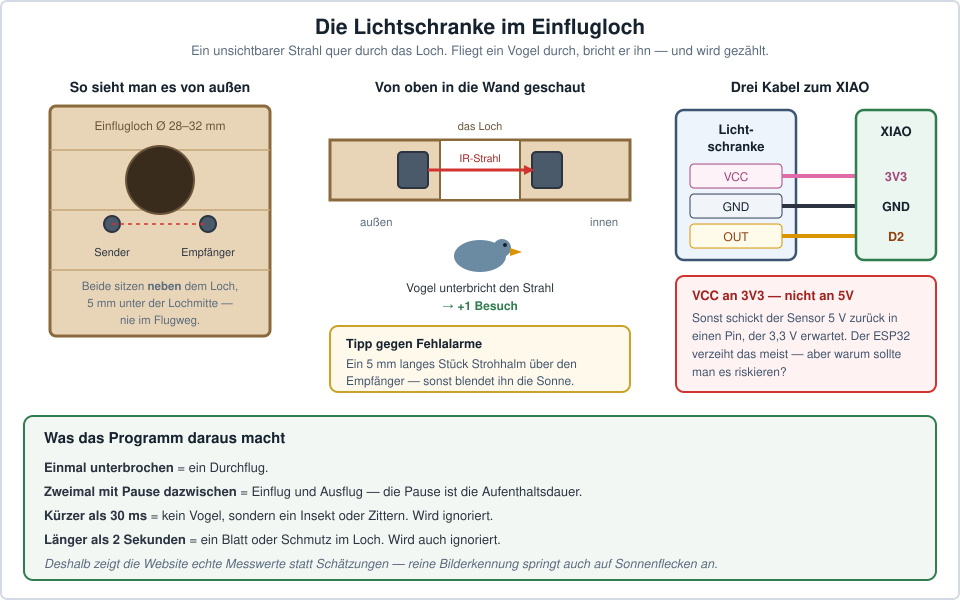

# 4. Bauplan — Einbau in den Nistkasten

> 🚦 **Bevor irgendetwas gebohrt wird:** Dieses Kapitel kommt erst dran, wenn alles aus
> [Kapitel 5](05-software.md) **auf dem Tisch** funktioniert hat — inklusive der zwei
> Wochen Probebetrieb.
>
> **Gebaut wird September bis Februar. Nie im März oder später.** Ein eingebauter Fehler
> kostet ein ganzes Jahr, weil ein belegter Kasten nicht geöffnet werden darf
> ([1.8](01-ueberblick.md#18-rechtliches-und-tierschutz)).

---

## 4.1 Das Grundprinzip: der Nistraum bleibt leer

Nur vier Dinge dürfen in den Kasten hinein:

1. das Kameramodul (etwa 2,5 × 2,5 cm, im Deckel)
2. vier IR-LEDs (im Deckel)
3. die Lichtschranke (seitlich am Einflugloch)
4. Kabel

Alles andere — Bastelcomputer, Akku, Laderegler — sitzt in einer Box **außen an der Wand**.
Das hat vier Gründe: keine Wärme im Nest, kein Geruch, der Akku bleibt tauschbar, ohne den
Kasten zu öffnen, und die Elektronik bleibt trocken.

```
                        ☀️ Solarpanel (an der sonnigsten Stelle
                           im Garten, per Kabel — NICHT am Kasten)
                              ╱
                             ╱  Kabel
      ┌────────────────────┐╱
      │  Elektronikbox     │      ← IP65, Nordseite, im Schatten
      │  XIAO · Laderegler │        Akku und USB bleiben zugänglich
      │  · Akku            │
      └──────┬─────┬───────┘
   ═══════════│═════│════════════   ← Kastendeckel (aufklappbar)
              │     │
     Kamera-  │     │  IR-LEDs + Lichtschranke
     Flachband▼     ▼
      ┌───────────────────────┐
      │  📷        ✦    ✦     │      ← Deckelunterseite:
      │        ✦        ✦     │        Kamera mittig, 4 LEDs außen
      │                       │
      │        Nistraum       │  ca. 20–25 cm
      │        (leer!)        │
      │                       │
      │   ═══○═══  ← Lichtschranke quer im Einflugloch
      │                       │
      └───────────────────────┘
              Nestboden
```

---

## 4.2 Werkzeug für diesen Teil

| Werkzeug | Wofür | Kind darf? |
|---|---|---|
| Akkuschrauber + Holzbohrer 3, 5, 6, 12 mm | Löcher für Linse, LEDs, Kabel, Mikrofon | mit Hilfe |
| Forstnerbohrer 20 mm *(optional)* | saubere Senkung für die Acrylscheibe | Erwachsener |
| Laubsäge oder Cutter | Acrylglas zuschneiden | Erwachsener |
| Schleifpapier 120er | Bohrlöcher entgraten | ✅ ja |
| Heißklebepistole | LEDs, Acryl, Lichtschranke fixieren | ✅ mit Aufsicht |
| Bleistift, Lineal | Anreißen | ✅ ja |
| Handy | IR-Test, Bildkontrolle | ✅ ja ⭐ |

---

## 4.3 Der Deckel

### Maße anreißen

Deckel abnehmen, **Innenseite nach oben**. Mittelpunkt finden: die beiden Diagonalen
kreuzen.

| Bohrung | Ø | Position | Zweck |
|---|---|---|---|
| **L** Linse | 12 mm | genau in der Mitte | Blickfeld der Kamera |
| **K** Kabel | 12 mm | 4 cm von L, Richtung Rückwand | Kamerakabel + IR-Litzen |
| **1–4** LEDs | 5 mm | vier Ecken, je 3 cm vom Rand | IR-Beleuchtung |

```
        Deckel von INNEN gesehen (Draufsicht)

     ┌─────────────────────────────────────┐
     │                                     │
     │   ✦1                          ✦2    │  ← 3 cm vom Rand
     │                                     │
     │              ● L                    │  ← Linse, Mitte
     │              ○ K   ← 4 cm hinter L  │
     │                                     │
     │   ✦3                          ✦4    │
     │                                     │
     └─────────────────────────────────────┘
                  ↑ Rückwand
```

> ⚠️ **Zur LED-Position:** Die LEDs müssen **mindestens 3 cm** von der Linse entfernt sein.
> Sitzen sie zu nah, leuchten sie direkt ins Objektiv, und das Nachtbild wird ein weißer
> Nebel — derselbe Effekt wie Blitzlicht auf einer Fensterscheibe.

### Die Kameraöffnung bauen

Von **innen** nach außen gearbeitet:

1. Loch **L** mit 12 mm durchbohren, beide Seiten entgraten.
2. Acrylglas auf **3 × 3 cm** zuschneiden. Die Schutzfolie **erst ganz zum Schluss**
   abziehen.
3. Die Acrylscheibe **von innen** über das Loch kleben — Heißkleber nur am Rand, dünn und
   **rundherum geschlossen**. Das ist die Dichtung gegen feuchte Luft.
4. Das Kameramodul **von außen** so über das Loch legen, dass die Linse mittig in die
   12-mm-Öffnung schaut. Mit zwei Punkten Heißkleber an den **Ecken der Platine** fixieren
   — **nie auf der Linse oder dem Sensor**.

```
   Querschnitt durch die Kameraöffnung:

        Elektronikbox oben
   ═══════════════════════════════
        ┌──────────┐
        │ Kamera-  │              ← außen auf dem Deckel
        │ modul    │
        └────┬─────┘
   ─────────┤ ├──────────────────  ← Deckel, 12 mm Bohrung
        ▓▓▓▓▓▓▓▓▓▓▓                ← Acrylscheibe, innen aufgeklebt
   ═══════════════════════════════
        ↓ Blickrichtung
          Nistraum
```

**Warum Acryl und nicht Glas?** Normales Fensterglas dämpft Infrarot merklich. Acryl lässt
940 nm gut durch — und es splittert nicht.

**Warum die Scheibe innen und die Kamera außen?** Damit ein Vogel niemals an Elektronik oder
Kabel kommt, und damit sich Kondenswasser nicht auf dem Sensor niederschlägt.

### Die IR-LEDs setzen

1. Die vier 5-mm-Löcher bohren.
2. LED-Module von außen einstecken, die LED-Kuppe schaut in den Nistraum.
3. Leicht **zur Mitte hin neigen** (etwa 15°), damit sich die Lichtkegel über dem Nest
   treffen.
4. Mit Heißkleber fixieren, die Bohrung rundherum abdichten.
5. Alle vier LEDs **parallel** verkabeln — alle Plus zusammen, alle Minus zusammen
   ([Schaltplan 3.6](03-schaltplan.md#36-das-unsichtbare-nachtlicht--mosfet-und-ir-leds)) —
   und die zwei Litzen durch Loch **K** nach oben führen.

### Die Kabeldurchführung K

Loch **K** ist der einzige Weg für Kamerakabel, IR-Litzen und Lichtschranken-Kabel.
Danach:

- Das **Flachbandkabel** der Kamera in einem **sanften Bogen** legen — nie gespannt, nie
  geknickt.
- **Zugentlastung:** direkt über dem Loch einen Kabelbinder um die *Litzen* legen (nicht um
  das Flachbandkabel!) und ihn an einer kleinen Schraube im Deckel einhängen.
- **Schlaufe lassen!** Der Deckel muss im Herbst zum Reinigen aufgehen können, ohne am
  Kabel zu ziehen.
- Das Loch von oben mit Heißkleber oder Silikon abdichten — **nicht** die Kabel eingießen,
  sondern nur den Spalt füllen.

---

## 4.4 Die Lichtschranke einbauen

Der Teil, der die Statistik ehrlich macht — und der einzige Eingriff an der Vorderwand.

> **Dieses Kapitel darfst du überspringen.** Die Lichtschranke ist optional und in der
> Firmware ab Werk abgeschaltet (`LICHTSCHRANKE_AN false`). Ohne sie zählt die
> Bilderkennung — ungenauer, aber der Kasten funktioniert vollständig. Weil der Einbau
> nur zwei kleine Bohrungen in der Vorderwand braucht, lässt er sich auch in einem
> späteren Jahr nachholen, ohne etwas aufzutrennen.



**Vorgehen:**

1. Zwei Bohrungen (Ø nach Bauteil, meist 3–5 mm) **seitlich neben dem Einflugloch**, genau
   gegenüberliegend, etwa **5 mm unterhalb der Lochmitte**. Der Vogel fliegt eher
   mittig-oben durch, der Strahl soll ihn aber sicher treffen.
2. Sender und Empfänger von außen einstecken, so dass sie sich **genau anschauen**.
3. **Noch nicht kleben!** Erst mit [Sketch 7](05-software.md#52-die-sieben-lern-sketches)
   justieren, bis „frei“ stabil angezeigt wird und ein Finger sicher auslöst.
4. Dann mit Heißkleber fixieren und die Bohrungen abdichten.

**Drei Tipps aus der Praxis:**

- **Bauteile bündig oder minimal versenkt** einsetzen — nichts darf in den Flugweg ragen.
- **Streulicht abschirmen:** Ein 5 mm langes Stück Strohhalm oder Schrumpfschlauch über den
  Empfänger schieben. Sonne, die schräg ins Loch fällt, blendet ihn sonst.
- **Kabel innen an der Wand entlang** nach oben zum Deckelloch **K** führen, mit
  Heißklebepunkten fixieren. Keine Schlaufen, an denen ein Vogel zupfen kann.

> ⚠️ **Das Einflugloch wird nicht verändert.** Nicht größer bohren, nicht anschrägen. Sein
> Durchmesser bestimmt, welche Art einzieht (28 mm Blaumeise, 32 mm Kohlmeise), und hält
> Nesträuber draußen.

---

## 4.5 Die Elektronikbox

Die IP65-Box kommt an die **Nordseite** des Kastens oder auf den Deckel — nie in die Sonne.
Ein Akku über 45 °C altert schnell.

```
   Box ca. 120 × 80 × 50 mm:

   ┌──────────────────────────────────────────┐
   │  [M12] ← Panelkabel   [M12] ← Notladung  │
   │                                          │
   │  ┌───────────────────┐  ┌─────────────┐  │
   │  │ Waveshare         │  │ 🔋 LiPo     │  │
   │  │ Solar Power       │  │ auf         │  │
   │  │ Manager           │  │ Klettband   │  │
   │  └───────────────────┘  └─────────────┘  │
   │                                          │
   │  ┌──────────┐  ┌──────────┐              │
   │  │ XIAO     │  │ MOSFET   │  🎤 ← Loch   │
   │  │ ESP32-S3 │  │ + Spg.-  │     zum      │
   │  └────┬─────┘  │  Sensor  │     Kasten   │
   │       ▲        └──────────┘              │
   │   USB-C erreichbar lassen!               │
   │  [Silikagel]                             │
   │  [M12] ← Kamerakabel, IR, Lichtschranke  │
   └──────────────────────────────────────────┘
```

**Sieben Regeln für die Box:**

1. **Der USB-C-Anschluss des XIAO muss erreichbar bleiben.** Dort steckt das Kabel vom
   Laderegler, und dort hängst du im Notfall den Computer an.
2. **Akku auf Klettband**, nicht festgeklebt und nicht mit Kabelbindern gequetscht. Er ist
   das Teil, das man am ehesten austauscht.
3. **Die Lämpchen des Ladereglers sichtbar lassen** — am besten so einbauen, dass man sie
   beim Öffnen der Box sofort sieht.
4. **Silikagel-Beutel** in eine Ecke legen. Nimmt Restfeuchte auf.
5. **Kabelverschraubungen nach unten**, nie nach oben. Wasser läuft nach unten ab.
6. **Tropfschlaufe:** Jedes Kabel vor dem Eintritt einen Bogen nach unten machen lassen.
7. **Die WLAN-Antenne des XIAO flach an die Innenseite des Deckels kleben** — mit einem
   Streifen doppelseitigem Klebeband, möglichst weit weg von Akku und Laderegler. Metall
   und Akku direkt davor schlucken das Signal. Das dünne Kabel dabei **nicht knicken** und
   nicht straff ziehen: Der u.FL-Stecker ist winzig und reißt sonst beim nächsten Öffnen
   der Box ab. Ohne Antenne ist die Kamera praktisch funkstumm
   ([Software 5.2](05-software.md#52-die-sieben-lern-sketches)).

```
   richtig:              falsch:
   Box                   Box
    │                     │
    └──┐              ────┘
       │  ← Wasser        ← Wasser läuft
       ▼    tropft ab       in die Box
```

### Die Notlade-Buchse

Der Retter für Regenwochen: ein kurzes **Micro-USB-Kabel** von der `USB IN`-Buchse des
Ladereglers nach außen durch eine M12-Verschraubung, mit Gummikappe drüber.

Bei Dauerregen einfach eine Powerbank anstecken — der Akku lädt sich, ohne dass die Box
geöffnet werden muss. Anders als bei einer reinen Notversorgung lädt hier wirklich der
**Akku**, nicht nur das Board.

### 4.5b Das Mikrofon hören lassen

Das Mikrofon sitzt **fest auf dem XIAO-Board**, und das liegt in der geschlossenen Box an
der Außenwand des Kastens. Ohne einen Weg für den Schall hört es gedämpften Garten und kaum
das Nest.

**Die Lösung nutzt aus, dass die Box direkt an der Kastenwand sitzt:**

```
   Nistkasten              Elektronikbox
   ┌────────────┐         ┌──────────────┐
   │            │  6 mm   │              │
   │   innen    │ ──○───→ │  🎤 XIAO      │
   │            │  Loch   │              │
   └────────────┘   ↑     └──────────────┘
                Moosgummi-Dichtung
                dazwischen (2–3 mm)
```

1. Ein **6-mm-Loch durch die Kastenwand** bohren, dort wo die Box sitzt — am besten in der
   oberen Hälfte, hinter dem Nest, nicht darüber.
2. Ein **gleich großes Loch in die Boxwand**, die an der Kastenwand anliegt.
3. Zwischen Box und Kasten einen **Streifen Moosgummi** mit passendem Loch — dichtet gegen
   Regen, ohne den Schall zu blockieren.
4. Boxseitig ein Stückchen **atmungsaktive Membran** (Gore-Tex-Rest, Vlies aus einem
   Belüftungsstopfen) über das Loch kleben. Lässt Schall durch, hält Spritzwasser und
   Insekten draußen.

Weil beide Löcher **einander zugewandt** sind und vom Wetter abgeschirmt liegen, bleibt die
Dichtigkeit nach außen erhalten. Das Loch geht nicht ins Freie, sondern von Box zu Kasten.

> **Kein Loch gebohrt?** Der Ton funktioniert trotzdem — er ist dann nur leiser und
> dumpfer, weil er über die Kabelverschraubungen kommt. Nachrüsten geht, aber nur zwischen
> September und Februar. **Wer Ton will, bohrt also beim Bauen.**

---

## 4.6 Solarpanel montieren

> ⭐ **Der wichtigste Satz des Kapitels: Das Panel gehört nicht an den Nistkasten.**

Nistkästen hängen gern halbschattig unter Bäumen — genau falsch für Solar. Das Panel kommt
per Kabel an die sonnigste erreichbare Stelle: Schuppendach, Zaunpfosten, Garagenwand,
Balkongeländer.

| Kriterium | Sollwert | Warum |
|---|---|---|
| Ausrichtung | **Süden** | maximale Tagesausbeute |
| Neigung | **30–40°** | guter Kompromiss Frühling/Sommer, und Regen wäscht es sauber |
| Verschattung | **keine, den ganzen Tag** | Ein Ast, der um 11 Uhr eine Ecke abschattet, kostet mehr Ertrag als man denkt |
| Höhe | ≥ 1,5 m | weniger Laub, weniger Schnee, weniger Neugier |
| Kabelquerschnitt | **0,75 mm²** reicht | bei 12 V fällt eine Verlängerung kaum ins Gewicht |
| Befestigung | Schrauben, keine Kabelbinder | ein 15-W-Panel wiegt ~1 kg und fängt Wind |

**Zum Kabel:** Bei 12 Volt darfst du entspannt verlängern. Bis etwa 10 Meter mit 0,75 mm²
verlierst du nur ein paar Zehntelvolt — und der Laderegler hat bis 6 Volt hinunter Luft.
Das war bei 5-Volt-Panels ganz anders und ist einer der Gründe für diese Bauweise.

> 🧒 **Kinderaufgabe mit echtem Ergebnis:** An einem sonnigen Wintertag stündlich notieren,
> wo im Garten Sonne ist und wo Schatten. Daraus wird die Panelposition **begründet** statt
> geraten. Das ist eine echte Messreihe, und das Ergebnis hält Jahre.

---

## 4.7 Endmontage — die Reihenfolge

| # | Schritt | Prüfen, bevor es weitergeht |
|---|---|---|
| 1 | Deckel bohren, Acryl einkleben, trocknen lassen | Kleber wirklich hart? |
| 2 | Kamera + LEDs im Deckel montieren | Sitzt alles fest? |
| 3 | Mikrofonloch bohren, Moosgummi und Membran setzen | Beide Löcher zeigen aufeinander? |
| 4 | *(optional)* Lichtschranke einsetzen, **justieren**, dann erst kleben — und `LICHTSCHRANKE_AN true` setzen | Löst ein Finger sicher aus? |
| 5 | Kabel durch **K**, Zugentlastung, Schlaufe für den Deckel | Kein Knick im Flachbandkabel? |
| 6 | Box am Kasten befestigen, Verschraubungen setzen | Alle nach unten? |
| 7 | Alles verbinden — Reihenfolge: **Akku, dann Panel, dann Board** | MPPT-Schalter auf 12 V? Schalter auf ON? |
| 8 | Am Computer testen: Bild? LEDs? Lichtschranke? Website? | **Jetzt** ist der letzte einfache Moment für Korrekturen |
| 9 | Box schließen | Silikagel drin? |
| 10 | Panel montieren, Kabel verlegen | Tropfschlaufen? |
| 11 | Kasten aufhängen | Einflugloch nach **Ost/Südost**, nicht nach Westen (Wetterseite) |
| 12 | **Zwei Wochen Probebetrieb**, täglich Akkustand prüfen | Steigt der Akku tagsüber? |

**Schritt 12 ist nicht optional.** Er ist der Unterschied zwischen „hat funktioniert“ und
„hat im April funktioniert“.

---

## 4.8 Blickfeld richtig einstellen

Ein Modul mit 60–70° Bildwinkel deckt bei 22 cm Abstand rund 25 × 19 cm ab — also den
Kastenboden. Trotzdem lohnt sich Feinjustierung:

1. Kasten aufrecht hinstellen, Deckel drauf.
2. Ein Kuscheltier oder einen zerknüllten Papierball auf den Boden legen — als
   „Vogel-Platzhalter“.
3. Livestream auf dem Handy öffnen.
4. Kamera minimal drehen, bis der Boden mittig und vollständig im Bild ist.
5. **Erst dann** den zweiten Heißkleberpunkt setzen.

| Problem | Lösung |
|---|---|
| Bild zu dunkel | `IR_HELLIGKEIT` erhöhen |
| Bildmitte weiß überstrahlt | Die LEDs leuchten in die Linse — Abstand vergrößern oder eine kleine Pappblende ums Objektiv kleben |
| Bild auf dem Kopf | `BILD_DREHEN true` |
| Bild seitenverkehrt | `BILD_SPIEGELN true` |

---

## 4.9 Was man am Kasten selbst *nicht* verändert

Der Nistkasten war schon fertig, und das soll so bleiben:

- **Einflugloch nicht vergrößern.** Der Durchmesser bestimmt, welche Art einzieht, und hält
  Nesträuber draußen.
- **Keine Sitzstange** vor dem Loch — die ist eine Einladung für Katzen und Elstern.
- **Keine zusätzlichen Lüftungslöcher.** Der Kasten ist so ausgelegt, wie er ist.
- **Nicht innen streichen oder lackieren.** Ausgasende Lösemittel in einem Brutraum sind ein
  echtes Problem.
- **Das Reinigungskonzept erhalten.** Der Deckel muss im Herbst aufgehen, um das alte Nest
  zu entfernen. Deshalb die Kabelschlaufe.

→ Weiter mit [5. Software](05-software.md)
