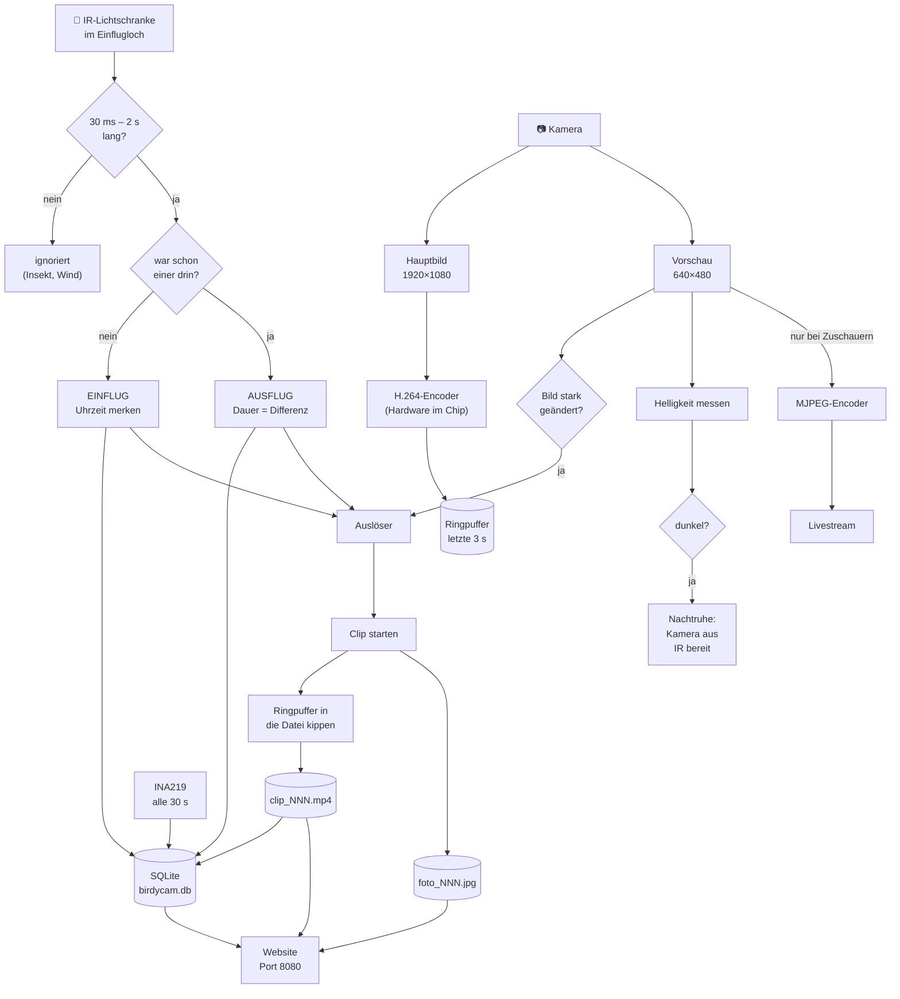

# 6. Website & Daten

Die Website läuft **auf dem Pi selbst**. Kein Server im Internet, keine Cloud, kein Abo.
Wer im gleichen WLAN ist, ruft `http://birdycam.local:8080/` auf und sieht alles.

---

## 6.1 Was die Website zeigt

```
┌────────────────────────────────────────────────────┐
│  🐦 BirdyCam    ☀️ Tag   78 % ⚡   🐣 Vogel ist drin │
├────────────────────────────────────────────────────┤
│  LIVEBILD                                          │
│  ┌──────────────────────────────────────────────┐  │
│  │            [ Livestream 16:9 ]               │  │
│  └──────────────────────────────────────────────┘  │
│  Der Stream startet erst, wenn du die Seite        │
│  öffnest — und hört auf, wenn du sie schließt.     │
├────────────────────────────────────────────────────┤
│  HEUTE                                             │
│  ┌─────┐┌─────┐┌─────┐┌─────┐┌─────┐               │
│  │ 47  ││1382 ││5:41 ││20:12││ 34s │               │
│  │heute││ges. ││erst.││letz.││⌀ Auf│               │
│  └─────┘└─────┘└─────┘└─────┘└─────┘               │
├────────────────────────────────────────────────────┤
│  WANN IST RUSHHOUR?                                │
│      █                                             │
│      █ █       █                                   │
│    █ █ █ █   █ █ █     █                           │
│  ░ █ █ █ █ █ █ █ █ █ █ █ ░ ░                       │
│  0     6     12    18                              │
├────────────────────────────────────────────────────┤
│  DIE LETZTEN 14 TAGE                               │
│                            █ █ █                   │
│                      █ █ █ █ █ █                   │
│  ░ ░ ▁ ▁ ▂ ▂ ▃ ▄ █ █ █ █ █ █                       │
│  Wenn diese Balken plötzlich steigen, sind die     │
│  Küken geschlüpft.                                 │
├────────────────────────────────────────────────────┤
│  AKKU & SPEICHER                                   │
│  [████████████████░░░░]  3.98 V                    │
│  ⚡ Die Sonne lädt gerade mit 0,84 A.               │
│  Ring: 47/200 Clips, 213/1000 Fotos · SSD 88 % frei│
├────────────────────────────────────────────────────┤
│  AUFNAHMEN    (Videoclips) ( Fotos )               │
│   ▶ clip_047.mp4      4.8 MB · 16.04. 06:12        │
│   ▶ clip_046.mp4      3.1 MB · 16.04. 06:09        │
└────────────────────────────────────────────────────┘
```

Handybedienbar, hell/dunkel automatisch, aktualisiert sich alle 5 Sekunden.

### Die drei stärksten Elemente

**1. Clips laufen direkt im Browser.** Ein Klick, und das Video spielt — auch Vorspulen
funktioniert. Das ist der praktische Gewinn von Variante A: H.264 in MP4 ist das Format,
das jeder Browser kann. (Bei Variante B muss man herunterladen und den VLC Player öffnen.)

**2. Das Balkendiagramm der letzten 14 Tage.** Nicht „welche Art", sondern **wann und wie
oft**. Die Fütterfrequenz steigt dramatisch, wenn die Küken schlüpfen — der Sprung in dieser
Kurve **ist der Schlupftag**. Kein Artenmodell liefert etwas Vergleichbares.

**3. Der Ladestrom.** Nicht nur „Akku 78 %", sondern „die Sonne bringt gerade 0,84 A". Das
macht Physik anfassbar: Hand über das Panel, Zahl bricht ein.

---

## 6.2 Wie die Daten fließen



Zwei Pfeile verdienen Aufmerksamkeit:

**„Ringpuffer in die Datei kippen"** — ohne ihn beginnt jeder Clip erst, wenn der Vogel schon
im Kasten sitzt. Mit ihm sieht man den Anflug.

**„nur bei Zuschauern"** — das ist die Umsetzung von „nur streamen, wenn sich jemand
verbindet". Der MJPEG-Encoder läuft wirklich nur, solange jemand die Seite offen hat.

---

## 6.3 Der Ringspeicher — „Round Robin"

Die Anforderung war: *„nach einer bestimmten Schranke per Round Robin wieder
überschreiben"*. So ist das umgesetzt:

```
     clip_000.mp4  clip_001.mp4  ...  clip_198.mp4  clip_199.mp4
          ▲                                              │
          └──────────────────────────────────────────────┘
                    danach geht es wieder bei 000 los

     Ein Zähler in clips/.ring.json merkt sich:
     "als nächstes ist Nr. 47 dran".
```

| Ring | Anzahl | Einstellung | Platz |
|---|---|---|---|
| Videoclips | 200 | `RING_CLIPS` | ~1 GB |
| Fotos | 1000 | `RING_FOTOS` | ~250 MB |

**Drei Eigenschaften:**

1. **Die Platte kann nie volllaufen.** Der Platzbedarf steht von Anfang an fest.
2. **Es gibt keine „Aufräum-Aktion"**, die man vergessen kann oder die irgendwann Stunden
   dauert.
3. **Der Ordner wächst nicht.** Es gibt immer genau 200 Namen — ein Verzeichnis mit 50.000
   Einträgen wird sonst quälend langsam.

### Was, wenn man Aufnahmen behalten will?

Die SSD ist **Puffer, nicht Archiv.** Was gut ist, wird über die Website heruntergeladen —
Rechtsklick auf den Clip, „Ziel speichern unter". Das ist eine schöne wöchentliche
Kinderaufgabe: „die drei besten Clips der Woche retten".

Bei 200 Clips à ~10 s reicht der Ring für **einen sehr aktiven Tag**. Wer mehr Rückblick
will, erhöht `RING_CLIPS` — 1000 Clips sind auf einer 240-GB-SSD problemlos möglich (~5 GB).

---

## 6.4 Die Datenbank

Wir benutzen **SQLite** — eine ganze Datenbank in einer einzigen Datei, in Python schon
eingebaut. Drei Tabellen:

| Tabelle | Inhalt | Wächst um |
|---|---|---|
| `besuche` | jeder Durchflug: Zeitpunkt, Aufenthaltsdauer | ~50 Zeilen/Tag |
| `clips` | jede Aufnahme: Datei, Dauer, Größe, Auslöser, Tag/Nacht | ~60 Zeilen/Tag |
| `telemetrie` | Akkuspannung und Ladestrom alle 5 Minuten | ~288 Zeilen/Tag |

**Besuche werden für immer behalten** — sie sind winzig, und über Jahre entsteht daraus ein
echter Datensatz. Telemetrie wird nach 180 Tagen gelöscht.

### Der WAL-Modus

```python
_verbindung.execute("PRAGMA journal_mode=WAL")
```

**WAL** heißt *Write-Ahead Log*: Änderungen werden erst in eine Nebendatei geschrieben und
dann in die Datenbank übertragen. Fällt mitten im Schreiben der Strom aus, ist die Datenbank
trotzdem heil — im schlimmsten Fall fehlt der letzte Eintrag.

Bei einer Solaranlage ist das keine Theorie: Der Akku kann leer werden, während gerade ein
Besuch eingetragen wird.

> 🧒 **Warum das schlau ist:** Stell dir vor, du schreibst mit Bleistift in ein Heft und
> radierst mittendrin. Wenn jemand das Licht ausmacht, ist die Seite halb kaputt. WAL macht
> es anders: Man schreibt erst auf einen Zettel und klebt ihn dann ein. Geht das Licht aus,
> ist entweder der Zettel da oder nicht — aber das Heft ist nie halb radiert.

---

## 6.5 Die Schnittstellen (für Neugierige)

Alles, was die Website anzeigt, kann man auch direkt abrufen:

| Adresse | Was kommt zurück |
|---|---|
| `/` | die Website |
| `/stream.mjpg` | der Livestream (MJPEG) |
| `/api/status` | JSON mit allen Zahlen |
| `/api/liste?typ=clips` | JSON-Liste der Clips (auch `fotos`) |
| `/api/telemetrie?stunden=48` | Akkuverlauf |
| `/medien/clips/clip_047.mp4` | die Datei selbst |

Beispielantwort von `/api/status` (gekürzt):

```json
{
  "besuche_gesamt": 1382,
  "besuche_heute": 47,
  "erster_heute": 1776359460,
  "letzter_heute": 1776412320,
  "dauer_schnitt_s": 34.2,
  "stunden": [0,0,0,0,0,2,11,9,6,4,3,5,2,3,4,7,8,6,3,1,0,0,0,0],
  "verlauf": [{"tag":"2026-04-03","anzahl":12}, {"tag":"2026-04-04","anzahl":18}],
  "kamera": {"nacht": false, "helligkeit": 128, "aufnahme_laeuft": false,
             "zuschauer": 1, "aufloesung": "1920x1080", "bildrate": 15},
  "lichtschranke": {"strahl_frei": true, "vogel_drin": false,
                    "durchfluege": 94, "ignoriert": 12},
  "akku": {"volt": 13.12, "ampere": 0.84, "prozent": 78, "laedt": true},
  "speicher": {"clips": 47, "fotos": 213, "frei_prozent": 88},
  "laufzeit_s": 246180
}
```

> 💡 **Bastelidee:** Mit ein paar Zeilen Python holt man diese Zahlen täglich ab und
> zeichnet über Wochen ein Diagramm. Der Schlupftag der Küken ist darin ein Sprung. Geht
> auch mit Excel („Daten → Aus dem Web").

**Der Livestream ist ein normaler MJPEG-Stream** und lässt sich in Home Assistant, im VLC
Player oder in einer Überwachungssoftware einbinden — Adresse
`http://birdycam.local:8080/stream.mjpg`.

---

## 6.6 Grenzen der Website — damit niemand enttäuscht ist

| Was nicht geht | Warum |
|---|---|
| **Von unterwegs zuschauen** | Nur im Heim-WLAN erreichbar. Von außen bräuchte man VPN. Portweiterleitung ist bei einer Kamera **ohne Passwort** eine schlechte Idee |
| **Passwortschutz** | Nicht eingebaut. Im Heimnetz vertretbar — deshalb aber auch **nicht** ins Internet stellen |
| Mehrere Zuschauer gleichzeitig | Geht, aber jeder zusätzliche kostet WLAN-Bandbreite und Akku |
| Ton | Kein Mikrofon in Variante A. Begründung in [1.7](01-machbarkeit.md#17-was-bewusst-fehlt-und-warum) |
| Artenerkennung | Bewusst weggelassen, siehe [1.7](01-machbarkeit.md#17-was-bewusst-fehlt-und-warum) |
| Livestream nachts sofort | Nachts ist die Kamera aus (Stromsparen). Beim Öffnen der Seite fährt sie in ~1,5 s hoch — einmal neu laden |

---

## 6.7 Ausbauideen — in der Reihenfolge, in der sie Spaß machen

| Idee | Aufwand | Was man lernt |
|---|---|---|
| **Temperatur im Nest** (DS18B20 an GPIO4) | 1 h | Ein zweiter Sensor, eine zweite Kurve. Am Temperaturverlauf erkennt man, ob gebrütet wird — der Vogel *heizt* |
| **Push-Nachricht beim ersten Anflug** | 2 h | Telegram-Bot: „Der erste Vogel war heute um 5:41 da!" |
| **Zeitraffer** | 2 h | Jede Minute ein Bild, abends zu einem Film zusammensetzen |
| **Tagesbeste-Seite** | 1 h | Die drei längsten Besuche des Tages automatisch oben anzeigen |
| **Daten exportieren** | 1 h | `sqlite3 birdycam.db "SELECT * FROM besuche" > besuche.csv` — dann in Excel auswerten. Der Einstieg in echte Datenanalyse |
| **Backup auf den Haus-PC** | 1 h | `rsync` per Cron: Clips automatisch sichern, dann ist die SSD wirklich nur Puffer |

---

## 6.8 Und wenn doch mal ein Rechner im Haus läuft?

Dann wird der Nistkasten-Node zum **Sensor** und der Haus-Rechner zum **Archiv**. Zwei
Zeilen in der Crontab des Haus-Rechners genügen:

```bash
rsync -av --ignore-existing pi@birdycam.local:/srv/birdycam/clips/ ~/birdycam-archiv/
```

Damit ist auch der letzte Kritikpunkt am Ringspeicher erledigt: Nichts geht mehr verloren,
und die 200 Clips auf dem Pi sind nur noch der Zwischenspeicher der letzten Tage.

→ Weiter mit [7. Wartung & Fehlersuche](07-wartung-und-fehlersuche.md)
