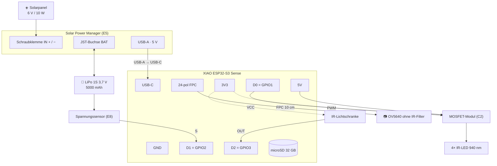

# 8. Variante B — ESP32-S3 ⭐ **die gewählte Variante**

**≈ 149 € statt ≈ 304 €.** Dieselben Funktionen, ruckeligeres Video.

👉 **Das ist der Hauptweg dieses Projekts.** Dieses Kapitel enthält alles, was du für
Variante B brauchst: Stückliste, Schaltplan, Tutorial und Firmware. Für Mechanik und
Nistkasten-Einbau gelten [3. Schaltplan](03-schaltplan.md) und
[4. Bauplan](04-bauplan.md) unverändert.

**Warum diese Variante:** Als kleines Projekt reichen Livestream, Clips, Statistik und
Dashboard. Gesangsbestimmung und Artenerkennung würden ohnehin eine Basisstation im Haus
brauchen — und damit ein anderes Projekt sein. Variante A bleibt als Alternative
dokumentiert, falls das Projekt später wächst.

---

## 8.1 Wann diese Variante die richtige ist

| Nimm Variante B, wenn… | Nimm Variante A, wenn… |
|---|---|
| 150 € sind die Obergrenze | Full HD wirklich zählt |
| Elektronik-Basteln ist das Ziel | Clips sollen im Browser anklickbar sein |
| Der Kasten steht sehr schattig (10-W-Panel ist unkritischer) | Speicherstabilität ist die Hauptsorge |
| Kein Linux-Wissen im Haus | Später BirdNET oder Artenerkennung dazukommen soll |


> **Kein Fehlkauf-Risiko:** Wer mit B anfängt, kann später auf A umsteigen. Kamera-Modul,
> Panel und Akku sind dann zwar andere, aber IR-LEDs, MOSFET, Lichtschranke, Gehäuse und
> der ganze Bauplan bleiben gleich. Das sind ~50 € Übertrag.

---

## 8.2 Die Unterschiede in einer Tabelle

| | **A — Pi Zero 2 W** | **B — ESP32-S3** |
|---|---|---|
| Preis | ≈ 304 € | **≈ 149 €** |
| Videoformat | **H.264 in MP4** | MJPEG in AVI |
| 1080p Bildrate | **15–30** | ~6 |
| 10-s-Clip | ~5 MB **bei 15 fps** | ~7 MB **bei 6 fps** |
| Clip im Browser | **✅ ein Klick** | ❌ Download + [VLC](https://www.videolan.org/) |
| Speicher | **USB-SSD, keine SD im Betrieb** | High-Endurance-microSD |
| Datenbank | SQLite (Jahre an Verlauf) | Textdatei (Tagesstatistik) |
| Verbrauch | 42 Wh/Tag | **15 Wh/Tag** |
| Panel | 30 W (35 × 45 cm, 2 kg) | **10 W (klein und leicht)** |
| Akku | LiFePO4 12 V/12 Ah, 3 Tage | LiPo 5000 mAh, ~1,2 Tage |
| Nachtsicht | ✅ | ✅ |
| Lichtschranke | ✅ | ✅ |
| Livestream nur bei Zuschauern | ✅ | ✅ |
| Vorlauf im Clip | ✅ 3 s | ✅ 3 s |
| Vogelgesang aufnehmen | ❌ | 🟡 **Code liegt bereit, abgeschaltet** |
| Programmiersprache | Python | C++ (Arduino) |
| Kann es kaputtgehen durch Stromausfall? | Dateisystem-Risiko, durch WAL abgesichert | **praktisch nein** — kein Betriebssystem |

**Der ehrliche Kern:** 1080p bei 6 Bildern/s ist nicht wertlos — man sieht alles, was
passiert, und jedes Einzelbild ist scharfes Full HD. Es ruckelt nur. Wer Flüssigkeit höher
gewichtet, stellt in `config.h` auf `FRAMESIZE_SVGA` (800×600) um: ~15 Bilder/s und ~3 MB
pro Clip.

---

## 8.2b Stream ODER Aufnahme — die wichtigste Designentscheidung

Bei Full HD kann der ESP32 **nicht gleichzeitig** streamen und aufnehmen. Das ist keine
Software-Bequemlichkeit, sondern Arithmetik:

```
   Ein Bild bei UXGA, JPEG-Qualität 18    ≈ 80 KB
   Bei 10 Bildern pro Sekunde             ≈ 0,80 MB/s

   Die SD-Karte am XIAO hängt an SPI und schafft praktisch ~1,2 MB/s.
   -> Aufnehmen allein:  0,80 von 1,2 MB/s   = 67 %  ✅ passt
   -> Aufnehmen + streamen: die Kamera müsste jedes Bild zweimal
      ausliefern, und die SD-Karte konkurriert mit dem WLAN um Rechenzeit.
      -> Die Karte bremst das Programm, die Bildrate bricht ein.
```

Deshalb wechseln sich zwei Betriebsarten ab:

```
   Niemand schaut zu               Jemand ruft die Website auf
   ─────────────────────────       ────────────────────────────
   ⏺ AUFNAHMEBEREIT                📹 STREAM
   Kamera → Vorlaufpuffer (3 s)    Kamera → WLAN in Full HD
   Auslöser → Clip auf SD-Karte    laufender Clip wird beendet
   Lichtschranke zählt             Lichtschranke zählt WEITER
                                   kein Vorlaufpuffer
```

**Zwei Details, die bewusst so sind:**

1. **Gezählt wird auch beim Streamen.** Die Lichtschranke kostet nichts, und die Statistik
   soll keine Löcher haben, nur weil jemand zuschaut.
2. **Der erste Clip nach dem Zuschauen hat keinen Vorlauf.** Während des Streams wird der
   Vorlaufpuffer nicht gefüllt — er ist danach leer und braucht ~3 Sekunden, um sich wieder
   zu füllen.

Umschaltbar in `config.h` mit `STREAM_HAT_VORRANG`. Auf `false` gesetzt wird beides parallel
versucht — sinnvoll nur bei kleiner Auflösung.

---

## 8.2c Router oder eigenes WLAN — beides geht

Die Kamera kann auf zwei Wegen erreichbar sein. Eingestellt wird das in
[`config.h`](../software/firmware/birdycam/config.h) mit `NETZ_MODUS`.

```
   NETZ_ROUTER                          NETZ_EIGENES
   ─────────────────────────            ──────────────────────────
   📱 ──── 🏠 Router ──── 📷            📱 ──────────────── 📷
      Handy   Heimnetz   Kamera            Handy      Kamera macht
                                                      eigenes WLAN auf
   ✅ sparsam (WLAN darf dösen)         ✅ funktioniert überall
   ✅ Uhrzeit aus dem Internet          ✅ kein Router nötig
   ✅ vom Sofa erreichbar               ⚠️ +40 % Stromverbrauch
   ⚠️ braucht Empfang am Kasten         ⚠️ keine Internet-Uhrzeit
                                        ⚠️ nur im Garten in Funkreichweite
```

**`NETZ_AUTO` (Standard) macht beides:** Erst wird der Router versucht. Kommt er innerhalb
von 20 Sekunden nicht, macht die Kamera ihr eigenes WLAN auf. Fällt der Router später aus,
schaltet sie nach etwa 2,5 Minuten ebenfalls um. Man steht also nie ohne Zugang da.

### ⚡ Die Stromrechnung — bitte vor dem Panel-Kauf lesen

Das ist der Punkt, den man vorher wissen muss:

| | Routerbetrieb | Eigenes WLAN |
|---|---|---|
| WLAN-Anteil am Verbrauch | ~0,25 W | **~0,50 W** |
| Gesamtverbrauch | 15 Wh/Tag | **21 Wh/Tag** |
| Empfohlenes Panel | 10 W | **15–20 W** |
| Aufpreis Panel | — | **+8 €** |

**Warum:** Ein WLAN-Sender muss ständig „Funkbaken" aussenden, damit Handys ihn finden. Er
darf deshalb nicht schlafen. Im Routerbetrieb hingegen darf der ESP32 zwischen zwei
Funkkontakten dösen („Modem-Sleep") — das halbiert den WLAN-Verbrauch.

**Sparoption:** `AP_NACHTS_AUS = true` schaltet das eigene WLAN nachts ab, wenn niemand
verbunden ist (spart ~2,5 Wh/Tag). Der Preis: Nachts kommt man nicht sofort dran, sondern
erst nach dem nächsten Helligkeitstest.

### 🕐 Und das Uhrzeit-Problem

Im eigenen WLAN gibt es **kein Internet** — also auch keinen Zeitserver. Ohne Uhrzeit
hätten alle Dateien das Datum 1970, und das Stunden-Diagramm wäre sinnlos.

**Die Lösung:** Der erste Besucher der Website schenkt der Kamera die Uhrzeit seines Handys.
Eine Zeile JavaScript sendet sie beim Öffnen der Seite mit:

```javascript
fetch('/api/zeit?ts='+Math.floor(Date.now()/1000));
```

Die Kamera nimmt den Wert nur an, wenn sie noch **keine** Zeit hat — sonst würde jeder
Seitenaufruf die Uhr neu stellen und Zeitstempel könnten springen. Und sie prüft auf
Plausibilität (irgendwann zwischen 2024 und 2050), damit ein kaputter Browser die Statistik
nicht ruiniert.

> **Praktische Folge:** Nach jedem Neustart im eigenen WLAN einmal die Website aufrufen.
> Danach stimmen die Zeitstempel. Bis dahin steht auf der Website als Warnung
> „Uhrzeit fehlt".

### So verbindet man sich mit dem eigenen WLAN

1. Am Handy in die WLAN-Einstellungen gehen
2. Netz **`BirdyCam`** auswählen, Passwort **`vogelhaus`** eingeben (beides in `config.h`
   änderbar)
3. Browser öffnen: **`http://192.168.4.1`**

Die Kamera hat ein **Captive Portal** eingebaut: Sie leitet jede eingegebene Adresse auf
sich selbst um. Viele Handys öffnen die Seite dadurch von selbst — so wie im Hotel-WLAN.

> ⚠️ **Ein Handy-Ärgernis, das man kennen muss:** Android und iOS merken, dass dieses WLAN
> kein Internet hat, und wechseln gerne wieder ins Mobilfunknetz. Wenn die Seite plötzlich
> nicht mehr lädt: In den WLAN-Einstellungen bei der Meldung „Kein Internetzugriff"
> auf **„Verbindung beibehalten"** tippen. Bei Android hilft zusätzlich, in den
> Netzwerkdetails „Automatisch wechseln" abzuschalten.

### Die Selbstdiagnose auf der Website

Weil die SD-Geschwindigkeit der Engpass ist, zeigt das Dashboard sie an:

> SD-Karte schreibt 1,05 MB/s · reicht aus ✓

**Wichtig zum Verstehen:** Eine zu langsame Karte erzeugt keine Fehlermeldung. Sie *bremst*
— das Programm wartet auf sie, und im Clip landen weniger Bilder pro Sekunde. Man erkennt es
also an **zwei Zahlen zusammen**:

| Anzeige | Bedeutung |
|---|---|
| Schreibrate nahe 1,2 MB/s **und** Bilder/s deutlich unter 10 | Karte ist am Limit → `BILD_QUALITAET` erhöhen |
| Schreibrate um 0,8 MB/s **und** Bilder/s bei ~10 | alles gut |
| „Bilder verworfen" > 0 | echter Schreibfehler — Karte voll oder defekt |

Die Firmware probiert beim Start außerdem **40, dann 20, dann 10 MHz** SPI-Takt und nimmt
den schnellsten, der funktioniert. Der gewählte Takt steht im Seriellen Monitor.

---

## 8.3 Stückliste

👉 **Zum Bestellen: [9. Bestellliste](09-bestellliste.md)** — nach Shop gruppiert, mit
Preisen, Prüfpunkten und Bestellreihenfolge. Überblick in
[2. Stückliste, Variante B](02-stueckliste.md#variante-b--esp32-s3-die-günstige-alternative).

Die drei wichtigsten Punkte:

- **XIAO ESP32-S3 „Sense"** — nur die Sense-Version hat Kameraanschluss und SD-Slot.
  Möglichst **mit vorgelöteten Pins** kaufen.
- **Kameramodul 24-pol DVP ohne IR-Filter.** Hier gibt es eine Entscheidung, die
  [9.0](09-bestellliste.md#90-️-die-eine-entscheidung-die-du-vorher-treffen-musst)
  ausführlich erklärt — kurz:

  | | OV2640 „Night Vision" ⭐ | OV5640 ohne IR-Filter |
  |---|---|---|
  | Auflösung | 1600×1200 = **1,92 MP** | 1920×1080 = **2,07 MP** |
  | Bilder/s | **8–12** | ~6 |
  | Lieferbar | ✅ bestätigt | 🟡 schwer zu finden |

  **7 % weniger Pixel, doppelte Bildrate, sicher lieferbar** — deshalb ist die Firmware auf
  `FRAMESIZE_UXGA` mit dem OV2640 voreingestellt. Wer 16:9 will, nimmt den OV5640 und
  stellt `FRAMESIZE_FHD` ein.
- **Solarpanel 6 V** (nicht 12 V!) — ein 12-V-Panel zerstört den Laderegler.

> ⚠️ **Ein Kaufteil ist unbestätigt:** Ein fertiges NoIR-Modul speziell für die XIAO Sense
> konnte ich nicht verifizieren. Die 24-Pin-**DVP**-Module aus der ESP32-CAM-Welt passen
> mechanisch und elektrisch (ESP32 hat *kein* MIPI-CSI, entgegen manchen
> Shop-Beschreibungen), und davon gibt es Nachtsicht-Varianten. Rückfallebene: den
> IR-Filter aus dem mitgelieferten Modul selbst ausbauen — 20 Minuten Feinmotorik, und die
> Kamera kann dabei kaputtgehen. **Deshalb ein Ersatzmodul mitbestellen und vor dem Einbau
> in den Kasten testen.**

---

## 8.4 Schaltplan

Alles gesteckt und geschraubt. Der einzige Lötpunkt ist die Stiftleiste am Board — und die
kann man vorgelötet kaufen.



### Pinbelegung

| Pin | GPIO | Belegung |
|---|---|---|
| **5V** | — | → MOSFET-Modul Lastseite `VIN+` |
| **3V3** | — | → MOSFET `VCC`, Lichtschranke `VCC` |
| **GND** | — | → gemeinsame Masse (dreimal nötig) |
| **D0** | GPIO1 | → MOSFET `SIG` (IR-Dimmung per PWM) |
| **D1** | GPIO2 | ← Spannungssensor `S` (Akkustand) |
| **D2** | GPIO3 | ← Lichtschranke `OUT` |
| D3–D5 | GPIO4–6 | frei, z. B. DS18B20 |
| **D8/D9/D10** | GPIO7/8/9 | **SD-Karte — nicht anfassen!** |
| *(intern)* | GPIO41/42 | Mikrofon (nur wenn `AUDIO_AN = true`) |

> ⚠️ **Der häufigste Anfängerfehler:** D8, D9 oder D10 benutzen. Dann funktioniert plötzlich
> die SD-Karte nicht mehr, und man sucht den Fehler in der Software. **Merksatz: D8, D9, D10
> gehören der Speicherkarte.**

**Angenehm gegenüber Variante A:** Der ESP32 läuft komplett mit 3,3 V, und seine Pins
verzeihen mehr. Die „5 V zerstören den Pi"-Falle aus
[Schaltplan 3.3](03-schaltplan.md#33-️-die-wichtigste-warnung-33-v-nicht-5-v) gibt es hier
nicht. Trotzdem: Lichtschranke an **3V3**, dann passt das Signalniveau.

Für IR-LEDs ([3.5](03-schaltplan.md#35-die-ir-beleuchtung)), Lichtschranke im Einflugloch
([3.6](03-schaltplan.md#36-die-lichtschranke-im-einflugloch)) und die Kamera-Flachbandregeln
([3.7](03-schaltplan.md#37-kamera-und-ssd)) gilt Kapitel 3 unverändert.

---

## 8.5 Bauplan

**[Kapitel 4](04-bauplan.md) gilt komplett** — Deckel bohren, Acryl einkleben, LEDs setzen,
Lichtschranke justieren, Tropfschlaufen, Panelmontage.

Zwei Unterschiede:

1. **Kleineres Gehäuse.** Kein 12-Ah-Akku, kein Laderegler in Zigarettenschachtelgröße.
   Eine Box von ~120 × 80 × 50 mm reicht.
2. **Kleineres Panel.** 10 W entspricht etwa 25 × 20 cm und wiegt ~500 g — deutlich
   einfacher zu montieren als das 2-kg-Panel der Variante A.

---

## 8.6 Software-Tutorial (7 Lern-Sketches + die fertige Firmware)

Der Code liegt in [`software/firmware/`](../software/firmware/). Jeder Schritt ist ein
eigenes kleines Programm, das für sich funktioniert — wenn einer nicht klappt, ist der
Fehler in genau diesem Schritt.

### Schritt 0 — Arduino IDE einrichten (Erwachsener, 30 min)

1. [Arduino IDE 2.x](https://www.arduino.cc/en/software) installieren.
2. **Datei → Einstellungen → Zusätzliche Boardverwalter-URLs:**

```
https://espressif.github.io/arduino-esp32/package_esp32_index.json
```

3. **Werkzeuge → Board → Boardverwalter** → `esp32` von Espressif installieren
   (**Version 3.x oder neuer** — die Mikrofon-Bibliothek `ESP_I2S.h` gibt es erst dort).
4. Einstellungen unter **Werkzeuge**:

| Einstellung | Wert |
|---|---|
| Board | **XIAO_ESP32S3** |
| Port | der neue COM-Port |
| **PSRAM** | **OPI PSRAM** ⚠️ |
| Upload Speed | 921600 |

> ⚠️ **PSRAM ist die Einstellung, an der die meisten scheitern.** Steht sie auf „Disabled",
> startet die Kamera nie — und die Fehlermeldung sagt nicht, warum.

**Board wird nicht gefunden?** USB abziehen, **BOOT** gedrückt halten, USB anstecken, BOOT
loslassen. Nach dem Hochladen einmal **RESET** drücken.

### Die sieben Schritte

| # | Sketch | Was du siehst | Dauer |
|---|---|---|---|
| **1** | [`step1_hallo`](../software/firmware/steps/step1_hallo/step1_hallo.ino) | LED blinkt, Board erzählt von sich | 15 min |
| **2** | [`step2_sdkarte`](../software/firmware/steps/step2_sdkarte/step2_sdkarte.ino) | Karte erkannt, Schreibtest, Geschwindigkeit | 15 min |
| **3** | [`step3_kamera`](../software/firmware/steps/step3_kamera/step3_kamera.ino) | 🎉 **das erste Livebild im Browser** | 30 min |
| **4** | [`step4_irlicht`](../software/firmware/steps/step4_irlicht/step4_irlicht.ino) | unsichtbares Licht, Handy-Trick | 20 min |
| **5** | [`step5_akku`](../software/firmware/steps/step5_akku/step5_akku.ino) | Akku messen und **kalibrieren** | 25 min |
| **6** | [`step6_mikrofon`](../software/firmware/steps/step6_mikrofon/step6_mikrofon.ino) | Lautstärkebalken, Tonaufnahme *(optional)* | 25 min |
| **7** | [`step7_lichtschranke`](../software/firmware/steps/step7_lichtschranke/step7_lichtschranke.ino) | Einflug/Ausflug mit Dauer | 30 min |
| **8** | [`birdycam`](../software/firmware/birdycam/) | die fertige Vogelkamera | 40 min |

Jeder Sketch enthält oben eine Anleitung, was vorher zu verkabeln ist, und unten eine
Fehlertabelle. Die Lernkästen („Was du gerade gelernt hast") stehen in
[Tutorial-Kapitel 5](05-software-tutorial.md) — die Erklärungen zu IR-Licht, PWM,
Spannungsteiler und Lichtschranke gelten für beide Varianten gleich.

### Schritt 8 — die fertige Firmware

Ordner [`software/firmware/birdycam/`](../software/firmware/birdycam/) in der Arduino IDE
öffnen. Alle Dateien erscheinen als Tabs. **Nur eine musst du anfassen:**
[`config.h`](../software/firmware/birdycam/config.h).

```cpp
#define NETZ_MODUS      NETZ_AUTO              // Router, eigenes WLAN, oder beides
#define WLAN_NAME       "HierDeinWLANName"     // <- eintragen (für Router/Auto)
#define WLAN_PASSWORT   "HierDeinPasswort"     // <- eintragen
#define AP_NAME         "BirdyCam"             // Name des eigenen WLAN
#define AP_PASSWORT     "vogelhaus"            // min. 8 Zeichen!
#define BATT_KALIBRIERUNG  5.00                // <- dein Wert aus Schritt 5
#define LICHTSCHRANKE_INVERTIERT  false        // <- ggf. aus Schritt 7
```

**Die Netzwerk-Einstellungen** (Erklärung in [8.2c](#82c-router-oder-eigenes-wlan--beides-geht)):

| Einstellung | Standard | Wirkung |
|---|---|---|
| `NETZ_MODUS` | `NETZ_AUTO` | Erst Router, sonst eigenes WLAN |
| | `NETZ_ROUTER` | Nur Heimnetz. Sparsam, Uhrzeit automatisch |
| | `NETZ_EIGENES` | Nur eigenes WLAN. Autark, **+40 % Strom** |
| `AP_NACHTS_AUS` | `false` | `true` spart ~2,5 Wh/Tag im eigenen WLAN |

Die vier Einstellungen, die über Bildqualität und Speicher entscheiden:

| Einstellung | Standard | Wirkung |
|---|---|---|
| `BILD_GROESSE` | `FRAMESIZE_UXGA` | `FRAMESIZE_FHD` nur mit OV5640 · `FRAMESIZE_SVGA` = ~15 Bilder/s |
| `BILD_QUALITAET` | `18` | kleiner = schöner + größer. **Unter 16 wird die SD-Karte zum Engpass** |
| `STREAM_HAT_VORRANG` | `true` | beim Zuschauen wird nicht aufgenommen |
| `RING_CLIPS` | `200` | ~1 GB. Auf 1000 erhöhen ist problemlos |

Hochladen. Im Seriellen Monitor (115200 Baud):

```
=====  BirdyCam startet  =====
[System] PSRAM: 8189 KB frei
[Strom] Bereit.
[Kamera] Laeuft.
[SD] Karte da: 30500 MB
[Bewegung] Vergleichsbild: 240 x 135 Punkte
[SD] Takt: 40 MHz
[Licht] Lichtschranke bereit an GPIO3 (Strahl ist frei)
[WLAN] Verbunden. IP: 192.168.1.87 (-52 dBm)
[WLAN] Erreichbar als http://birdycam.local/
[Web] Website:    http://192.168.1.87/
[Web] Livestream: http://192.168.1.87:81/
=====  BirdyCam ist bereit  =====
```

Dann **`http://birdycam.local/`** öffnen.

---

## 8.7 Die Module der Firmware

| Datei | Aufgabe |
|---|---|
| [`birdycam.ino`](../software/firmware/birdycam/birdycam.ino) | Hauptprogramm, `setup()` und `loop()` |
| [`config.h`](../software/firmware/birdycam/config.h) | **alle Einstellungen** |
| [`camera_pins.h`](../software/firmware/birdycam/camera_pins.h) | Pinbelegung der Kamera (nicht ändern) |
| [`bewegung.cpp`](../software/firmware/birdycam/bewegung.cpp) | Bildvergleich auf verkleinertem Bild |
| [`lichtschranke.cpp`](../software/firmware/birdycam/lichtschranke.cpp) | Vögel zählen per Interrupt |
| [`avi.cpp`](../software/firmware/birdycam/avi.cpp) | AVI-Datei aus Einzelbildern bauen + SD-Selbstdiagnose |
| [`speicher.cpp`](../software/firmware/birdycam/speicher.cpp) | Ringspeicher + Statistik |
| [`strom.cpp`](../software/firmware/birdycam/strom.cpp) | Akku, Akku-Trend, IR-PWM, Tiefschlaf bei Notaus |
| [`systeminfo.cpp`](../software/firmware/birdycam/systeminfo.cpp) | Systemzustand, Gesundheitsbewertung, WLAN-Aufsicht |
| [`audio.cpp`](../software/firmware/birdycam/audio.cpp) | Gesang erkennen und als WAV speichern *(aus)* |
| [`netzwerk.cpp`](../software/firmware/birdycam/netzwerk.cpp) | Router **oder** eigenes WLAN, Captive Portal, Uhrzeit |
| [`web.cpp`](../software/firmware/birdycam/web.cpp) | Website und Livestream |

### Ein Blick in `avi.cpp` — für Neugierige

Der ESP32 kann kein H.264. Er kann aber sehr schnell Einzelfotos machen. Ein **MJPEG-AVI**
ist genau das: viele JPEG-Bilder hintereinander mit einem 224 Byte großen „Deckblatt" davor,
das sagt „spiel das mit 6 Bildern pro Sekunde ab".

Ein paar Zahlen im Deckblatt (wie viele Bilder es geworden sind) kennt man erst am **Ende**.
Deshalb schreibt das Programm zuerst Platzhalter, und springt zum Schluss zurück und trägt
die richtigen Werte ein. Das ist ein Muster, das in Dateiformaten sehr oft vorkommt — und
gut zum Verstehen, wie Dateien eigentlich aufgebaut sind.

---

## 8.7b Die Website — Dashboard, Statistik und Systemzustand

Die Website läuft **auf dem ESP32 selbst**. Kein Server, keine Cloud, kein Abo.
`http://birdycam.local/` im Heimnetz — fertig.

```
┌──────────────────────────────────────────────────────────┐
│ 🐦 BirdyCam  ☀️Tag  ⏺aufnahmebereit  🔋78%⚡  Kasten leer │
├──────────────────────────────────────────────────────────┤
│ LIVEBILD                                                 │
│ ┌──────────────────────────────────────────────────────┐ │
│ │             [ Livestream, Port 81 ]                  │ │
│ └──────────────────────────────────────────────────────┘ │
├──────────────────────────────────────────────────────────┤
│ HEUTE                                                    │
│ ┌────┐┌────┐┌─────┐┌─────┐                               │
│ │ 47 ││1382││ 5:41││20:12│                               │
│ └────┘└────┘└─────┘└─────┘                               │
├──────────────────────────────────────────────────────────┤
│ WANN IST RUSHHOUR?                                       │
│     █ █       █                                          │
│   █ █ █ █   █ █ █     █                                  │
│ ░ █ █ █ █ █ █ █ █ █ █ █ ░ ░                              │
│ 0     6     12    18                                     │
├──────────────────────────────────────────────────────────┤
│ AKKU                                                     │
│ [████████████████░░░░]  78 % (3.92 V)                    │
│ ⬆ steigt — die Sonne lädt   (Verlauf über 10 Minuten)    │
├──────────────────────────────────────────────────────────┤
│ SYSTEMZUSTAND                                            │
│ ┌──────────────────────────────────────────────────────┐ │
│ │ ✓ Alles in Ordnung                                   │ │
│ └──────────────────────────────────────────────────────┘ │
│ · Alles in Ordnung                                       │
│ ┌────────┐┌────────┐┌────────┐┌────────┐                 │
│ │gut     ││  42 °C ││ 121 KB ││ 3.4 MB │                 │
│ │(-61dBm)││  Chip  ││  Heap  ││ PSRAM  │                 │
│ └────────┘└────────┘└────────┘└────────┘                 │
│ SD-Karte schreibt 1,05 MB/s · reicht aus ✓                │
│ Karte 1204 von 30500 MB belegt (4 %) · 47 Clips · 213 F. │
│ ▸ Technische Details                                     │
├──────────────────────────────────────────────────────────┤
│ AUFNAHMEN   (Videoclips)( Fotos )( Vogelgesang )         │
│  ▶ clip_047.avi        4.8 MB · 16.04. 06:12             │
└──────────────────────────────────────────────────────────┘
```

### Die Systemzustand-Karte

Der Kasten hängt ab März unerreichbar im Garten. Man kann dann **nichts** mehr nachschauen
— außer über die Website. Also zeigt sie alles, was zur Beurteilung nötig ist.

**Oben eine Ampel** mit Klartext-Meldungen. Sie wird aus diesen Regeln gebildet:

| Prüfung | ⚠️ Achtung | ✕ Problem |
|---|---|---|
| Akkuspannung | unter 3,60 V | nahe Notaus-Schwelle |
| SD-Karte | Bilder verworfen (zu langsam) | keine Karte erkannt |
| Arbeitsspeicher | war schon unter 35 KB | jetzt unter 25 KB |
| WLAN | Signal unter −80 dBm | — |
| Chip-Temperatur | über 65 °C | über 80 °C |
| Kamerafehler | mehr als 50 | — |
| Letzter Neustart | Absturz oder Spannungseinbruch | — |

**Vier Kacheln** mit den Werten, die am häufigsten etwas erklären:

| Kachel | Warum sie wichtig ist |
|---|---|
| **WLAN-Signal** | In Worten statt dBm („gut", „schwach"). Erklärt ruckelnde Streams |
| **Chip-Temperatur** | Verrät, ob das Gehäuse in der Sonne hängt |
| **Arbeitsspeicher frei** | Sinkt er über Tage, gibt es ein Speicherleck → Neustarts |
| **PSRAM frei** | Zeigt, ob Vorlaufpuffer und Kamera noch Luft haben |

**Darunter zwei Zeilen zur Speicherkarte:** erreichte Schreibrate und ob sie ausreicht,
plus Belegung und Anzahl der Aufnahmen.

**Und aufklappbar „Technische Details"** — die Werte, die man einmal im Jahr braucht:

```
Laufzeit                     18 h 42 min
Letzter Start                Einschalten
WLAN-Neuverbindungen         2
IP-Adresse                   192.168.1.87
Kamerafehler                 0
Bilder pro Sekunde           9.4
Arbeitsspeicher frei / min.  121 / 96 KB
PSRAM frei / gesamt          3520 / 8189 KB
Chip                         ESP32-S3 @ 240 MHz
ESP-IDF                      5.x.x
Lichtschranke                Strahl frei
Durchflüge gezählt           94
IR-Licht                     aus (Tag)
```

> **„Letzter Start" ist das nützlichste Feld der ganzen Seite.** Steht dort
> *Spannungseinbruch*, war die Stromversorgung zu schwach. Steht dort *Watchdog*, hat sich
> das Programm aufgehängt. Steht dort *Einschalten*, war der Akku leer und der Laderegler
> hat wieder eingeschaltet. Drei völlig verschiedene Ursachen — und man erkennt sie ohne
> hinzugehen.

### Akku ohne Amperemeter

Anders als die Pi-Variante (die einen INA219 hat) misst der ESP32 nur **Spannung**. Ob die
Sonne lädt, erkennt die Firmware deshalb am **Verlauf**: Sie vergleicht die aktuelle
Spannung mit der von vor 10 Minuten. Mehr als 10 mV Anstieg → „lädt".

Das ist weniger präzise als eine Strommessung, reicht aber für die Frage, die man
tatsächlich hat: *Kommt der Akku über den Tag oder nicht?*

### Schnittstellen

| Adresse | Rückgabe |
|---|---|
| `http://birdycam.local/` **oder** `http://192.168.4.1/` | die Website |
| `…:81/` | reiner Livestream (MJPEG) |
| `/api/status` | alles als JSON — Statistik, Akku, System, Netzwerk |
| `/api/system` | nur die Systemdaten |
| `/api/liste?typ=clips` | Liste der Aufnahmen (`clips`, `fotos`, `audio`) |
| `/api/zeit?ts=…` | Uhrzeit stellen (macht die Website automatisch) |
| `/datei?p=/clips/clip_047.avi` | die Datei |

Im **eigenen WLAN** ist die feste Adresse `192.168.4.1` immer erreichbar — `.local` kann
je nach Handy funktionieren oder nicht.

> 💡 **Bastelidee:** `/api/system` alle 5 Minuten von einem Rechner im Haus abfragen und
> mitschreiben. Dann sieht man über Wochen, wie sich Akku, Temperatur und freier Speicher
> entwickeln — und erkennt Probleme, bevor sie zum Ausfall werden.

### Die Netzwerk-Aufsicht

Ohne sie wäre die Kamera nach dem ersten Router-Neustart dauerhaft offline: Sie würde weiter
aufnehmen, aber niemand käme mehr dran. Deshalb prüft
[`netzwerk.cpp`](../software/firmware/birdycam/netzwerk.cpp) alle 15 Sekunden:

| Situation | Was passiert |
|---|---|
| Router weg (Modus ROUTER) | Neuverbindung versuchen, immer wieder |
| Router weg (Modus AUTO) | Nach ~2,5 Minuten eigenes WLAN aufmachen |
| Router wieder da | Verbindung nutzen, Uhrzeit nachholen |
| Eigenes WLAN + Nacht + niemand verbunden | Bei `AP_NACHTS_AUS` abschalten, morgens wieder an |

**Sie wartet dabei nie** — die Kamera nimmt auch ohne Netzwerk weiter auf. Wie oft
neu verbunden wurde, steht in den technischen Details.

---

## 8.8 Speicher — warum die SD-Karte hier hält

Variante B kann keine SSD betreiben; ein ESP32 hat kein USB-Host für Massenspeicher. Das
Problem ist aber kleiner, als es klingt.

**Warum SD-Karten in Raspberry-Pi-Projekten sterben:** nicht die Videos, sondern das
**Betriebssystem** — Systemlogs im Sekundentakt, Swap-Datei, Dateisystem-Journal, unsauberes
Ausschalten mitten im Schreiben.

**Ein ESP32 hat kein Betriebssystem auf der Karte.** Keine Logs, kein Swap, kein Journal.
Die Karte sieht ausschließlich große, zusammenhängende Schreibvorgänge: ein Clip, ein Bild.

| Posten | Menge/Tag (UXGA, Qualität 18) |
|---|---|
| Bewegungsclips (~60 × 8 s × 0,80 MB/s) | ~384 MB |
| Vogelfotos (~200 × 80 KB) | ~16 MB |
| Statistik-Textdatei (1× pro Minute) | < 1 MB |
| **Summe** | **≈ 0,4 GB/Tag** |

> **Überraschend, aber wichtig:** Die Tagesmenge hängt fast **nicht** von der Auflösung ab,
> sondern nur davon, **wie viele Sekunden aufgenommen werden**. Der Grund: In beiden Fällen
> ist die SD-Karte der Engpass, und die Firmware füllt sie bis knapp unter die Grenze — bei
> Full HD mit 6 großen Bildern pro Sekunde, bei SVGA mit 15 kleinen. Unterm Strich landen
> beide bei ~0,6–0,7 MB/s.
>
> **SVGA kauft also Flüssigkeit, nicht Speicherplatz.** Wer wirklich weniger Daten will,
> senkt `CLIP_MAX_SEKUNDEN` oder erhöht `BILD_QUALITAET` (z. B. auf 22).

Ein 200er-Clipring belegt damit rund **1,3 GB** — auf einer 32-GB-Karte reichlich Luft. Wer
mehr Rückblick will, kann `RING_CLIPS` problemlos auf 1000 erhöhen (~6,4 GB).

Drei Maßnahmen in der Firmware:

1. **High-Endurance-Karte** (Dashcam-Klasse, für Dauervideo gebaut).
2. **Ringspeicher mit festen Dateinamen** — Verzeichniseinträge werden wiederverwendet statt
   ständig angelegt und gelöscht. Der Ordner wächst nie.
3. **Datei sofort schließen.** Nach jedem Clip. Ein Stromausfall kostet dann maximal den
   *einen* laufenden Clip, nie das Dateisystem.

**Rechnung:** 0,4 GB/Tag ergibt bei einer Brutsaison von etwa fünf aktiven Monaten rund
**60 GB pro Jahr**; im Dauerbetrieb über zwölf Monate wären es ~146 GB. Eine
32-GB-High-Endurance-Karte (Dashcam-Klasse) verträgt mehrere Terabyte an Schreibvolumen —
das sind auch pessimistisch gerechnet **viele Jahre**. Und der Ausfallmechanismus
„Betriebssystem zerschreibt die Karte" existiert hier gar nicht.

> **Und wenn sie stirbt?** Karte tauschen, 12 €. Die Firmware legt Ordner und Ring
> automatisch neu an. Was wichtig war, ist über die Website heruntergeladen — die Karte ist
> Puffer, nicht Archiv.

---

## 8.9 Grenzen dieser Variante

| Was nicht geht | Warum |
|---|---|
| Clips im Browser abspielen | MJPEG-AVI kann kein Browser. Herunterladen und [VLC](https://www.videolan.org/) |
| Verlauf über Wochen | Nur Tagesstatistik in einer Textdatei, keine Datenbank |
| Mehrere Zuschauer | Ein Livestream gleichzeitig, der zweite muss warten |
| Full HD flüssig | ~6 Bilder/s. SVGA ist die angenehmere Wahl |
| Gesang mit Artnamen | Braucht BirdNET auf einem Pi 4/5 — [1.7](01-machbarkeit.md#17-was-bewusst-fehlt-und-warum) |
| Artenerkennung | Bewusst weggelassen |
| Von unterwegs zuschauen | Nur im Heim-WLAN. Kein Passwortschutz → **nicht** ins Internet stellen |

---

## 8.10 Der eine Bonus, den nur Variante B hat

**Vogelgesang aufnehmen.** Die XIAO Sense hat ein digitales Mikrofon an Bord, und der Code
dafür ist fertig — er ist nur abgeschaltet. In `config.h`:

```cpp
#define AUDIO_AN  true
```

Dann läuft auf dem **zweiten Prozessorkern** eine Daueraufgabe, die zuhört. Wird es im
Vogelgesang-Frequenzbereich laut, speichert sie eine WAV-Datei — inklusive der 2 Sekunden
*davor*, weil sonst der Anfang jedes Rufs fehlt. Round-Robin über 100 Dateien.

**Was es kann:** „Heute war um 5:40 Uhr das erste Vogelkonzert, 40 Sekunden lang."
**Was es nicht kann:** sagen, *welcher* Vogel singt.

Der Trick zur Erkennung ist eine einzige Rechenzeile: die **Differenz** zwischen
benachbarten Messwerten. Tiefes Brummen (Verkehr, Wind) ändert sich langsam → kleine
Differenzen. Vogelgesang ist hoch und ändert sich schnell → große Differenzen. Damit hört
das Programm Vögel besser als Autos, ohne irgendeine Signalverarbeitungs-Bibliothek.

Die Schwelle stellt man mit [Schritt 6](../software/firmware/steps/step6_mikrofon/step6_mikrofon.ino)
ein: Wert bei Stille notieren, Wert beim Pfeifen notieren, `GESANG_SCHWELLE` in die Mitte
legen.

> ⚠️ **Erwartungsmanagement:** Ein Mikrofon am Nistkasten hört **den ganzen Garten**, nicht
> den Kasten. Es kann „Vogel im Kasten" und „Vogel im Nachbarbaum" nicht trennen — das ist
> keine Einschränkung des Aufbaus, sondern der Physik.

---

← Zurück zur [Übersicht](../README.md) · Hauptplan: [1. Machbarkeit](01-machbarkeit.md)
